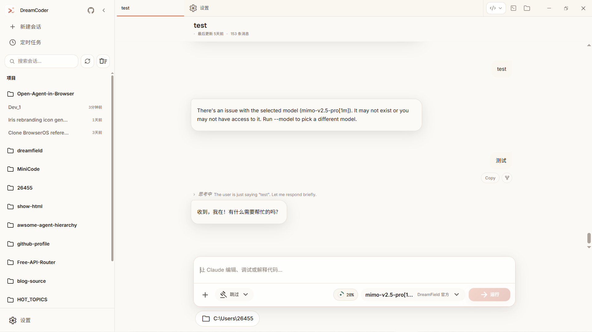
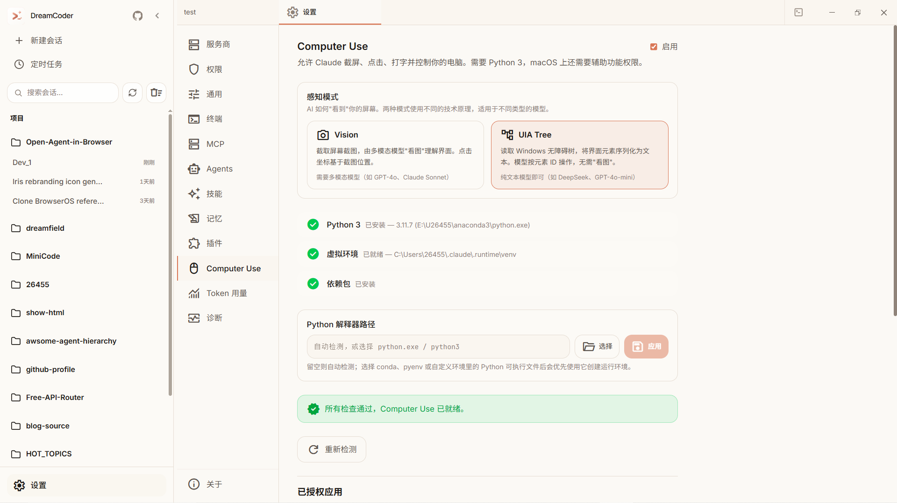
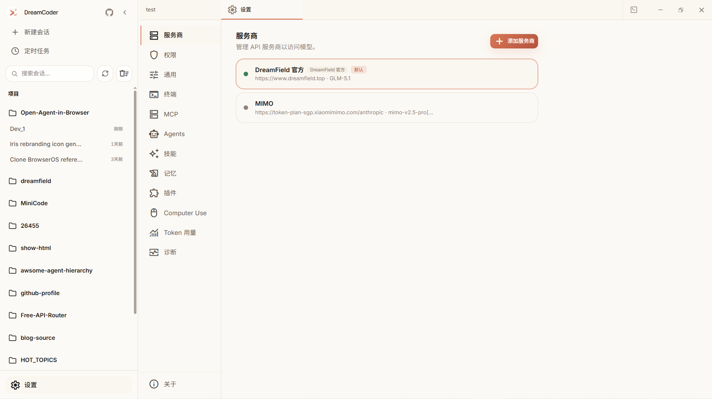
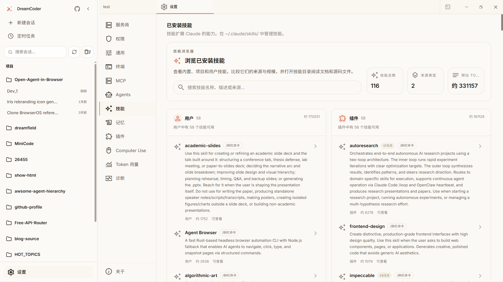

<!--
╔══════════════════════════════════════════════════════════════════════════╗
║  DreamSeed 种梦计划 — AI创造者大赛  官方 README 模板                ║
║                                                                      ║
║  使用说明：                                                          ║
║  1. 将本模板放在参赛仓库根目录 README.md 的顶部                       ║
║  2. 头图使用 DreamField 官方公开活动图片地址                         ║
║  3. 请保留 DREAMFIELD_README_HEADER_START / END 标识                 ║
║  4. 分割线以下供创作者自由编写项目内容                               ║
╚══════════════════════════════════════════════════════════════════════════╝
-->

<!-- DREAMFIELD_README_HEADER_START -->

<p align="center">
  <a href="https://www.dreamfield.top">
    
  </a>
</p>

<!-- DREAMFIELD_README_HEADER_END -->

---

<div align="right">

[English](./README_en.md) | 简体中文

</div>

<div align="center">

# DreamCoder

**Claude Code 的开源桌面端图形界面**

*更适合日常创作与协作的 AI 编程工作台*

[](https://v2.tauri.app/)
[](https://react.dev/)
[](https://bun.sh/)
[](./LICENSE)
[](https://github.com/GoDiao/dreamcoder/issues?q=is%3Aopen+is%3Aissue+label%3A%22good+first+issue%22)
[](https://github.com/GoDiao/dreamcoder/issues?q=is%3Aopen+is%3Aissue+label%3A%22help+wanted%22)

</div>

> 🌱 **正在招募贡献者！** 我们整理了一批 [good first issue](https://github.com/GoDiao/dreamcoder/issues?q=is%3Aopen+is%3Aissue+label%3A%22good+first+issue%22) 和 [help wanted](https://github.com/GoDiao/dreamcoder/issues?q=is%3Aopen+is%3Aissue+label%3A%22help+wanted%22)，每条都有 mentor 可以陪你走完第一个 PR。先读 [贡献指南](docs/CONTRIBUTING_zh.md) 再下手会更顺。

---

## ✨ 为什么选择 DreamCoder？

Claude Code 的能力很强，但命令行并不适合所有人。
**DreamCoder 把 Claude Code 的核心能力带进原生桌面应用，让会话管理、模型切换、文件操作都更直观。**

> “我想要 Claude Code 的能力，也想要一个顺手的桌面界面来管理会话、切换模型、处理文件。”

*   **基于 Claude Code 核心体验演进**：DreamCoder 复用了 Claude Code 的核心逻辑，或使用兼容运行时，在保留能力边界的同时补上桌面交互体验。
*   **隐私优先**：API Key 与数据默认保存在本地，不依赖托管云端服务。
*   **多模型自由切换**：无缝接入 Anthropic、OpenAI、DeepSeek、阿里通义、MiniMax、Azure、Google Vertex 等。

---

## 🚀 核心功能

### 1. 原生桌面体验
*   **会话管理更顺手**：可视化历史、侧边栏导航、多标签页界面。
*   **终端无缝融入工作流**：内置 PTY (PowerShell/Bash/Zsh)，集成 xterm.js。
*   **设置项可视化**：无需手动编辑 JSON，直接在 UI 中管理 Provider 和 API Key。



### 2. 深度适配 Claude Code
*   **Computer Use 双模式**：同时支持视觉截图模式，以及全新的 **UIA Tree 模式**（文本辅助访问，更快、成本更低）。
*   **工具调用全程可见**：AI 读写文件、执行终端命令的过程透明呈现，便于理解与审查。
*   **MCP 扩展能力**：通过 Model Context Protocol 持续扩展 AI 的上下文与工具能力。



### 3. 灵活的 Provider 体系
*   **切换足够轻**：点击即可在不同模型供应商之间切换。
*   **支持范围够广**：Anthropic (Claude)、OpenAI、DeepSeek、Moonshot (Kimi)、MiniMax、Azure OpenAI、Google Vertex、AWS Bedrock。
*   **连接状态一眼可见**：可在设置界面直接测试可用性与延迟。



---

### 4. MCP 扩展
*   **原生支持 MCP**：完整接入 Model Context Protocol。
*   **配置过程图形化**：不再手写 JSON，通过界面管理 MCP 服务器。
*   **开箱即可扩展**：内置常用 MCP 工具集成，方便快速接入。



---

## 🛠️ 技术栈

| 组件 | 技术选型 |
|------|----------|
| 桌面外壳 | [Tauri 2](https://v2.tauri.app/) (Rust) |
| 前端 UI | React 18 + Vite + TailwindCSS 4 |
| 后端运行时 | Bun (Node.js 兼容) |
| 终端 | portable-pty (Rust) + xterm.js |
| 状态管理 | Zustand |
| 协议 | WebSocket, MCP, LSP |

---

## 💻 平台支持现状

| 平台          | 状态                                          | 预编译安装包                                          |
|---------------|-----------------------------------------------|-------------------------------------------------------|
| Windows x64   | ✅ 维护者长期实测                              | ✅ NSIS `.exe` + MSI `.msi`（每个 release 都提供）     |
| macOS arm64   | ⚠️ 暂未日常验证（已保留构建脚本）               | ❌ 欢迎社区共同补齐                                    |
| Linux x64     | ⚠️ 暂未日常验证                                | ❌ 欢迎社区共同补齐                                    |

> DreamCoder 当前主要围绕 **Windows x64** 持续开发和验证。
> 代码中已经保留 `#[cfg(target_os = "macos" / "linux")]` 分支，但由于维护者并不日常使用这两个平台，
> 非 Windows 构建目前仍属于“代码已覆盖、体验待更多实机验证”的状态。
> 如果你正在使用 macOS 或 Linux，欢迎通过 issue 或 PR 一起把这部分体验补完整；
> Linux 内存问题可关注 [#25](https://github.com/GoDiao/dreamcoder/issues/25)。

---

## 📅 路线图

- [x] **Phase 1**: 桌面端 GUI + 多模型支持 + 项目工作台
- [x] **Phase 2**: CLI 后端集成 + Computer Use + MCP + Skills + Agent Teams
- [x] **Phase 2.5**: 性能优化 — bundle 拆分、轮询节流、终端 LRU、sessionStore 重构
- [x] **Phase 3**: H5 远程访问 (手机/浏览器接入桌面端会话)
- [ ] **Phase 4**: IM 适配器集成 (飞书/钉钉/Telegram/微信)
- [ ] **Phase 5**: Release 自动化 + 自动更新

详见 [ROADMAP](docs/ROADMAP_zh.md)

---

## 🏁 快速开始

### 环境要求
*   [Bun](https://bun.sh/) >= 1.0
*   [Rust](https://www.rust-lang.org/tools/install)（用于构建桌面端）
*   Node.js >= 18（部分依赖仍会用到）

### 安装与运行

> 这是一个 Bun monorepo（根目录与 `desktop/` 各自维护依赖）。**下面四步建议完整执行**，否则 `tauri dev` 往往会因为 sidecar 二进制或 Tauri CLI 缺失而无法启动。

```bash
# 0. 克隆仓库
git clone https://github.com/GoDiao/dreamcoder.git
cd dreamcoder

# 1. 安装根工作区依赖（sidecar 运行时：Anthropic SDK / AWS SDK / ink 等）
bun install

# 2. 安装桌面端依赖（Tauri CLI + React 前端）
cd desktop && bun install

# 3. 编译 sidecar 二进制
bun run build:sidecars

# 4. 启动桌面端开发模式
bun run tauri dev
```

> **Linux 用户**：还需要先安装 WebKitGTK、libappindicator、librsvg 等系统依赖，
> 详见 [Tauri 官方 prerequisites](https://v2.tauri.app/start/prerequisites/)。
> 如果你愿意补充发行版对应命令，欢迎直接提交 PR。

### 配置 AI 模型

1. 打开 DreamCoder，进入 **设置 -> Provider（模型供应商）**。
2. 添加你的 API Key（例如 Anthropic、OpenAI 或 DeepSeek）。
3. 选择默认模型后即可开始使用。

---

## 🤝 贡献指南

欢迎提交 Issue 和 PR。若你准备参与改进 DreamCoder，建议先阅读 [贡献指南](docs/CONTRIBUTING_zh.md)，可以更快熟悉开发流程与协作方式。

## 📝 更新日志

版本演进与重要变更见 [CHANGELOG.md](CHANGELOG.md)。

## 📄 许可证

[MIT](./LICENSE) &copy; 2024-2026 GoDiao & DreamCoder Contributors