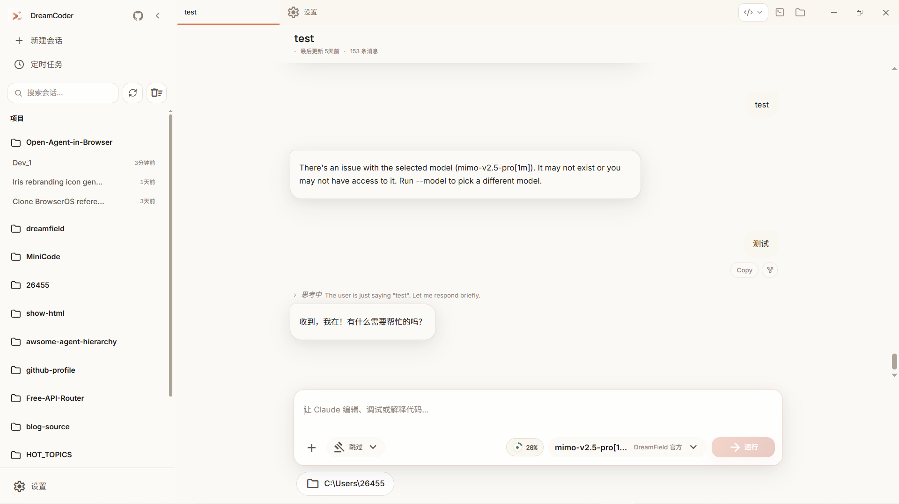
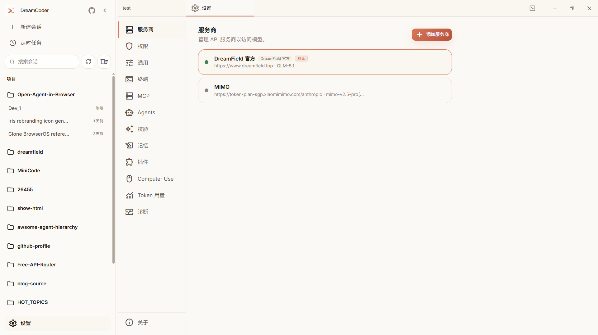
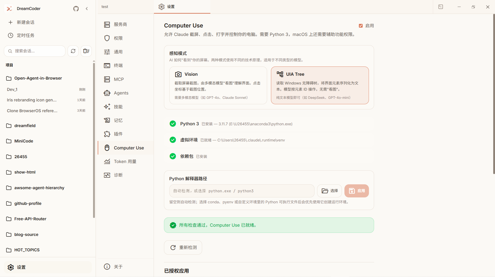
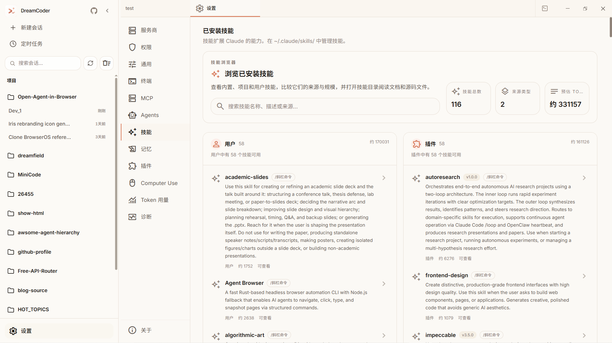

<div align="right">

[English](./README_en.md) | 简体中文

</div>

<div align="center">

# DreamCoder

**本地运行的多模型 AI 编程工作台**

*在桌面管理 Claude Code 工作流，也能在局域网内从手机接续会话。*

[](https://v2.tauri.app/)
[](https://react.dev/)
[](https://bun.sh/)
[](./LICENSE)
[](https://github.com/GoDiao/dreamcoder/issues?q=is%3Aopen+is%3Aissue+label%3A%22good+first+issue%22)
[](https://github.com/GoDiao/dreamcoder/issues?q=is%3Aopen+is%3Aissue+label%3A%22help+wanted%22)

[](https://atomgit.com/GoDiao/DreamCoder)

国内 AtomGit 托管：[atomgit.com/GoDiao/DreamCoder](https://atomgit.com/GoDiao/DreamCoder)（镜像仓库；issue 和 PR 请提交到 [GitHub](https://github.com/GoDiao/dreamcoder)）

</div>

> 🌱 **欢迎贡献！** 可以从 [good first issue](https://github.com/GoDiao/dreamcoder/issues?q=is%3Aopen+is%3Aissue+label%3A%22good+first+issue%22) 和 [help wanted](https://github.com/GoDiao/dreamcoder/issues?q=is%3Aopen+is%3Aissue+label%3A%22help+wanted%22) 开始；动手前请阅读 [贡献指南](docs/CONTRIBUTING_zh.md)。

---

## ✨ 为什么选择 DreamCoder？

DreamCoder 在本机运行桌面应用与会话服务，把模型配置、编程会话、终端和工具调用放在同一个工作台。

*   **选择模型服务**：配置 Anthropic 或 OpenAI 兼容接口；提供 DeepSeek、通义千问、Kimi、智谱 GLM、LM Studio、Ollama 等预设，也支持自定义端点。具体模型能否使用取决于服务商与配置。
*   **看清编程过程**：在桌面查看会话、文件变更、终端和工具调用。
*   **从手机接续**：启用 H5 接入后，可在同一局域网内通过手机浏览器访问桌面会话；跨网络访问需要自行配置反向代理。
*   **读懂编程智能体**：附带七篇源码导读，沿一次代码修改讲解执行循环、工具、权限、会话与桌面集成，见[《编程智能体实现指南》](docs/tutorial/README.md)。

Provider 配置和 API Key 保存在本机文件中。使用云端模型时，请求数据会发送给你选择的服务商；详见 [隐私说明](PRIVACY.md)。

---

## 🚀 核心功能

### 1. 原生桌面体验
*   **会话管理更顺手**：可视化历史、侧边栏导航、多标签页界面。
*   **终端无缝融入工作流**：内置 PTY (PowerShell/Bash/Zsh)，集成 xterm.js。
*   **设置项可视化**：无需手动编辑 JSON，直接在 UI 中管理 Provider 和 API Key。



### 2. 多模型配置
*   **Provider 预设与自定义端点**：按所选服务商配置 API Key、地址与模型映射。
*   **连接检查**：在设置界面测试已配置端点的可用性与延迟。



### 3. Claude Code 工作流
*   **Computer Use 双模式**：支持视觉截图模式和 **UIA Tree 模式**（文本辅助访问）。
*   **工具调用全程可见**：AI 读写文件、执行终端命令的过程透明呈现，便于理解与审查。
*   **MCP 扩展能力**：通过 Model Context Protocol 持续扩展 AI 的上下文与工具能力。



### 4. 局域网内手机接续
*   **H5 接入**：在设置中开启访问、管理 Token，并使用二维码从同一局域网内的手机连接。
*   **访问范围**：桌面端需保持运行；跨网络访问需要自行配置反向代理，相关部署指南仍在编写。

---

### 5. MCP 扩展
*   **支持 MCP**：通过 Model Context Protocol 接入外部工具。
*   **配置过程图形化**：不再手写 JSON，通过界面管理 MCP 服务器。



---

## 📖 源码导读

想了解编程智能体内部怎样工作，可以读[《编程智能体实现指南》](docs/tutorial/README.md)。系列共七篇，沿一次小的代码修改，依次讲解执行循环、代码工具、权限控制、会话与上下文、流式响应与故障恢复，以及桌面端集成，文中结论都附有源码链接。

---

## 🛠️ 技术栈

| 组件 | 技术选型 |
|------|----------|
| 桌面外壳 | [Tauri 2](https://v2.tauri.app/) (Rust) |
| 前端 UI | React 18 + Vite + TailwindCSS 4 |
| 后端运行时 | Bun (Node.js 兼容) |
| 终端 | portable-pty (Rust) + xterm.js |
| 状态管理 | Zustand |
| 协议 | WebSocket, MCP, LSP |

---

## 💻 平台支持现状

| 平台          | 状态                                          | 预编译安装包                                          |
|---------------|-----------------------------------------------|-------------------------------------------------------|
| Windows x64   | ✅ 维护者长期实测                              | v0.4.5 未附安装包；请查看 Releases 或按下文从源码运行     |
| macOS arm64   | ⚠️ 暂未日常验证（已保留构建脚本）               | ❌ 欢迎社区共同补齐                                    |
| Linux x64     | ⚠️ 暂未日常验证                                | ❌ 欢迎社区共同补齐                                    |

> DreamCoder 当前主要围绕 **Windows x64** 持续开发和验证。
> 代码中已经保留 `#[cfg(target_os = "macos" / "linux")]` 分支，但由于维护者并不日常使用这两个平台，
> 非 Windows 构建目前仍属于“代码已覆盖、体验待更多实机验证”的状态。
> 如果你正在使用 macOS 或 Linux，欢迎通过 issue 或 PR 一起把这部分体验补完整；
> Linux 内存问题可关注 [#25](https://github.com/GoDiao/dreamcoder/issues/25)。
> 安装包供应情况以 [GitHub Releases](https://github.com/GoDiao/dreamcoder/releases) 页面中的实际附件为准。

---

## 📅 路线图

- [x] **Phase 1**: 桌面端 GUI + 多模型支持 + 项目工作台
- [x] **Phase 2**: CLI 后端集成 + Computer Use + MCP + Skills + Agent Teams
- [x] **Phase 2.5**: 性能优化 — bundle 拆分、轮询节流、终端 LRU、sessionStore 重构
- [x] **Phase 3**: H5 局域网访问 (启用后从手机/浏览器接入桌面端会话)
- [ ] **Phase 4**: IM 适配器集成 (飞书/钉钉/Telegram/微信)
- [ ] **Phase 5**: Release 自动化 + 自动更新

详见 [ROADMAP](docs/ROADMAP_zh.md)

---

## 🏁 快速开始

### 环境要求
*   [Bun](https://bun.sh/) >= 1.0
*   [Rust](https://www.rust-lang.org/tools/install)（用于构建桌面端）
*   Node.js >= 18（部分依赖仍会用到）

### 安装与运行

> v0.4.5 Release 没有预编译安装包。下面是从源码运行开发版的方法。这是一个 Bun monorepo（根目录与 `desktop/` 各自维护依赖）；**四步建议完整执行**，否则 `tauri dev` 往往会因为 sidecar 二进制或 Tauri CLI 缺失而无法启动。

```bash
# 0. 克隆仓库
git clone https://github.com/GoDiao/dreamcoder.git
cd dreamcoder

# 1. 安装根工作区依赖（sidecar 运行时：Anthropic SDK / AWS SDK / ink 等）
bun install

# 2. 安装桌面端依赖（Tauri CLI + React 前端）
cd desktop && bun install

# 3. 编译 sidecar 二进制
bun run build:sidecars

# 4. 启动桌面端开发模式
bun run tauri dev
```

> **Linux 用户**：还需要先安装 WebKitGTK、libappindicator、librsvg 等系统依赖，
> 详见 [Tauri 官方 prerequisites](https://v2.tauri.app/start/prerequisites/)。
> 如果你愿意补充发行版对应命令，欢迎直接提交 PR。

### 配置 AI 模型

1. 打开 DreamCoder，进入 **设置 -> Provider（模型供应商）**。
2. 添加你的 API Key（例如 Anthropic、OpenAI 或 DeepSeek）。
3. 选择默认模型后即可开始使用。

### 界面语言

首次启动时，DreamCoder 会根据系统语言自动选择界面语言：系统语言为中文（`zh-*`）时使用中文界面，其他语言默认使用英文界面。你随时可以在 **设置** 中手动切换，手动选择会被保存，并在之后始终优先生效。

---

## 🤝 贡献指南

欢迎提交 Issue 和 PR。若你准备参与改进 DreamCoder，建议先阅读 [贡献指南](docs/CONTRIBUTING_zh.md)，可以更快熟悉开发流程与协作方式。

## 📝 更新日志

版本演进与重要变更见 [CHANGELOG.md](CHANGELOG.md)。

## 📄 许可证

[MIT](./LICENSE) &copy; 2024-2026 GoDiao & DreamCoder Contributors
