<div align="right">

English | [简体中文](./README_zh.md)

</div>

<div align="center">

<picture>
  <source media="(prefers-color-scheme: dark)" srcset="./assets/dark/readme-banner.png">
  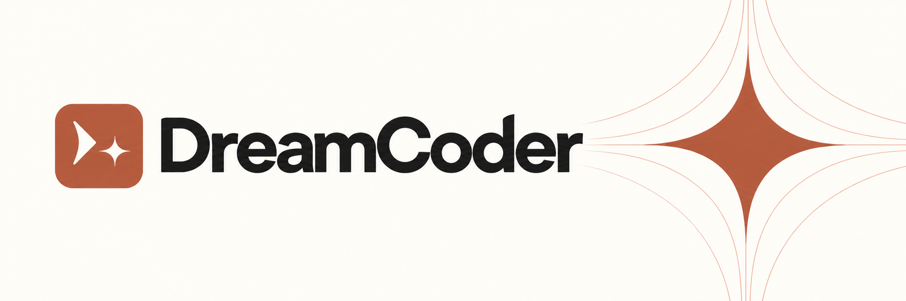
</picture>

**A locally run, multi-provider AI coding workspace**

*Manage Claude Code workflows on your desktop and continue sessions from your phone on the same LAN.*

[**⬇️ Download for macOS (Apple Silicon)**](https://github.com/GoDiao/dreamcoder/releases/latest) · [**⬇️ Download for Windows (x64)**](https://github.com/GoDiao/dreamcoder/releases/latest)

[](https://www.electronjs.org/)
[](https://react.dev/)
[](https://bun.sh/)
[](./LICENSE)
[](https://github.com/GoDiao/dreamcoder/issues?q=is%3Aopen+is%3Aissue+label%3A%22good+first+issue%22)
[](https://github.com/GoDiao/dreamcoder/issues?q=is%3Aopen+is%3Aissue+label%3A%22help+wanted%22)

[](https://atomgit.com/GoDiao/DreamCoder)

Also hosted on AtomGit: [atomgit.com/GoDiao/DreamCoder](https://atomgit.com/GoDiao/DreamCoder) (mirror; please open issues and pull requests on [GitHub](https://github.com/GoDiao/dreamcoder))

</div>

> 🎉 **500 stars!** Thank you to everyone who starred, tried, reported issues, and contributed. DreamCoder is only five months old, and it has grown step by step because of you. Next, we'll keep pace with the best practices of frontier coding agents and try everything that can make the experience better, along with brand-new features. Our goal will always be to **reach for the stars**.

> 🌱 **Contributions welcome!** Browse [good first issues](https://github.com/GoDiao/dreamcoder/issues?q=is%3Aopen+is%3Aissue+label%3A%22good+first+issue%22) and [help wanted](https://github.com/GoDiao/dreamcoder/issues?q=is%3Aopen+is%3Aissue+label%3A%22help+wanted%22), and read the [contributing guide](docs/general/CONTRIBUTING_en.md) before starting.

---

## ✨ Why DreamCoder?

DreamCoder runs its desktop app and session service locally, bringing model configuration, coding sessions, the terminal, and tool activity into one workspace.

*   **Choose a model provider**: Configure Anthropic or OpenAI-compatible endpoints. Presets include DeepSeek, Qwen, Kimi, Zhipu GLM, LM Studio, and Ollama; custom endpoints are also supported. Model availability depends on your provider and configuration.
*   **Follow the work**: Review sessions, file changes, terminal activity, and tool calls on your desktop.
*   **See it, not just read it**: The agent can answer with interactive pages (charts, diagrams, step-by-step walkthroughs) shown right in the conversation, and a built-in browser shows your dev server next to the chat.
*   **Design and clone**: Start from 60+ templates and 156+ design systems with `/design`: the agent interviews you first, then builds a web page or app prototype. It can also clone a website. Results are kept in your project's `dc_artifacts/`, ready to export, keep editing, or compare side by side on a canvas.
*   **Plan work on a board**: A project board keeps tasks, owners, reviewers and progress for you and your sessions, across sessions and worktrees.
*   **Continue on your phone**: Enable H5 Access to reach desktop sessions from a phone browser on the same LAN. Access across networks requires a reverse proxy you configure yourself.
*   **Learn how a coding agent works**: A seven-part source code walkthrough follows one code change through the execution loop, tools, permissions, sessions, and desktop integration. See the [Coding Agent Implementation Guide](docs/tutorial/README.en.md).

Provider settings and API keys are stored in local files. When you use a cloud model, requests are sent to your chosen provider. See the [privacy notice](PRIVACY.md).

---

## 🚀 Key Features

### 1. Native Desktop Experience
*   **Smoother session management**: Visual history, a sidebar with several ways to organize sessions, and a full-height side panel per session.
*   **A side panel of tabs**: Changes, the file tree, single files, web pages, terminals and pages each open as a tab from the new tab page. Each session keeps its own tabs, and they come back after a restart (terminals excepted).
*   **Terminal built into the workflow**: Built-in PTY (PowerShell/Bash/Zsh) with xterm.js.
*   **Settings you can manage visually**: Configure providers, API keys, and preferences without editing JSON files.

<picture>
  <source media="(prefers-color-scheme: dark)" srcset="./assets/dark/main.png">
  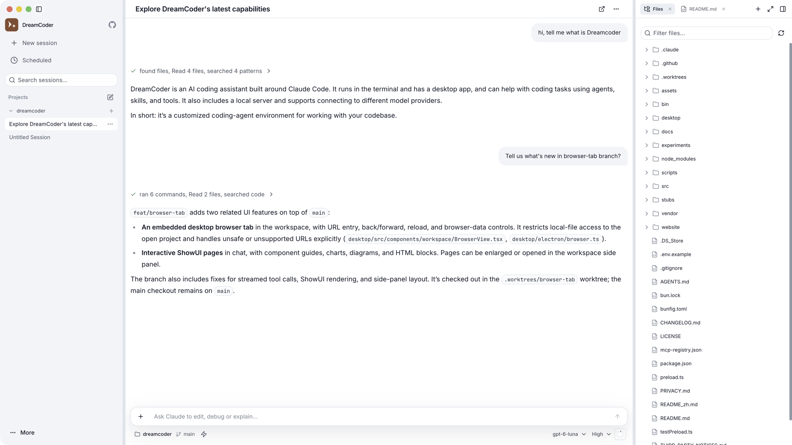
</picture>

### 2. Pages and a Built-in Browser
*   **Pages in the conversation**: When a chart, a diagram or a walkthrough explains better than text, the agent builds a page from components: charts and over forty G2 chart types, flowcharts, sequence and architecture diagrams, mind maps, step-by-step walkthroughs, comparison matrices, roadmaps, 3D scenes and more. Each change is a new revision; enlarge a page or open it in the side panel.

<picture>
  <source media="(prefers-color-scheme: dark)" srcset="./assets/dark/pages-3.png">
  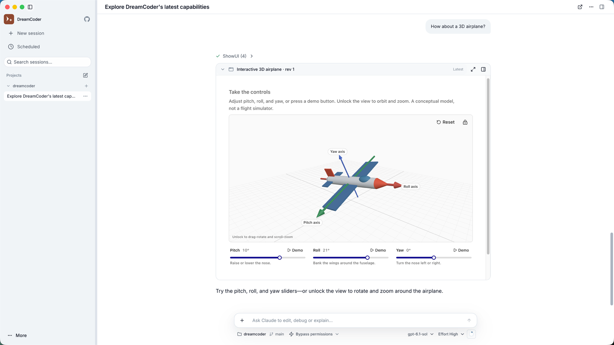
</picture>

<picture>
  <source media="(prefers-color-scheme: dark)" srcset="./assets/dark/pages-2.png">
  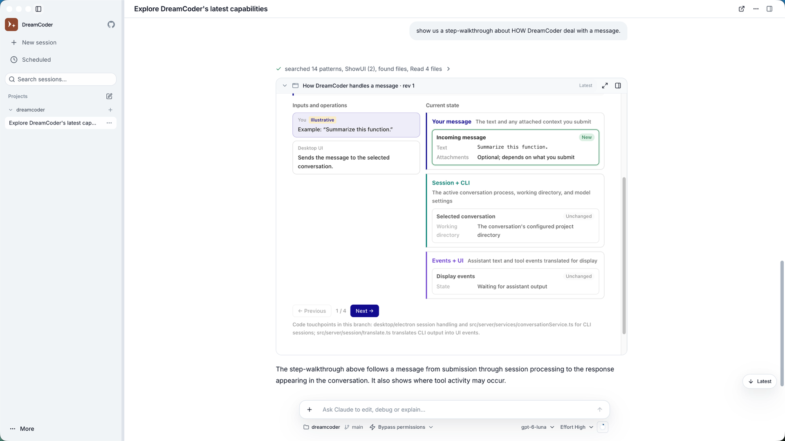
</picture>
<picture>
  <source media="(prefers-color-scheme: dark)" srcset="./assets/dark/pages-1.png">
  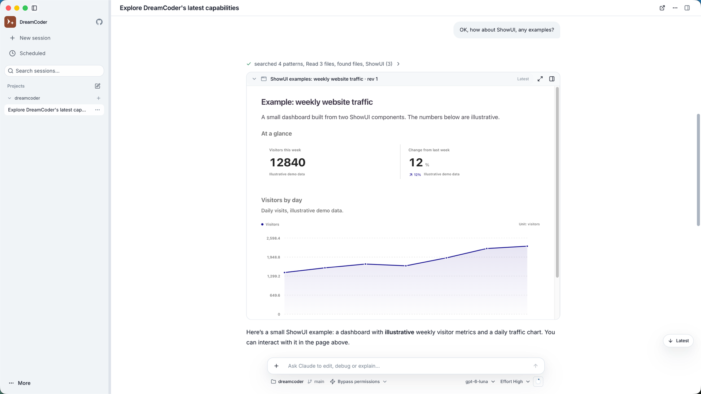
</picture>

*   **Built-in browser**: Open a local dev server, an HTML file in the project or an https site in a side panel tab, next to the conversation. Sign-ins are kept across restarts. The agent can operate the page itself (read it, click, type, take screenshots, read the console and network), only in the browser of its own session; on external sites it asks first, and you can trust sites under Settings → Permissions. You can also select text or pick an element on the page and add it to the chat. Desktop app only.

<picture>
  <source media="(prefers-color-scheme: dark)" srcset="./assets/dark/browser.png">
  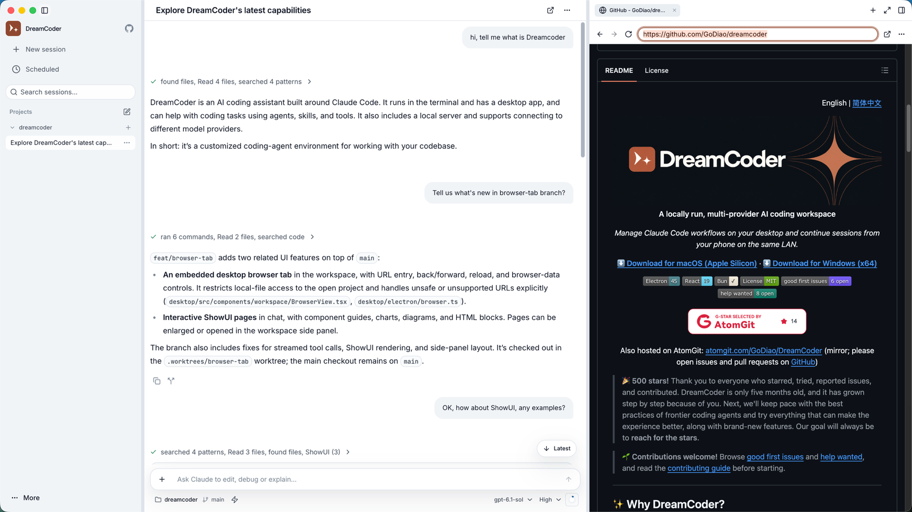
</picture>

### 3. Artifacts and Design Mode
*   **Artifacts**: Pages, prototypes and canvases the agent makes are kept as folders in your project instead of getting lost in the conversation. The Artifacts page in the sidebar lists them across projects with thumbnails, search and a project filter; open one full screen, continue it in a new chat, or export it as PDF, PNG or a standalone HTML file. When a worktree is deleted, its artifacts move to a global folder together with the design systems they use.

<picture>
  <source media="(prefers-color-scheme: dark)" srcset="./assets/dark/artifacts.png">
  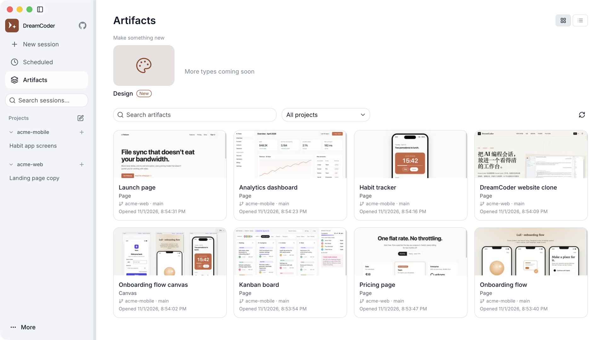
</picture>

*   **Design mode**: Click Design on the Artifacts page, or type `/design`. The agent asks what you need, you pick a template, and it builds a web page or app prototype, then checks the result in the built-in browser. The library has 60+ page and prototype templates (searchable by title, description and tags) and 156+ design systems (colors, fonts, spacing) that apply to a template or to a page made from scratch.

<picture>
  <source media="(prefers-color-scheme: dark)" srcset="./assets/dark/design.png">
  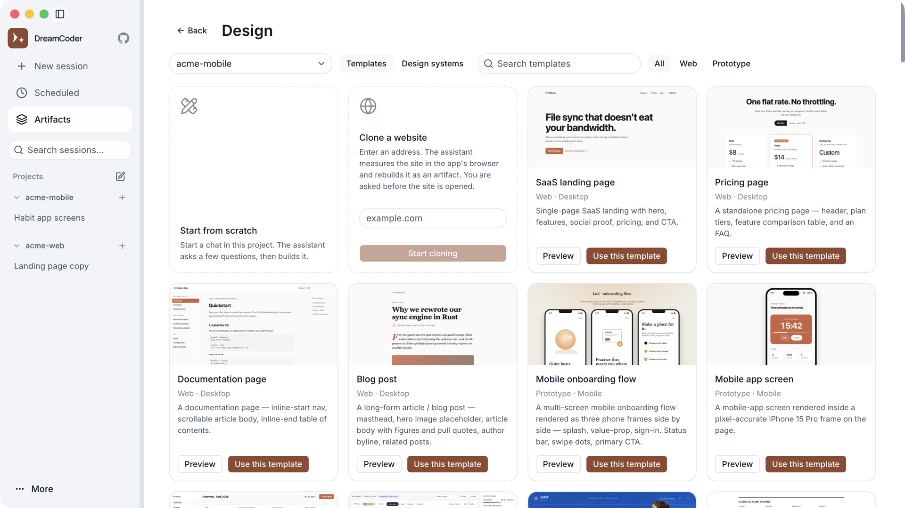
</picture>
<picture>
  <source media="(prefers-color-scheme: dark)" srcset="./assets/dark/template-choice.png">
  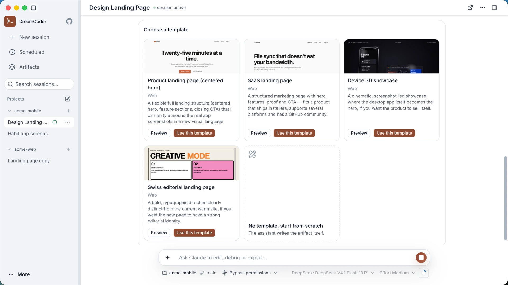
</picture>

*   **Canvas**: Lay several pages out as boards on one surface; zoom, pan, drag and resize them, and their positions are saved. Panning and zooming work with the mouse over a board; click a board's "Interact" button to work inside it.
*   **Clone a website**: Give the agent a URL and it opens the site in a hidden browser, reads its structure and styles, and rebuilds it as a page in your project, with videos that play and seek. You grant access to the site first.

<picture>
  <source media="(prefers-color-scheme: dark)" srcset="./assets/dark/canvas.png">
  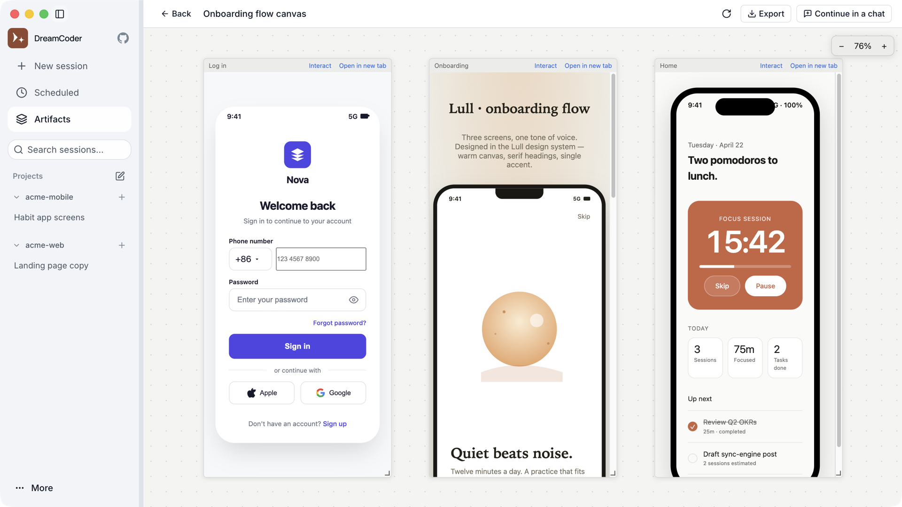
</picture>
<picture>
  <source media="(prefers-color-scheme: dark)" srcset="./assets/dark/clone.png">
  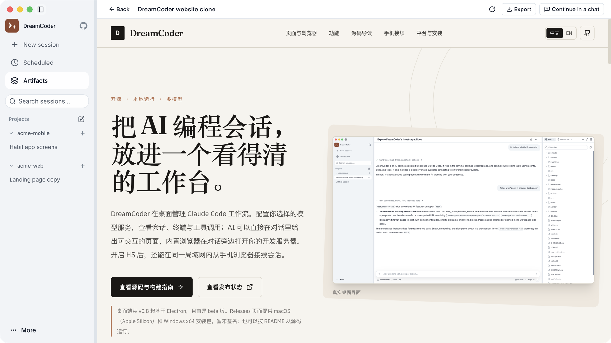
</picture>

The templates and most of the design systems are converted from [Open Design](https://github.com/nexu-io/open-design) (Apache-2.0); see [THIRD_PARTY_NOTICES.md](THIRD_PARTY_NOTICES.md).

### 4. Project Board
*   **One board for you and your sessions**: Each project gets a persistent board of tasks and sub-tasks. You create and assign tasks there; sessions read the board, split their work into sub-tasks, record progress and submit a report when they finish. The board outlives the sessions, and every worktree of the project shares it.
*   **Owner, reviewer and creator**: Each task records who does it, who reviews it and who created it. The reviewer checks the delivery against the acceptance criteria and accepts it or sends it back; without a reviewer, you accept it. The hierarchy view shows the whole task tree, and Needs me collects what waits on you: a blocked task with the session's question, or a delivery to accept.
*   **You stay in charge**: The creator sets a task's acceptance criteria. When another session wants to change them, it asks you every time, and the card shows which criteria are added and removed. Sessions also ask before they create the board, start a session on a task, cancel a task or make themselves a reviewer.

<picture>
  <source media="(prefers-color-scheme: dark)" srcset="./assets/dark/kanban.png">
  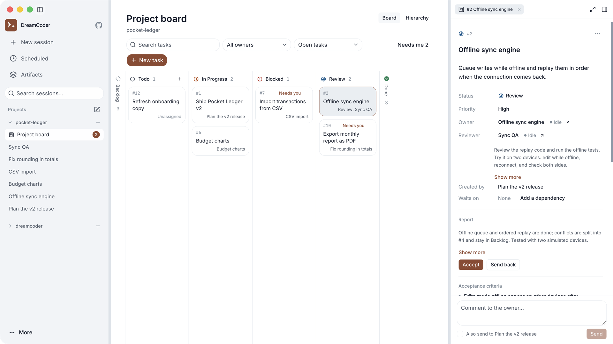
</picture>
<picture>
  <source media="(prefers-color-scheme: dark)" srcset="./assets/dark/kanban-approval.png">
  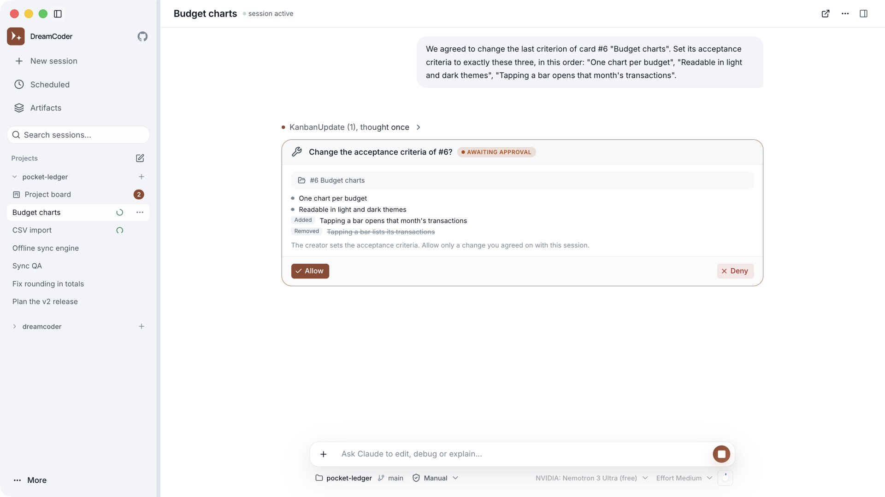
</picture>

<picture>
  <source media="(prefers-color-scheme: dark)" srcset="./assets/dark/kanban-tree.png">
  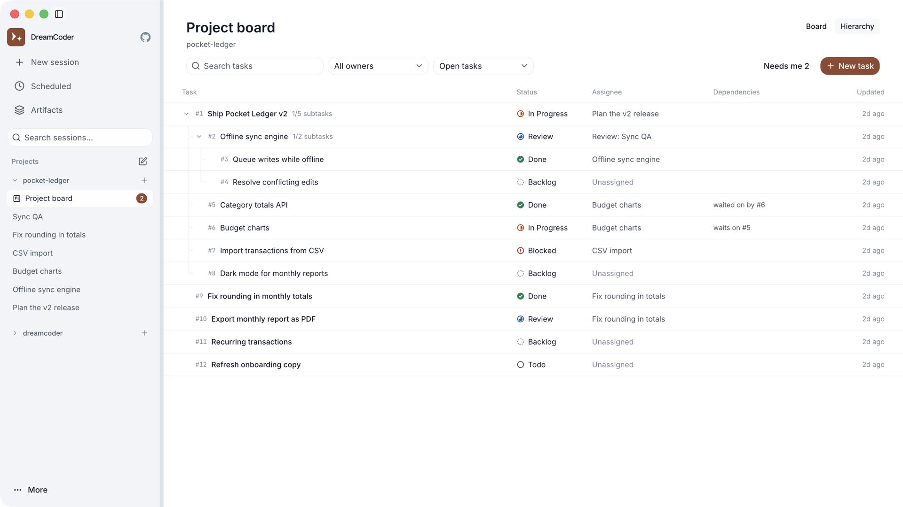
</picture>
<picture>
  <source media="(prefers-color-scheme: dark)" srcset="./assets/dark/kanban-inbox.png">
  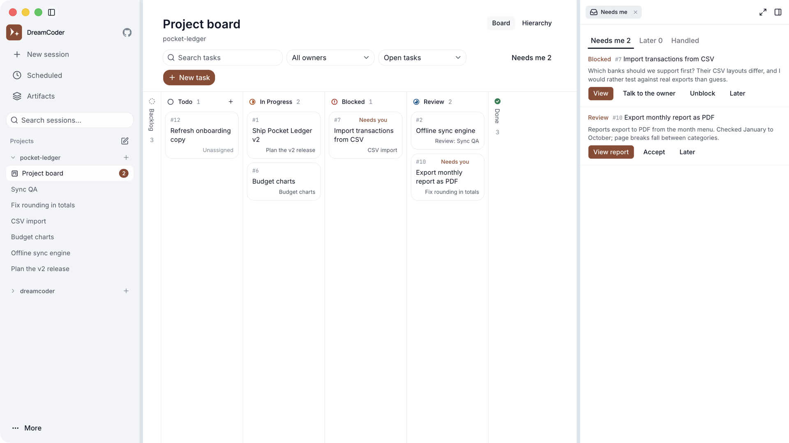
</picture>

### 5. Multi-Provider Configuration
*   **Presets and custom endpoints**: Set the API key, endpoint, and model mapping for your chosen provider.
*   **Connection check**: Test the availability and latency of configured endpoints in Settings.

<picture>
  <source media="(prefers-color-scheme: dark)" srcset="./assets/dark/setting_provider.png">
  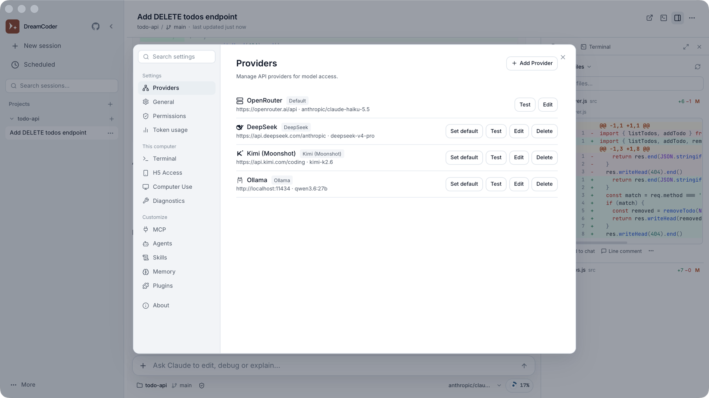
</picture>

### 6. Claude Code Workflows
*   **Computer Use**: operates desktop apps and browsers in the background through UI elements, powered by [cua-driver](https://github.com/trycua/cua) (MIT). DreamCoder downloads it when you turn Computer Use on; no Python needed. Verified on macOS; Windows needs community testing, Linux is a preview.
*   **Transparent tool execution**: File edits and terminal commands are surfaced clearly, so it's easy to understand and review what the agent is doing.
*   **MCP extensibility**: Expand context and tooling through the Model Context Protocol.

<picture>
  <source media="(prefers-color-scheme: dark)" srcset="./assets/dark/setting_computeruse.png">
  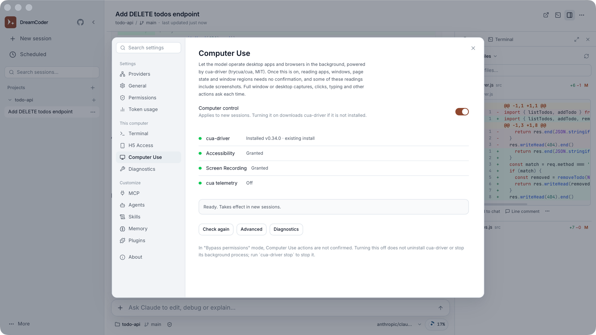
</picture>

### 7. Continue on Your Phone over LAN
*   **H5 Access**: Enable access in Settings, manage the token, and use the QR code to connect a phone on the same LAN.
*   **Access scope**: Keep the desktop app running. Cross-network access requires your own reverse proxy; the deployment guide is still in progress.

### 8. MCP Extensions
*   **Visual configuration**: Manage MCP servers in the UI instead of editing JSON by hand.

<picture>
  <source media="(prefers-color-scheme: dark)" srcset="./assets/dark/setting_skills.png">
  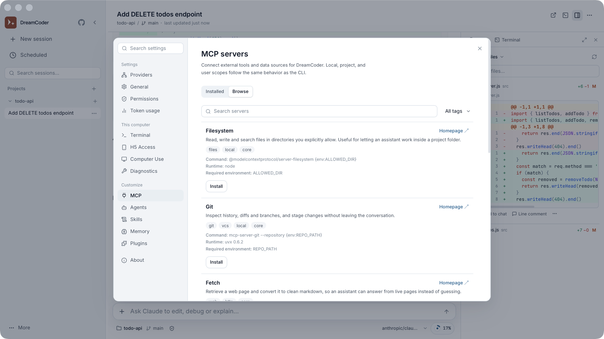
</picture>

---

## 📖 Source Code Walkthrough

To learn how a coding agent works under the hood, read the [Coding Agent Implementation Guide](docs/tutorial/README.en.md) (also available in [Chinese](docs/tutorial/README.md)). The seven-part series follows one small code change through the execution loop, code tools, permissions, sessions and context, streaming and failure recovery, and desktop integration, with source links for each point.

---

## 🛠️ Tech Stack

| Component | Technology |
|-----------|------------|
| Desktop Shell | [Electron](https://www.electronjs.org/) |
| Frontend UI | React 19 + Vite + TailwindCSS 4 |
| Backend Runtime | Bun (Node.js compatible) |
| Terminal | Bun PTY in the sidecar + xterm.js |
| Pages | [ShowAI](https://github.com/Renaissance-Mind/ShowAI) page format and reader |
| State Management | Zustand |
| Protocol | WebSocket, MCP, LSP |

---

## 💻 Platform Support

| Platform     | Status                                  | Pre-built Installer                                      |
|--------------|-----------------------------------------|----------------------------------------------------------|
| Windows x64  | ✅ Long tested (the maintainer's former main platform) | ✅ [`-setup.exe`](https://github.com/GoDiao/dreamcoder/releases/latest) (unsigned) |
| macOS arm64  | ✅ Maintainer's daily platform           | ✅ [`.dmg`](https://github.com/GoDiao/dreamcoder/releases/latest) (unsigned)      |
| Linux x64    | ⚠️ Not part of daily validation yet      | ❌ Community help welcome                                 |

> The maintainer now develops primarily on **macOS (Apple Silicon)**, running from source (`bun run electron:dev`); it ships as a `.dmg` from v0.5.0.
> **Windows x64** was the main platform before and has been tested extensively, but the maintainer no longer develops on it day to day, so feedback on how new changes behave on Windows is especially welcome.
> **Linux** is not built or packaged; running the desktop app from source may work but is not part of the maintainer's day-to-day workflow, so Linux support is still best-effort.
> For the validated Ubuntu browser workflow, exFAT installation workaround, and local Ollama results, see the [Linux validation report](docs/general/LINUX_BROWSER_VALIDATION.md). For startup, shutdown, and termination by PID, see the [browser usage guide](docs/general/WEB_USAGE.md).
> If you're running DreamCoder on Windows or Linux, issues and PRs are especially valuable;
> for the current Linux memory investigation, see [#25](https://github.com/GoDiao/dreamcoder/issues/25).
> Check [GitHub Releases](https://github.com/GoDiao/dreamcoder/releases) for the actual assets available with each release.

---

## 📅 Roadmap

What DreamCoder has, what is being built, and what is planned or dropped: see the [Feature overview](https://github.com/GoDiao/dreamcoder/issues/244).

---

## 🏁 Getting Started

### Prerequisites
*   [Bun](https://bun.sh/) >= 1.0
*   Node.js >= 18 (still needed by parts of the dependency chain)

### Installation

> Installers for macOS (Apple Silicon) and Windows x64 are on [Releases](https://github.com/GoDiao/dreamcoder/releases/latest). They are not code-signed yet; the release notes explain how to open them the first time. The steps below run the development version from source. This is a Bun monorepo, with separate dependencies at the repo root and in `desktop/`. **Run all the steps below**; `electron:dev` fails to start without the Electron binary or the sidecar binary.

```bash
# 0. Clone the repo
git clone https://github.com/GoDiao/dreamcoder.git
cd dreamcoder

# 1. Install root workspace dependencies (sidecar runtime: Anthropic SDK, AWS SDK, ink, etc.)
bun install

# The ShowAI page reader and its dependencies (vendor/showai)
(cd vendor/showai && bun install)

# 2. Install desktop dependencies (Electron + React frontend)
cd desktop && bun install

# 3. Download the Electron binary (Bun does not run Electron's install script)
bun run electron:install

# 4. Build the sidecar binary
bun run build:sidecars

# 5. Launch the desktop app in dev mode (starts Vite and Electron together)
bun run electron:dev
```

> To build an installer for your platform, run `bun run electron:pack`; it writes to `desktop/electron-release/`.

### Configure Your Model

1. Open DreamCoder and go to **Settings -> Providers**.
2. Add your API key (for example Anthropic, OpenAI, or DeepSeek).
3. Choose a default model and start coding.

### UI Language

On first launch, DreamCoder detects your system locale: Chinese systems (`zh-*`) get the Chinese UI, everything else defaults to English. You can switch languages anytime in **Settings**, and your manual choice is persisted and always takes precedence afterwards.

---

## 💝 Sponsorship

DreamCoder is maintained by one person in their spare time. Companies and individuals are welcome to sponsor its development. See the [sponsorship policy](docs/general/SPONSORS_en.md) for tiers and rules, and email diaoshengjia@gmail.com to get in touch.

## 🤝 Contributing

Issues and pull requests are welcome. If you'd like to improve DreamCoder, start with the [Contributing Guide](docs/general/CONTRIBUTING_en.md) to get familiar with the workflow and collaboration style.

## 📝 Changelog

For release history and notable updates, see [CHANGELOG.md](CHANGELOG.md).

## 📄 License

[MIT](./LICENSE) &copy; 2024-2026 GoDiao & DreamCoder Contributors
