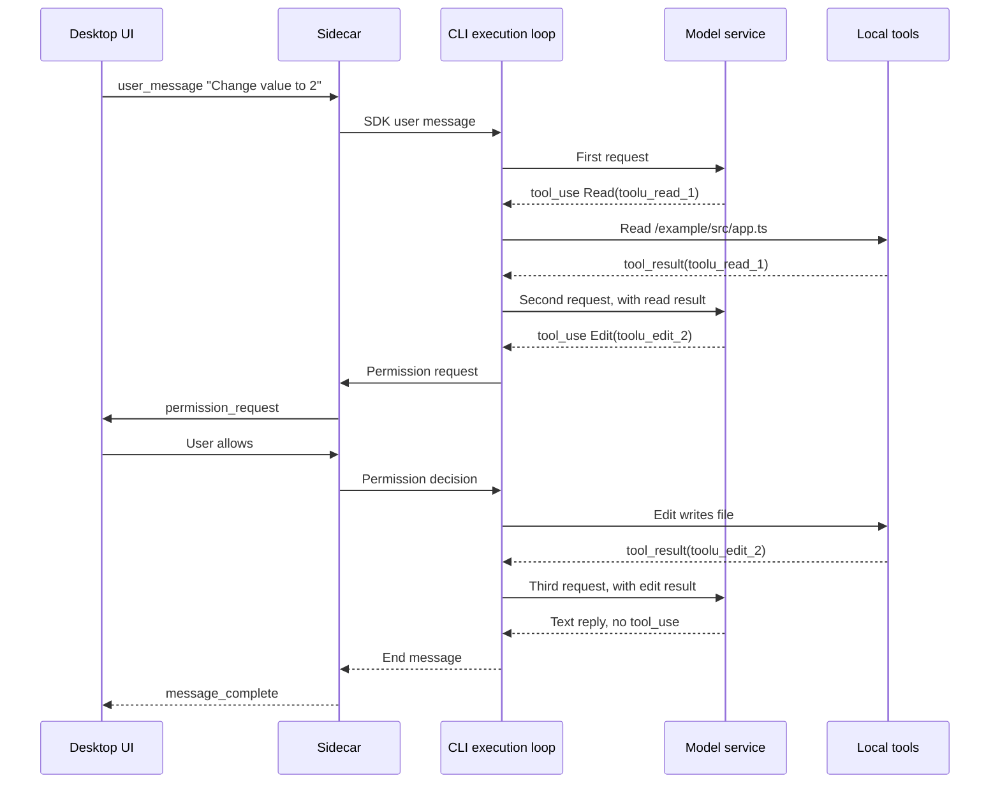

English | [简体中文](./00-overview.zh.md)

# How a coding agent completes a code change

A model receives text and returns text. It cannot open local files by itself. Yet when you type "Change `value` to 2" in DreamCoder, a file in the project really does change. People new to coding agents usually first ask who read the file, who wrote it, and what the model did. The answer is a set of programs outside the model. They tell the model which tools are available, run the tool requests the model makes, and hand the results back to the model.

This chapter follows one constructed small change through the whole path, maps each step to its location in the DreamCoder source, and shows where each later chapter sits on this path. The series is a guided reading of the source code. You need basic TypeScript and `async/await`; other concepts are explained where they first appear.

## What the programs outside the model do

Leaving out the UI, permissions and the various kinds of error handling, a code change needs the programs outside the model to do only four things:

1. Send the user's request, the earlier conversation and the descriptions of available tools to the model together.
2. Read the model's reply. The reply may contain text, and it may also contain tool call requests (`tool_use`) that give a tool name and arguments, for example "use `Read` to read `/example/src/app.ts`".
3. Run the requested tool on the local machine, and send the execution result (`tool_result`) as a new message to the model, together with the earlier messages.
4. Repeat steps 2 and 3 until the model's reply no longer contains a tool call, then give the final reply to the user.

Local programs do both the reading and the writing. The model only decides which tool to call and with which arguments, and decides the next step based on the returned result. The loop formed by steps 2 to 4 is called the execution loop, and [Part 1](./01-execution-loop.en.md) covers it in full.

## The full course of one change

The project contains one file:

```ts
// /example/src/app.ts
export const value = 1
```

In the desktop app, the user types "Change `value` to 2" and sends it. Over the whole process the user sends only this one message, while the program sends the model three requests.

**First request.** The program sends the user message and the tool descriptions to the model. The model does not yet know the file contents, so it asks to read the file:

```json
{
  "type": "tool_use",
  "id": "toolu_read_1",
  "name": "Read",
  "input": { "file_path": "/example/src/app.ts" }
}
```

The program runs `Read`, gets the file contents with line numbers, and writes them as a `tool_result`:

```json
{
  "type": "tool_result",
  "tool_use_id": "toolu_read_1",
  "content": "1\texport const value = 1"
}
```

**Second request.** The program appends the previous `tool_use` and `tool_result` to the end of the messages and requests the model again. The model now sees the file contents and proposes an edit:

```json
{
  "type": "tool_use",
  "id": "toolu_edit_2",
  "name": "Edit",
  "input": {
    "file_path": "/example/src/app.ts",
    "old_string": "export const value = 1",
    "new_string": "export const value = 2"
  }
}
```

Before `Edit` runs, it goes through two checks. The argument check requires that the target file was read by `Read` first, that it has not changed since it was read, and that `old_string` can be found in the file ([Part 2](./02-code-tools.en.md)). The permission check may require user confirmation in the default mode ([Part 3](./03-permissions.en.md)). After the user allows it, `Edit` writes the file and returns a result whose `tool_use_id` is `toolu_edit_2` and whose content is `The file /example/src/app.ts has been updated successfully.`. Each `tool_result` points back to its `tool_use` through `tool_use_id`. This correspondence is explained in [Part 1](./01-execution-loop.en.md#from-tool_use-to-tool_result).

**Third request.** The program appends the messages again and requests the model. The model replies "Changed `value` to 2." with no tool call, and the execution loop ends. The file becomes:

```ts
// /example/src/app.ts
export const value = 2
```

The model could also read the file again in the third request, or run a type check to confirm the result. That would add one more round of tool calls. The model decides from the context whether to read or search first and whether to verify. The program does not prescribe an order for tool calls.

### What the desktop UI shows

1. After the user sends the message, the session enters the running state (`chatState` is `thinking`). [`chatStore.sendMessage()`](https://github.com/GoDiao/dreamcoder/blob/dba5b24c75be4e3c35cd42d082dc9a7f8b631087/desktop/src/stores/chatStore.ts#L881)
2. A tool call entry for `Read` appears in the conversation area, with the tool name and arguments, followed by its result. [`tool_use_complete` handling](https://github.com/GoDiao/dreamcoder/blob/dba5b24c75be4e3c35cd42d082dc9a7f8b631087/desktop/src/stores/chatStore.ts#L1433), [`tool_result` handling](https://github.com/GoDiao/dreamcoder/blob/dba5b24c75be4e3c35cd42d082dc9a7f8b631087/desktop/src/stores/chatStore.ts#L1469)
3. A call entry for `Edit` appears. When confirmation is needed, the UI shows a permission request and waits for the user to choose. After the user allows it, the result of `Edit` appears. [`permission_request` handling](https://github.com/GoDiao/dreamcoder/blob/dba5b24c75be4e3c35cd42d082dc9a7f8b631087/desktop/src/stores/chatStore.ts#L1502)
4. The model's final reply is displayed piece by piece. When it ends, the session returns to the idle state. [`message_complete` handling](https://github.com/GoDiao/dreamcoder/blob/dba5b24c75be4e3c35cd42d082dc9a7f8b631087/desktop/src/stores/chatStore.ts#L1562)

The UI only displays these events. The model proposes which file to read and what to change it to, and the CLI carries out the work.

## Mapping to the DreamCoder source

The DreamCoder desktop version has three parts: the desktop React UI; the Sidecar, a local service process bundled with the desktop app; and the CLI, a child process started by the Sidecar, in which the execution loop runs. In the diagram below, the upper part is the message channel from desktop input to the CLI, and the lower part is the round trips between the execution loop in the CLI, the local tools and the model service.


| Location | Responsibility | Source entry point |
| --- | --- | --- |
| Desktop React UI | Holds UI state, sends user input, displays output | [`chatStore.sendMessage()`](https://github.com/GoDiao/dreamcoder/blob/dba5b24c75be4e3c35cd42d082dc9a7f8b631087/desktop/src/stores/chatStore.ts#L881) |
| Sidecar | Receives desktop messages by session ID, starts the CLI child process and forwards messages | [`handleWebSocket.message()`](https://github.com/GoDiao/dreamcoder/blob/dba5b24c75be4e3c35cd42d082dc9a7f8b631087/src/server/ws/handler.ts#L160), [`ConversationService.startSession()`](https://github.com/GoDiao/dreamcoder/blob/dba5b24c75be4e3c35cd42d082dc9a7f8b631087/src/server/services/conversationService.ts#L155) |
| CLI and execution loop | Consumes user messages, requests the model, runs tools | [`QueryEngine.submitMessage()`](https://github.com/GoDiao/dreamcoder/blob/dba5b24c75be4e3c35cd42d082dc9a7f8b631087/src/QueryEngine.ts#L211), [`query()`](https://github.com/GoDiao/dreamcoder/blob/dba5b24c75be4e3c35cd42d082dc9a7f8b631087/src/query.ts#L220) |

Mapped onto these locations, the example from the previous section runs in this order:



The diagram omits the output produced during execution: each assistant message and tool result is sent to the UI through the Sidecar as soon as it is produced.

**Outbound.** The desktop app sends `user_message` over the session WebSocket. The Sidecar's [`handleUserMessage()`](https://github.com/GoDiao/dreamcoder/blob/dba5b24c75be4e3c35cd42d082dc9a7f8b631087/src/server/ws/handler.ts#L267) first makes sure the CLI process for that session has started, then calls [`ConversationService.sendMessage()`](https://github.com/GoDiao/dreamcoder/blob/dba5b24c75be4e3c35cd42d082dc9a7f8b631087/src/server/services/conversationService.ts#L395), which wraps the input as an SDK user message and sends it to the CLI. [Part 6](./06-desktop-integration.en.md#how-a-desktop-session-runs) covers how the process starts and which two connections carry the messages.

**Inside the CLI.** [`QueryEngine.submitMessage()`](https://github.com/GoDiao/dreamcoder/blob/dba5b24c75be4e3c35cd42d082dc9a7f8b631087/src/QueryEngine.ts#L696) passes the messages, system prompt, tool context and permission function to `query()`. All three model requests happen inside its [`queryLoop()`](https://github.com/GoDiao/dreamcoder/blob/dba5b24c75be4e3c35cd42d082dc9a7f8b631087/src/query.ts#L242):

| Step in the example | Code location |
| --- | --- |
| Request the model (three times) | [`deps.callModel()`](https://github.com/GoDiao/dreamcoder/blob/dba5b24c75be4e3c35cd42d082dc9a7f8b631087/src/query.ts#L660) |
| Find `tool_use` in the reply | [`queryLoop()`](https://github.com/GoDiao/dreamcoder/blob/dba5b24c75be4e3c35cd42d082dc9a7f8b631087/src/query.ts#L827) |
| Run `Read` and `Edit` | [`runTools()`](https://github.com/GoDiao/dreamcoder/blob/dba5b24c75be4e3c35cd42d082dc9a7f8b631087/src/services/tools/toolOrchestration.ts#L19) → [`runToolUse()`](https://github.com/GoDiao/dreamcoder/blob/dba5b24c75be4e3c35cd42d082dc9a7f8b631087/src/services/tools/toolExecution.ts#L337) |
| Send the permission request for `Edit` to the desktop app | The CLI sends a `can_use_tool` control request, and the Sidecar converts it into [`permission_request`](https://github.com/GoDiao/dreamcoder/blob/dba5b24c75be4e3c35cd42d082dc9a7f8b631087/src/server/ws/handler.ts#L1208) |
| The reply has no `tool_use`, so the loop ends | [End check in `queryLoop()`](https://github.com/GoDiao/dreamcoder/blob/dba5b24c75be4e3c35cd42d082dc9a7f8b631087/src/query.ts#L1063) |

**Return path.** After the CLI output returns to the Sidecar, [`translateCliMessage()`](https://github.com/GoDiao/dreamcoder/blob/dba5b24c75be4e3c35cd42d082dc9a7f8b631087/src/server/ws/handler.ts#L962) converts it into UI events, namely the `tool_use_complete`, `tool_result`, `message_complete` and other events listed in the previous section. [Part 6](./06-desktop-integration.en.md#step-4-output-returns-to-the-clients) maps each message type to its UI event.

## Why reads and writes are done by local programs

The following is an analysis of what this implementation does.

The model only proposes tool requests. All file and command operations go through the same execution layer in the CLI. This layer does argument validation, permission checks and result formatting. When a tool fails or is denied, the execution layer still produces a `tool_result` with the original ID, and the model can adjust its next step based on it. The cost is that every round of tool results has to go back to the model, which decides the next step. One reply can contain multiple tool calls, and their results are collected before the model is requested once more, but consecutive rounds of tool calls increase the number of requests and the waiting time. This example used two rounds of tool calls and three model requests, and each request carried all earlier messages.

## Cases beyond the example

> You can skip this section on a first read and come back after reading Parts 1 to 3.

- **A tool fails or permission is denied.** For example, the `old_string` of `Edit` cannot be found in the file, or the user denies the write. The execution layer produces a `tool_result` with `is_error: true`. The model sees the error in the next request and may retry with different arguments, or may reply to the user directly. See [Part 2](./02-code-tools.en.md) and [Part 3](./03-permissions.en.md).
- **One reply proposes multiple tool calls.** Calls that can run concurrently are executed together. See [Part 2](./02-code-tools.en.md#concurrency-is-decided-by-input).
- **The loop ending does not mean the task is done.** When the end reason is `completed`, you cannot conclude from it that the change the user asked for has been made. See [Part 1](./01-execution-loop.en.md#when-the-loop-ends-branches-beyond-the-pseudocode).
- **The user interrupts or a model request fails.** Files already written are not reverted. See [Part 5](./05-streaming-recovery.en.md).

## Where the later chapters sit

| Chapter | Position on this path | Question answered |
| --- | --- | --- |
| [Part 1: The execution loop](./01-execution-loop.en.md) | `query()` / `queryLoop()` in the CLI | How the three model requests are completed by the same loop, and when the loop ends |
| [Part 2: The code tool system](./02-code-tools.en.md) | From `runTools()` to `Read` / `Edit` | How the program finds a tool by name, validates arguments and organizes results |
| [Part 3: Permission control](./03-permissions.en.md) | The permission check and desktop confirmation before `Edit` runs | When user confirmation is needed, and how the confirmation result gets back to the tool call |
| [Part 4: Sessions and context](./04-session-context.en.md) | Message preparation and the session record before each model request | What is restored when a session is reopened, and how overly long messages are handled |
| [Part 5: Streaming responses and failure recovery](./05-streaming-recovery.en.md) | The streaming path of model output and tool execution | On interruption, failure and retry, what has already run and what will repeat |
| [Part 6: Model access and desktop integration](./06-desktop-integration.en.md) | The Sidecar and the CLI child process | How provider configuration reaches the CLI, how session processes start, and how H5 (mobile web access) connects |

## Summary

- The model only proposes tool calls. Local programs run tools such as `Read` and `Edit` and hand the `tool_result` back to the model. One user message may correspond to several model requests.
- The path in the DreamCoder desktop version is: desktop UI → Sidecar → CLI execution loop → model service and local tools. Messages produced during execution travel back along the same path and are converted into UI events.
- The model decides which file to read and in what order to call tools. The program does argument validation, permission checks and the end check.

The next chapter, [The agent's execution loop](./01-execution-loop.en.md), starts from `query()` and shows how one loop completes all three model requests.
