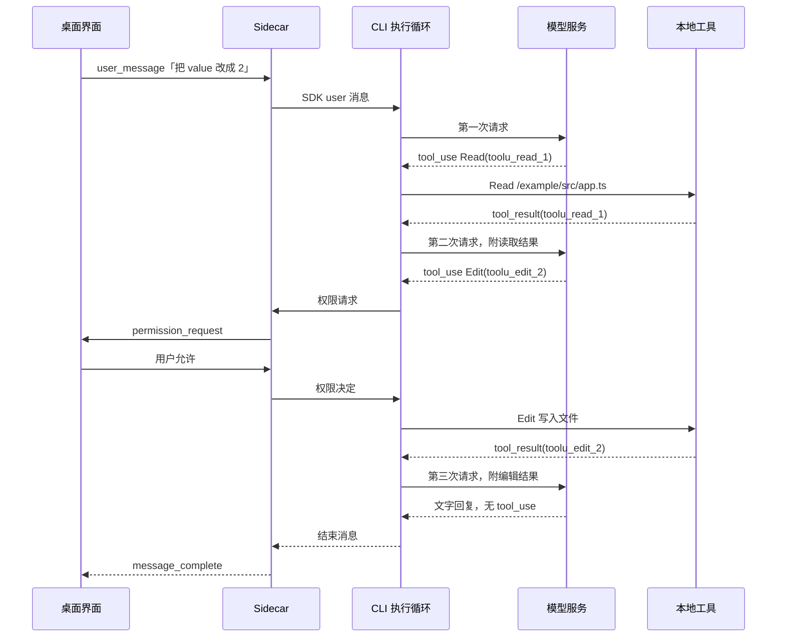

[English](./00-overview.en.md) | 简体中文

# 编程智能体如何完成一次代码修改

模型接收文字、返回文字，本身不能打开本地文件。可是在 DreamCoder 里输入“把 `value` 改成 2”，项目中的文件确实被改了。初次接触编程智能体，通常会先问：谁读了文件，谁写了文件，模型在其中做了什么？答案是模型外面的一组程序：它们把可用工具告诉模型，执行模型提出的工具请求，再把结果交回模型。

本篇用一次构造的小修改走完整条路径，再把每一步对应到 DreamCoder 的源码位置，并给出后续各篇在这条路径上的位置。本系列是源码导读，阅读时需要 TypeScript 基础和 `async/await`，其他概念在首次出现时说明。

## 模型之外的程序做什么

去掉界面、权限和各种异常处理，一次代码修改只需要模型外的程序做四件事：

1. 把用户的要求、此前的对话和可用工具的说明一起发给模型。
2. 读取模型的回复。回复里可能有文字，也可能有工具调用请求（`tool_use`），内容是工具名称和参数，例如“用 `Read` 读取 `/example/src/app.ts`”。
3. 在本机执行模型请求的工具，把执行结果（`tool_result`）作为新消息，连同前面的消息再发给模型。
4. 重复第 2、3 步，直到模型的回复不再包含工具调用，然后把最终回复交给用户。

读文件、写文件都由本地程序完成。模型只决定调用哪个工具、传什么参数，并根据返回的结果决定下一步。第 2 到第 4 步构成的循环叫执行循环，[第一篇](./01-execution-loop.zh.md)专门讲它。

## 一次修改的完整过程

项目中有一个文件：

```ts
// /example/src/app.ts
export const value = 1
```

用户在桌面端输入“把 `value` 改成 2”并发送。整个过程中，用户只发送了这一条消息，程序向模型发了三次请求。

**第一次请求。** 程序把用户消息和工具说明发给模型。模型还不知道文件内容，于是请求读取：

```json
{
  "type": "tool_use",
  "id": "toolu_read_1",
  "name": "Read",
  "input": { "file_path": "/example/src/app.ts" }
}
```

程序执行 `Read`，得到带行号的文件内容，写成一个 `tool_result`：

```json
{
  "type": "tool_result",
  "tool_use_id": "toolu_read_1",
  "content": "1\texport const value = 1"
}
```

**第二次请求。** 程序把上一步的 `tool_use` 和 `tool_result` 追加到消息末尾，再请求模型。模型看到了文件内容，提出修改：

```json
{
  "type": "tool_use",
  "id": "toolu_edit_2",
  "name": "Edit",
  "input": {
    "file_path": "/example/src/app.ts",
    "old_string": "export const value = 1",
    "new_string": "export const value = 2"
  }
}
```

`Edit` 执行前要经过两项检查：参数检查要求目标文件先被 `Read` 读过、读取后没有被改动，且 `old_string` 能在文件中找到（[第二篇](./02-code-tools.zh.md)）；权限检查在默认模式下可能要求用户确认（[第三篇](./03-permissions.zh.md)）。用户允许后，`Edit` 写入文件，返回 `tool_use_id` 为 `toolu_edit_2`、内容为 `The file /example/src/app.ts has been updated successfully.` 的结果。每个 `tool_result` 通过 `tool_use_id` 指回对应的 `tool_use`，这组对应关系在[第一篇](./01-execution-loop.zh.md#从-tool_use-到-tool_result)说明。

**第三次请求。** 程序再次追加消息并请求模型。模型回复“已将 `value` 改为 2”，没有工具调用，执行循环结束。文件变为：

```ts
// /example/src/app.ts
export const value = 2
```

模型也可以在第三次请求时再读一次文件，或运行类型检查确认结果，那样就会多出一轮工具调用。先读还是先搜索、要不要验证，都由模型根据上下文决定，程序没有规定工具的调用顺序。

### 桌面界面上看到的

1. 用户发送消息后，会话进入运行状态（`chatState` 为 `thinking`）。[`chatStore.sendMessage()`](https://github.com/GoDiao/dreamcoder/blob/dba5b24c75be4e3c35cd42d082dc9a7f8b631087/desktop/src/stores/chatStore.ts#L881)
2. 对话区出现 `Read` 的工具调用记录，包含工具名称和参数；随后出现它的结果。[`tool_use_complete` 处理](https://github.com/GoDiao/dreamcoder/blob/dba5b24c75be4e3c35cd42d082dc9a7f8b631087/desktop/src/stores/chatStore.ts#L1433)、[`tool_result` 处理](https://github.com/GoDiao/dreamcoder/blob/dba5b24c75be4e3c35cd42d082dc9a7f8b631087/desktop/src/stores/chatStore.ts#L1469)
3. 出现 `Edit` 的调用记录。需要确认时，界面显示权限请求并等待用户选择；用户允许后，出现 `Edit` 的结果。[`permission_request` 处理](https://github.com/GoDiao/dreamcoder/blob/dba5b24c75be4e3c35cd42d082dc9a7f8b631087/desktop/src/stores/chatStore.ts#L1502)
4. 模型的最终回复逐段显示，结束后会话回到空闲状态。[`message_complete` 处理](https://github.com/GoDiao/dreamcoder/blob/dba5b24c75be4e3c35cd42d082dc9a7f8b631087/desktop/src/stores/chatStore.ts#L1562)

界面只显示这些事件，读哪个文件、改成什么由模型提出，执行由 CLI 完成。

## 对应到 DreamCoder 源码

DreamCoder 桌面版由三部分组成：桌面 React 界面；Sidecar，即桌面应用附带的本地服务进程；CLI，即由 Sidecar 启动的子进程，执行循环在其中运行。下图上方是桌面输入到 CLI 的消息通道，下方是 CLI 中的执行循环与本地工具、模型服务之间的往返。


| 位置 | 职责 | 源码入口 |
| --- | --- | --- |
| 桌面 React 界面 | 保存界面状态，发送用户输入，展示输出 | [`chatStore.sendMessage()`](https://github.com/GoDiao/dreamcoder/blob/dba5b24c75be4e3c35cd42d082dc9a7f8b631087/desktop/src/stores/chatStore.ts#L881) |
| Sidecar | 按会话 ID 接收桌面消息，启动 CLI 子进程并转发消息 | [`handleWebSocket.message()`](https://github.com/GoDiao/dreamcoder/blob/dba5b24c75be4e3c35cd42d082dc9a7f8b631087/src/server/ws/handler.ts#L160)、[`ConversationService.startSession()`](https://github.com/GoDiao/dreamcoder/blob/dba5b24c75be4e3c35cd42d082dc9a7f8b631087/src/server/services/conversationService.ts#L155) |
| CLI 与执行循环 | 消费用户消息，请求模型，执行工具 | [`QueryEngine.submitMessage()`](https://github.com/GoDiao/dreamcoder/blob/dba5b24c75be4e3c35cd42d082dc9a7f8b631087/src/QueryEngine.ts#L211)、[`query()`](https://github.com/GoDiao/dreamcoder/blob/dba5b24c75be4e3c35cd42d082dc9a7f8b631087/src/query.ts#L220) |

把上一节的例子放到这些位置上，时序如下：



图中省略了执行期间的输出：每条助手消息和工具结果产生后，都会经 Sidecar 陆续送到界面。

**去程。** 桌面经会话 WebSocket 发送 `user_message`，Sidecar 的 [`handleUserMessage()`](https://github.com/GoDiao/dreamcoder/blob/dba5b24c75be4e3c35cd42d082dc9a7f8b631087/src/server/ws/handler.ts#L267) 先确认该会话的 CLI 进程已经启动，再调用 [`ConversationService.sendMessage()`](https://github.com/GoDiao/dreamcoder/blob/dba5b24c75be4e3c35cd42d082dc9a7f8b631087/src/server/services/conversationService.ts#L395)，把输入封装为 SDK 用户消息送给 CLI。进程怎样启动、消息经哪两条连接传输，见[第六篇](./06-desktop-integration.zh.md#一个桌面会话怎样运行)。

**CLI 内部。** [`QueryEngine.submitMessage()`](https://github.com/GoDiao/dreamcoder/blob/dba5b24c75be4e3c35cd42d082dc9a7f8b631087/src/QueryEngine.ts#L696) 把消息、系统提示、工具上下文和权限函数传给 `query()`，三次模型请求都发生在其中的 [`queryLoop()`](https://github.com/GoDiao/dreamcoder/blob/dba5b24c75be4e3c35cd42d082dc9a7f8b631087/src/query.ts#L242)：

| 例子中的步骤 | 代码位置 |
| --- | --- |
| 请求模型（三次） | [`deps.callModel()`](https://github.com/GoDiao/dreamcoder/blob/dba5b24c75be4e3c35cd42d082dc9a7f8b631087/src/query.ts#L660) |
| 从回复中找出 `tool_use` | [`queryLoop()`](https://github.com/GoDiao/dreamcoder/blob/dba5b24c75be4e3c35cd42d082dc9a7f8b631087/src/query.ts#L827) |
| 执行 `Read` 和 `Edit` | [`runTools()`](https://github.com/GoDiao/dreamcoder/blob/dba5b24c75be4e3c35cd42d082dc9a7f8b631087/src/services/tools/toolOrchestration.ts#L19) → [`runToolUse()`](https://github.com/GoDiao/dreamcoder/blob/dba5b24c75be4e3c35cd42d082dc9a7f8b631087/src/services/tools/toolExecution.ts#L337) |
| `Edit` 的权限请求发到桌面 | CLI 发出 `can_use_tool` 控制请求，Sidecar 转成 [`permission_request`](https://github.com/GoDiao/dreamcoder/blob/dba5b24c75be4e3c35cd42d082dc9a7f8b631087/src/server/ws/handler.ts#L1208) |
| 回复没有 `tool_use`，循环结束 | [`queryLoop()` 的结束判断](https://github.com/GoDiao/dreamcoder/blob/dba5b24c75be4e3c35cd42d082dc9a7f8b631087/src/query.ts#L1063) |

**回程。** CLI 的输出回到 Sidecar 后，由 [`translateCliMessage()`](https://github.com/GoDiao/dreamcoder/blob/dba5b24c75be4e3c35cd42d082dc9a7f8b631087/src/server/ws/handler.ts#L962) 转成界面事件，也就是上一节列出的 `tool_use_complete`、`tool_result`、`message_complete` 等。各类消息与界面事件的对应见[第六篇](./06-desktop-integration.zh.md#第-4-步输出回到客户端)。

## 为什么读写由本地程序执行

以下是对这段实现效果的分析。

模型只提出工具请求，文件和命令操作都经过 CLI 的同一个执行层。参数校验、权限判定和结果格式化都在这一层完成；工具失败或被拒绝时，执行层同样生成带原 ID 的 `tool_result`，模型可以据此调整下一步。代价是每一轮工具结果都要交回模型，由模型决定下一步：一次回复可以包含多个工具调用，结果汇总后再请求一次模型，但连续的工具调用轮次会增加请求次数和等待时间。本例用了两轮工具调用、三次模型请求，每次请求都带着此前的消息。

## 例子之外的情况

> 首次阅读可以先跳过本节，读完第一到第三篇再回来看。

- **工具失败或权限被拒绝。** 例如 `Edit` 的 `old_string` 在文件中找不到，或用户拒绝了写入。执行层生成 `is_error: true` 的 `tool_result`，模型在下一次请求中看到错误，可能换一种参数重试，也可能直接回复用户。见[第二篇](./02-code-tools.zh.md)和[第三篇](./03-permissions.zh.md)。
- **一次回复提出多个工具调用。** 可并发的调用会一起执行，见[第二篇](./02-code-tools.zh.md#并发由输入决定)。
- **循环结束不等于任务完成。** 结束原因为 `completed` 时，不能据此判断用户要求的修改已经完成，见[第一篇](./01-execution-loop.zh.md#何时结束伪代码之外的分支)。
- **用户中断或模型请求失败。** 已写入的文件不会被撤销，见[第五篇](./05-streaming-recovery.zh.md)。

## 后续各篇的位置

| 篇目 | 在这条路径上的位置 | 回答的问题 |
| --- | --- | --- |
| [第一篇：执行循环](./01-execution-loop.zh.md) | CLI 中的 `query()` / `queryLoop()` | 三次模型请求怎样由同一个循环完成，循环何时结束 |
| [第二篇：代码工具系统](./02-code-tools.zh.md) | `runTools()` 到 `Read` / `Edit` | 程序怎样按名称找到工具、校验参数、组织结果 |
| [第三篇：权限控制](./03-permissions.zh.md) | `Edit` 执行前的权限判定与桌面确认 | 何时需要用户确认，确认结果怎样回到工具调用 |
| [第四篇：会话与上下文](./04-session-context.zh.md) | 每次模型请求前的消息整理与会话记录 | 重新打开会话时恢复什么，消息过长时怎样处理 |
| [第五篇：流式响应与故障恢复](./05-streaming-recovery.zh.md) | 模型输出与工具执行的流式路径 | 中断、失败和重试时，哪些已经执行，哪些会重复 |
| [第六篇：模型接入与桌面端集成](./06-desktop-integration.zh.md) | Sidecar 与 CLI 子进程 | Provider 配置怎样进入 CLI，会话进程怎样启动，H5 怎样接入 |

## 小结

- 模型只提出工具调用，本地程序执行 `Read`、`Edit` 等工具并把 `tool_result` 交回模型；一条用户消息可能对应多次模型请求。
- DreamCoder 桌面版的路径是：桌面界面 → Sidecar → CLI 执行循环 → 模型服务与本地工具，执行期间的消息沿原路转成界面事件返回。
- 读哪个文件、按什么顺序调用工具由模型决定；参数校验、权限判定和结束判断由程序完成。

这三次模型请求如何由同一个循环完成，下一篇[《智能体的执行循环》](./01-execution-loop.zh.md)从 `query()` 开始读。
