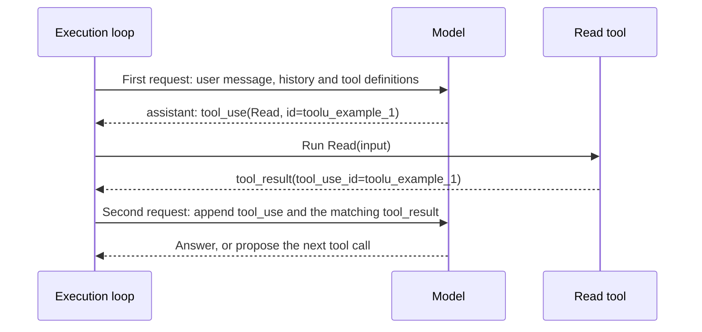
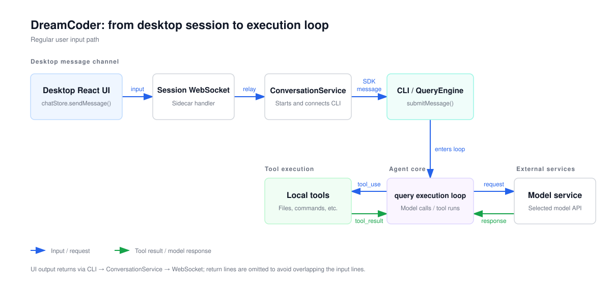
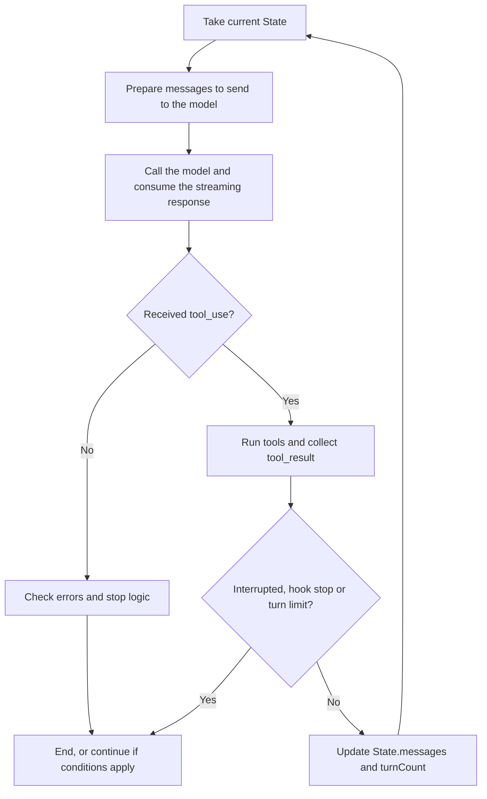

English | [简体中文](./01-execution-loop.zh.md)

# The agent's execution loop

A model by itself only generates text. When the user says "Change `value` to 2", a coding agent can still read the file first, then edit it, then check the result. A program outside the model carries out these actions: it requests the model, runs a tool when the model asks to call one, hands the result back to the model, and requests it again. This program is called the execution loop (agent loop).

This chapter first explains the minimal execution loop in four steps, then maps each step to DreamCoder's `queryLoop()`, and ends with the conditions under which the loop stops. Before reading, you need to know TypeScript's `async/await`. Async generators are explained where they first appear.

## The minimal execution loop

Leaving out streaming output, permissions, context compaction and the various recovery branches, the execution loop has only four steps:

1. Send the current messages and the definitions of available tools to the model.
2. Check whether the model response contains tool calls (`tool_use`). If not, end.
3. Run these tools and produce one tool result (`tool_result`) for each call.
4. Append the model response and the tool results to the end of the messages, and go back to step 1.

Written as pseudocode, it looks roughly like this. **This is simplified code written to explain the structure. It is not DreamCoder source code.**

```ts
async function agentLoop(messages, tools) {
  while (true) {
    const response = await callModel(messages, tools)             // Step 1
    const toolUses = response.content.filter(b => b.type === 'tool_use')
    if (toolUses.length === 0) return response                    // Step 2
    const results = []
    for (const use of toolUses) {                                 // Step 3
      const output = await runTool(use.name, use.input)
      results.push({ type: 'tool_result', tool_use_id: use.id, content: output })
    }
    messages = [                                                  // Step 4
      ...messages,
      { role: 'assistant', content: response.content },
      { role: 'user', content: results },
    ]
  }
}
```

So one user input may correspond to several model requests. The first response asks to read the file, and the program runs the read and hands the contents back. Only the second response can propose an edit. The user does not need to send another message for each tool call.

For a single `Read`, the two requests run in this order:



### From `tool_use` to `tool_result`

A tool call proposed by the model is a content block that contains the tool name, the arguments and a call ID. The tool name `Read` comes from [`FILE_READ_TOOL_NAME`](https://github.com/GoDiao/dreamcoder/blob/dba5b24c75be4e3c35cd42d082dc9a7f8b631087/src/tools/FileReadTool/prompt.ts#L5):

```json
{
  "type": "tool_use",
  "id": "toolu_example_1",
  "name": "Read",
  "input": { "file_path": "/example/src/query.ts" }
}
```

After the tool finishes, the user message in the next model request contains a `tool_result` content block that points back to the original call with `tool_use_id`:

```json
{
  "type": "tool_result",
  "tool_use_id": "toolu_example_1",
  "content": "...file contents or error message..."
}
```

The result may be a success, or it may carry `is_error: true`. For example, when the tool name does not exist, [`runToolUse()`](https://github.com/GoDiao/dreamcoder/blob/dba5b24c75be4e3c35cd42d082dc9a7f8b631087/src/services/tools/toolExecution.ts#L337) produces an error result with the original `tool_use.id`, so that the model knows in the next round which call failed.

This correspondence is the main difference between a `tool_result` and ordinary text output. One response may contain multiple `tool_use` blocks, and calls that can run concurrently also produce results in the order they finish (see [Part 2](./02-code-tools.en.md#concurrency-is-decided-by-input)). If the tool outputs were just joined into one piece of text and put back into the prompt, the model could not reliably tell which call each piece of output came from, nor which one failed. With results paired by `tool_use.id`, neither the order of the results nor their success or failure affects which call they belong to. When later chapters mention "a result with the original ID", they mean this correspondence.

## Mapping to the DreamCoder source

The DreamCoder desktop version first sends user input to the CLI session through WebSocket and the Sidecar. The [overview](./00-overview.en.md) covers this transport. This chapter picks up after the CLI receives the input. The diagram below marks the positions of the CLI, the execution loop, the model service and the local tools.



| Location | Responsibility in this execution |
| --- | --- |
| [`desktop/src/stores/chatStore.ts`](https://github.com/GoDiao/dreamcoder/blob/dba5b24c75be4e3c35cd42d082dc9a7f8b631087/desktop/src/stores/chatStore.ts#L991), [`src/server/services/conversationService.ts`](https://github.com/GoDiao/dreamcoder/blob/dba5b24c75be4e3c35cd42d082dc9a7f8b631087/src/server/services/conversationService.ts#L395) | Send desktop input to the CLI session. This chapter starts reading downstream of them. |
| [`src/QueryEngine.ts`](https://github.com/GoDiao/dreamcoder/blob/dba5b24c75be4e3c35cd42d082dc9a7f8b631087/src/QueryEngine.ts#L211) | `submitMessage()` prepares this input, the session state and the permission function, calls `query()`, and consumes the messages produced during execution. |
| [`src/query.ts`](https://github.com/GoDiao/dreamcoder/blob/dba5b24c75be4e3c35cd42d082dc9a7f8b631087/src/query.ts#L220) | `query()` is the public entry point. The internal `queryLoop()` implements the four-step loop. |
| [`src/query/deps.ts`](https://github.com/GoDiao/dreamcoder/blob/dba5b24c75be4e3c35cd42d082dc9a7f8b631087/src/query/deps.ts#L33), [`src/services/api/claude.ts`](https://github.com/GoDiao/dreamcoder/blob/dba5b24c75be4e3c35cd42d082dc9a7f8b631087/src/services/api/claude.ts#L755) | Connect the model call in step 1 to `queryModelWithStreaming()`. |
| [`src/services/tools/toolOrchestration.ts`](https://github.com/GoDiao/dreamcoder/blob/dba5b24c75be4e3c35cd42d082dc9a7f8b631087/src/services/tools/toolOrchestration.ts#L19), [`src/services/tools/StreamingToolExecutor.ts`](https://github.com/GoDiao/dreamcoder/blob/dba5b24c75be4e3c35cd42d082dc9a7f8b631087/src/services/tools/StreamingToolExecutor.ts#L40) | Regular and streaming tool execution for step 3, which hand the results back to the loop. |

The main reading path is `QueryEngine.submitMessage() → query() → queryLoop()`. We look at the entry point first, then go through the four steps in turn.

### Entry point: one `query()` call

[`QueryEngine.submitMessage()`](https://github.com/GoDiao/dreamcoder/blob/dba5b24c75be4e3c35cd42d082dc9a7f8b631087/src/QueryEngine.ts#L696) passes this input's messages, the system prompt, the tool context and the permission function to `query()`:

```ts
for await (const message of query({
  messages,
  systemPrompt,
  userContext,
  systemContext,
  canUseTool: wrappedCanUseTool,
  toolUseContext: processUserInputContext,
  fallbackModel,
  querySource: 'sdk',
  maxTurns,
  taskBudget,
})) {
  // QueryEngine consumes the messages produced by this execution
}
```

`query()` is an async generator. An async generator is a function whose items can be read one by one with `for await`: each time the function body executes a `yield`, it hands over one item, and the function continues running after the caller has processed it. Whatever the function finally `return`s becomes its return value when it ends. Here, `yield` hands messages and streaming events produced during execution to `QueryEngine`, and `return` gives the reason the loop terminated. The `for await` above reads only the `yield` items and does not directly obtain the return value.

The core inputs of [`QueryParams`](https://github.com/GoDiao/dreamcoder/blob/dba5b24c75be4e3c35cd42d082dc9a7f8b631087/src/query.ts#L183) include the current `messages`, the system prompt and context, the `canUseTool` permission function and `toolUseContext`. The latter provides the tool set and the context needed for execution. Parameters such as `fallbackModel` and `maxTurns` control optional branches.

### Step 1: request the model

The model call happens in [`deps.callModel()`](https://github.com/GoDiao/dreamcoder/blob/dba5b24c75be4e3c35cd42d082dc9a7f8b631087/src/query.ts#L660). In production, [`productionDeps()`](https://github.com/GoDiao/dreamcoder/blob/dba5b24c75be4e3c35cd42d082dc9a7f8b631087/src/query/deps.ts#L33) points `callModel` to `queryModelWithStreaming()`. Below are several consecutive lines of the call arguments. Parameters such as model selection are in the `options` that follow:

```ts
messages: prependUserContext(messagesForQuery, userContext),
systemPrompt: fullSystemPrompt,
thinkingConfig: toolUseContext.options.thinkingConfig,
tools: toolUseContext.options.tools,
signal: toolUseContext.abortController.signal,
```

`tools` corresponds to the tool definitions in the pseudocode, and `signal` lets the request respond to user cancellation. The messages sent to the model are `messagesForQuery`: each iteration takes the messages after the compact boundary from `State.messages`, then, according to the current configuration, applies the tool result budget, optional history trimming and auto-compaction, and finally attaches the user context through `prependUserContext()`. [`queryLoop()`](https://github.com/GoDiao/dreamcoder/blob/dba5b24c75be4e3c35cd42d082dc9a7f8b631087/src/query.ts#L375) The pseudocode sends all `messages` directly. The real code adds context preparation at this step, which Part 4 covers in detail.

### Step 2: detect tool calls

`deps.callModel()` returns an async message stream. The loop passes each item up to the upper layer and at the same time collects the complete assistant message. One response may propose multiple tool requests. The code in [`queryLoop()`](https://github.com/GoDiao/dreamcoder/blob/dba5b24c75be4e3c35cd42d082dc9a7f8b631087/src/query.ts#L827) that extracts tool requests is as follows: [source](https://github.com/GoDiao/dreamcoder/blob/dba5b24c75be4e3c35cd42d082dc9a7f8b631087/src/query.ts#L830)

```ts
const msgToolUseBlocks = message.message.content.filter(
  content => content.type === 'tool_use',
) as ToolUseBlock[]
if (msgToolUseBlocks.length > 0) {
  toolUseBlocks.push(...msgToolUseBlocks)
  needsFollowUp = true
}
```

This corresponds to the `filter` and `if` in the pseudocode. `needsFollowUp` means that this round has tool results to hand back to the model. A comment in the source says that `stop_reason === 'tool_use'` in the API response is not always reliable, so `needsFollowUp` is set based on the content blocks actually received. [`queryLoop()`](https://github.com/GoDiao/dreamcoder/blob/dba5b24c75be4e3c35cd42d082dc9a7f8b631087/src/query.ts#L553)

### Step 3: run tools and collect results

The two tool execution paths meet at the same place in [`queryLoop()`](https://github.com/GoDiao/dreamcoder/blob/dba5b24c75be4e3c35cd42d082dc9a7f8b631087/src/query.ts#L1381):

```ts
const toolUpdates = streamingToolExecutor
  ? streamingToolExecutor.getRemainingResults()
  : runTools(toolUseBlocks, assistantMessages, canUseTool, toolUseContext)
```

The regular path is orchestrated by [`runTools()`](https://github.com/GoDiao/dreamcoder/blob/dba5b24c75be4e3c35cd42d082dc9a7f8b631087/src/services/tools/toolOrchestration.ts#L19). Tool lookup, input validation and the permission decision happen in lower layers, which [Part 2](./02-code-tools.en.md) goes through layer by layer. When streaming tool execution is enabled, `StreamingToolExecutor` can accept tool requests and start running them before the model response has finished, and this line obtains the remaining results. [Part 5](./05-streaming-recovery.en.md) explains the mechanism in detail.

The `update.message` returned by the execution layer is first `yield`ed by the loop to the upper layer, then converted into a result the model can see: [source](https://github.com/GoDiao/dreamcoder/blob/dba5b24c75be4e3c35cd42d082dc9a7f8b631087/src/query.ts#L1396)

```ts
toolResults.push(
  ...normalizeMessagesForAPI(
    [update.message],
    toolUseContext.options.tools,
  ).filter(_ => _.type === 'user'),
)
```

Only the converted `user` messages go into `toolResults`, for use in later model requests. So the tool progress the UI sees differs from the messages the model receives next time. Progress and attachments each have their own rules during conversion.

### Step 4: update state and enter the next round

The pseudocode keeps all state in one `messages` variable. The [`State`](https://github.com/GoDiao/dreamcoder/blob/dba5b24c75be4e3c35cd42d082dc9a7f8b631087/src/query.ts#L201) of `queryLoop()` also has to remember the tool context, the turn count, the context compaction state and some recovery state. When preparing the next round, [`queryLoop()`](https://github.com/GoDiao/dreamcoder/blob/dba5b24c75be4e3c35cd42d082dc9a7f8b631087/src/query.ts#L1718) builds the new `State` with the following three fields (excerpt):

```ts
messages: [...messagesForQuery, ...assistantMessages, ...toolResults],
turnCount: nextTurnCount,
transition: { reason: 'next_turn' },
```

The assistant messages come before the tool results, so that the next model request can see "which tool calls were proposed" and "what these calls returned". The loop also carries the updated `toolUseContext`, because tools may change the context needed for later execution.

The four arrays used in this line have different responsibilities, and each is declared in [`queryLoop()`](https://github.com/GoDiao/dreamcoder/blob/dba5b24c75be4e3c35cd42d082dc9a7f8b631087/src/query.ts#L550):

| Data | When it is produced | Purpose |
| --- | --- | --- |
| `State.messages` | Already held when entering this round; updated after tools finish | Starting point of the messages for the next round |
| `messagesForQuery` | Before each model call, prepared from this round's messages | The effective context this round is going to send to the model |
| `assistantMessages` | Collected while consuming this round's model response | Holds this round's assistant messages, including any `tool_use` |
| `toolResults` | Collected while this round's tools run | Holds the tool results and related attachments that later model requests need to see |

`assistantMessages` and `toolResults` are local collectors for this round. The relationship between the transcript on disk and the model context is covered in [Part 4](./04-session-context.en.md).

The initial `turnCount` is 1. It increases by one when a batch of tool results has been processed and the loop is about to enter the next round. [`queryLoop()`](https://github.com/GoDiao/dreamcoder/blob/dba5b24c75be4e3c35cd42d082dc9a7f8b631087/src/query.ts#L270), [next-round state](https://github.com/GoDiao/dreamcoder/blob/dba5b24c75be4e3c35cd42d082dc9a7f8b631087/src/query.ts#L1674) A "turn" here is a count of the main execution loop and is unrelated to the number of messages the user sends. Model fallback and some recovery branches are not necessarily counted as regular tool rounds either.

For the earlier `Read` request, the state changes across the four steps as follows:

| Point | Main state | Next step |
| --- | --- | --- |
| Before step 1 | `turnCount = 1`; `messagesForQuery` contains this user input and the effective history | Request the model |
| Step 2 | `assistantMessages` receives the assistant message containing `tool_use.id = toolu_example_1`; `needsFollowUp = true` | Look up and run the tool |
| After step 3 | `toolResults` receives the result with `tool_use_id = toolu_example_1` | Check for interruption, Hooks and the turn limit |
| Step 4 | The new `State.messages` takes in `messagesForQuery`, `assistantMessages` and `toolResults`, in that order | Rebuild the context and request the model |

## Design analysis

The following is an analysis of what this implementation does.

### Why `query()` is an async generator

Within one call, the execution loop has to do two things: keep handing over messages during execution, so that the UI can display streaming text and tool progress; and give a termination reason at the end. An async generator handles these two with `yield` and `return` respectively. State such as the turn count and the message arrays stays inside the function, and the caller only needs to read with `for await`. The cost is that the caller has to tell two kinds of output apart: `for await` reads only the `yield` items, the termination reason has to be obtained separately, and that reason is not the same value as the final text shown to the user.

### Why the model is requested only after tool results are processed

The `State` update happens after tool processing, attachment collection and limit checks. The code does not request the model again as soon as it receives a `tool_use`. This gives a fixed checkpoint before every model request, where the loop checks interruption, Hooks and `maxTurns`. When the request is sent, every `tool_use` in this round also already has a matching `tool_result`. The cost is that tool results have to wait until all tools in this round are processed before they are given to the model. Streaming tool execution lets tools start running earlier, and the UI can also see results earlier, but the results given to the model still meet at this point. Part 5 covers the interruption and fallback issues this causes.

## When the loop ends: branches beyond the pseudocode

> You can skip this section on a first read and come back after reading Parts 2 and 3.

The pseudocode has only one end condition: the response has no `tool_use`. `queryLoop()` has several more checks after step 2:



The diagram still omits streaming tool execution, context compaction and error recovery branches.

| Condition | Handling in the current code |
| --- | --- |
| The model response has no `tool_use` | Goes through checks such as the stop hook. Returns `completed` when there is no blocking and no additional condition to continue. [source](https://github.com/GoDiao/dreamcoder/blob/dba5b24c75be4e3c35cd42d082dc9a7f8b631087/src/query.ts#L1063) |
| There are tool results, and no other condition intercepts | Merges the assistant messages and tool results into the next round's `State.messages` and requests the model again. [source](https://github.com/GoDiao/dreamcoder/blob/dba5b24c75be4e3c35cd42d082dc9a7f8b631087/src/query.ts#L1715) |
| `maxTurns` is set and the next round would exceed the limit | Produces a `max_turns_reached` attachment and returns `max_turns`. [source](https://github.com/GoDiao/dreamcoder/blob/dba5b24c75be4e3c35cd42d082dc9a7f8b631087/src/query.ts#L1705) |
| The user interrupts during the model stream or tool execution | Cleans up or fills in the corresponding tool results and returns `aborted_streaming` or `aborted_tools`. The two handling paths differ. [source](https://github.com/GoDiao/dreamcoder/blob/dba5b24c75be4e3c35cd42d082dc9a7f8b631087/src/query.ts#L1012), [tool phase](https://github.com/GoDiao/dreamcoder/blob/dba5b24c75be4e3c35cd42d082dc9a7f8b631087/src/query.ts#L1485) |
| The model call throws an error not handled by the recovery logic | Produces an API error message and returns `model_error`. [source](https://github.com/GoDiao/dreamcoder/blob/dba5b24c75be4e3c35cd42d082dc9a7f8b631087/src/query.ts#L955) |
| A Hook prevents the normal stop or prevents continuing | Depending on the Hook's return value, adds feedback and continues, or returns `stop_hook_prevented` or `hook_stopped`. [source](https://github.com/GoDiao/dreamcoder/blob/dba5b24c75be4e3c35cd42d082dc9a7f8b631087/src/query.ts#L1274), [tool phase](https://github.com/GoDiao/dreamcoder/blob/dba5b24c75be4e3c35cd42d082dc9a7f8b631087/src/query.ts#L1519) |

**Where `maxTurns` is checked.** After this round's tools run, the loop computes `nextTurnCount = turnCount + 1`, and only then decides whether it can build the next round's `State`. [`queryLoop()`](https://github.com/GoDiao/dreamcoder/blob/dba5b24c75be4e3c35cd42d082dc9a7f8b631087/src/query.ts#L1674) If `maxTurns = 1` is set and the first model response proposes a tool call, the tool may still run; the program returns `max_turns` before the second model request. So this limit controls whether the main loop can continue. Model fallback, error retries and continuation from the stop Hook also have their own branches, so you should not simply use `turnCount` to infer the number of all underlying API requests.

**What `completed` means.** It is the end reason of the execution loop and does not guarantee that the code change the user asked for has been made. When the model proposes no tool call, the loop still checks recoverable errors, the stop Hook and a token budget continuation that may be enabled. Only after all these branches are handled does it return `completed`. [`queryLoop()`](https://github.com/GoDiao/dreamcoder/blob/dba5b24c75be4e3c35cd42d082dc9a7f8b631087/src/query.ts#L1063), [completion branch](https://github.com/GoDiao/dreamcoder/blob/dba5b24c75be4e3c35cd42d082dc9a7f8b631087/src/query.ts#L1358)

**Interruption and errors.** The cancellation signal is handled differently at two points. If the model is still streaming output, the loop first consumes or fills in the results of tool calls that have already appeared, then returns `aborted_streaming`. If tools are running, it returns `aborted_tools` in the tool phase. [`queryLoop()`](https://github.com/GoDiao/dreamcoder/blob/dba5b24c75be4e3c35cd42d082dc9a7f8b631087/src/query.ts#L1012), [tool phase](https://github.com/GoDiao/dreamcoder/blob/dba5b24c75be4e3c35cd42d082dc9a7f8b631087/src/query.ts#L1485) A model error not handled by the recovery logic calls `yieldMissingToolResultBlocks()`, which produces an error result for each `tool_use` already output in this round, to handle calls that may be left dangling. [`yieldMissingToolResultBlocks()`](https://github.com/GoDiao/dreamcoder/blob/dba5b24c75be4e3c35cd42d082dc9a7f8b631087/src/query.ts#L125), [error branch](https://github.com/GoDiao/dreamcoder/blob/dba5b24c75be4e3c35cd42d082dc9a7f8b631087/src/query.ts#L955) Filling in messages only fixes the structure of the record. It does not revert file writes or command side effects that have already happened.

## Summary

- The minimal form of the execution loop has four steps: request the model, detect `tool_use`, run tools to get `tool_result`, and append the messages and request again.
- A `tool_result` points back to its original call with `tool_use_id`. When multiple tools run concurrently, fail or finish out of order, the model can still tell which call each result belongs to.
- DreamCoder's `queryLoop()` adds context preparation, streaming execution, checkpoints and multiple end conditions on top of the four steps. `completed` means the loop has ended, not that the task is done.

The next chapter, [The code tool system](./02-code-tools.en.md), continues along this call chain from step 3: how `runTools()` finds the implementation of `Read`, where it validates arguments and how it orders multiple tool calls.
