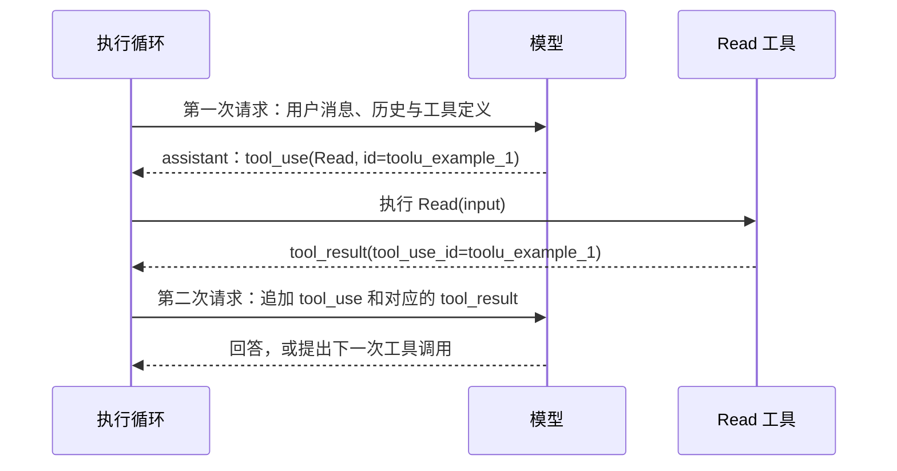
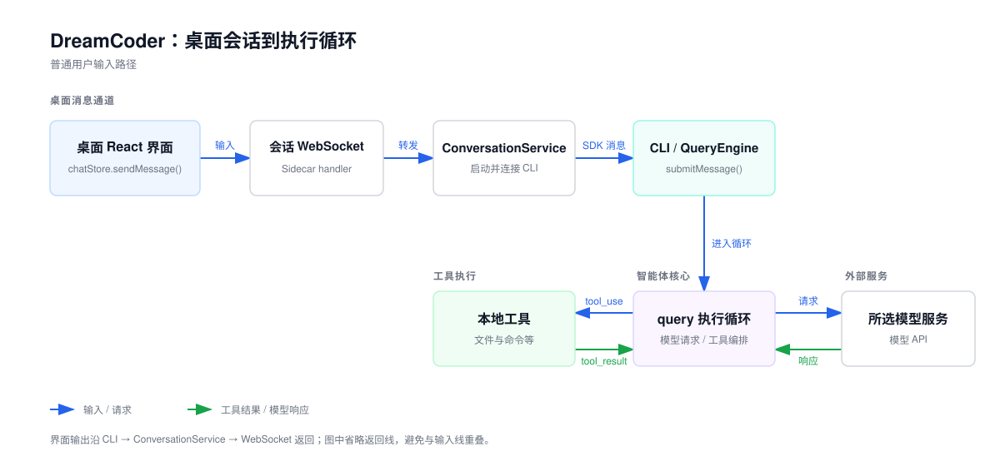
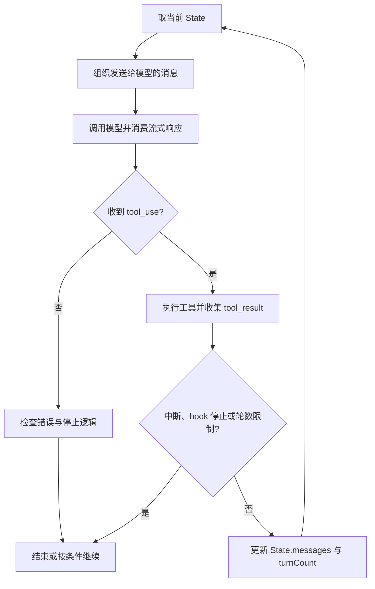

[English](./01-execution-loop.en.md) | 简体中文

# 智能体的执行循环

模型本身只生成文字。用户说“把 `value` 改成 2”，编程智能体却能先读文件、再修改、再检查结果。完成这些动作的是模型外面的一段程序：它请求模型，发现模型要调用工具就去执行，把结果交回模型，再请求一次。这段程序叫执行循环（Agent Loop）。

本篇先用四步说明最小的执行循环，再把每一步对应到 DreamCoder 的 `queryLoop()`，最后看循环在哪些条件下结束。阅读前需要了解 TypeScript 的 `async/await`；异步生成器在第一次出现时解释。

## 最小的执行循环

去掉流式输出、权限、上下文压缩和各类恢复分支，执行循环只有四步：

1. 把当前消息和可用工具的定义发给模型。
2. 检查模型响应里有没有工具调用（`tool_use`）；没有就结束。
3. 执行这些工具，为每个调用生成一个工具结果（`tool_result`）。
4. 把模型响应和工具结果追加到消息末尾，回到第 1 步。

写成伪代码大致如下。**这段是为说明结构写的简化代码，不是 DreamCoder 源码**：

```ts
async function agentLoop(messages, tools) {
  while (true) {
    const response = await callModel(messages, tools)             // 第 1 步
    const toolUses = response.content.filter(b => b.type === 'tool_use')
    if (toolUses.length === 0) return response                    // 第 2 步
    const results = []
    for (const use of toolUses) {                                 // 第 3 步
      const output = await runTool(use.name, use.input)
      results.push({ type: 'tool_result', tool_use_id: use.id, content: output })
    }
    messages = [                                                  // 第 4 步
      ...messages,
      { role: 'assistant', content: response.content },
      { role: 'user', content: results },
    ]
  }
}
```

因此一条用户输入可能对应多次模型请求。第一次响应要求读文件，程序执行后把内容交回；第二次响应才可能提出修改。用户不需要为每次工具调用再发一条消息。

以一次 `Read` 为例，两次请求的时序如下：



### 从 `tool_use` 到 `tool_result`

模型提出的工具调用是一个内容块，包含工具名称、参数和调用 ID。工具名称 `Read` 来自 [`FILE_READ_TOOL_NAME`](https://github.com/GoDiao/dreamcoder/blob/dba5b24c75be4e3c35cd42d082dc9a7f8b631087/src/tools/FileReadTool/prompt.ts#L5)：

```json
{
  "type": "tool_use",
  "id": "toolu_example_1",
  "name": "Read",
  "input": { "file_path": "/example/src/query.ts" }
}
```

工具执行完成后，下一次模型请求中的用户消息会包含一个 `tool_result` 内容块，用 `tool_use_id` 指回原调用：

```json
{
  "type": "tool_result",
  "tool_use_id": "toolu_example_1",
  "content": "……文件内容或错误信息……"
}
```

结果可能成功，也可能带 `is_error: true`。例如工具名称不存在时，[`runToolUse()`](https://github.com/GoDiao/dreamcoder/blob/dba5b24c75be4e3c35cd42d082dc9a7f8b631087/src/services/tools/toolExecution.ts#L337) 会生成带原 `tool_use.id` 的错误结果，让模型在下一轮知道哪次调用失败。

这组对应关系是 `tool_result` 与普通文本输出的主要区别。一次响应可能包含多个 `tool_use`，可并发的调用还会按完成先后产出结果（见[第二篇](./02-code-tools.zh.md#并发由输入决定)）。如果只把工具输出拼成一段文本放回提示词，模型无法可靠判断每段输出来自哪次调用，也分不清哪一次失败了。按 `tool_use.id` 配对后，结果的先后顺序和成败都不影响归属。后续各篇提到“带原 ID 的结果”，都指这里的对应关系。

## 对应到 DreamCoder 源码

DreamCoder 桌面版先将用户输入经 WebSocket 和 Sidecar 送入 CLI 会话，这段传输见[开篇](./00-overview.zh.md)。本篇从 CLI 收到输入之后读起。下图标出了 CLI、执行循环、模型服务和本地工具的位置。



| 位置 | 在这次执行中的职责 |
| --- | --- |
| [`desktop/src/stores/chatStore.ts`](https://github.com/GoDiao/dreamcoder/blob/dba5b24c75be4e3c35cd42d082dc9a7f8b631087/desktop/src/stores/chatStore.ts#L991)、[`src/server/services/conversationService.ts`](https://github.com/GoDiao/dreamcoder/blob/dba5b24c75be4e3c35cd42d082dc9a7f8b631087/src/server/services/conversationService.ts#L395) | 将桌面输入送到 CLI 会话；本篇从它们的下游开始读。 |
| [`src/QueryEngine.ts`](https://github.com/GoDiao/dreamcoder/blob/dba5b24c75be4e3c35cd42d082dc9a7f8b631087/src/QueryEngine.ts#L211) | `submitMessage()` 准备本次输入、会话状态和权限函数，调用 `query()`，消费执行期间产出的消息。 |
| [`src/query.ts`](https://github.com/GoDiao/dreamcoder/blob/dba5b24c75be4e3c35cd42d082dc9a7f8b631087/src/query.ts#L220) | `query()` 是对外的入口；内部 `queryLoop()` 实现四步循环。 |
| [`src/query/deps.ts`](https://github.com/GoDiao/dreamcoder/blob/dba5b24c75be4e3c35cd42d082dc9a7f8b631087/src/query/deps.ts#L33)、[`src/services/api/claude.ts`](https://github.com/GoDiao/dreamcoder/blob/dba5b24c75be4e3c35cd42d082dc9a7f8b631087/src/services/api/claude.ts#L755) | 将第 1 步的模型调用接到 `queryModelWithStreaming()`。 |
| [`src/services/tools/toolOrchestration.ts`](https://github.com/GoDiao/dreamcoder/blob/dba5b24c75be4e3c35cd42d082dc9a7f8b631087/src/services/tools/toolOrchestration.ts#L19)、[`src/services/tools/StreamingToolExecutor.ts`](https://github.com/GoDiao/dreamcoder/blob/dba5b24c75be4e3c35cd42d082dc9a7f8b631087/src/services/tools/StreamingToolExecutor.ts#L40) | 第 3 步的普通和流式工具执行，把结果交回循环。 |

阅读主线是 `QueryEngine.submitMessage() → query() → queryLoop()`。下面先看入口，再按四步逐一对照。

### 入口：一次 `query()` 调用

[`QueryEngine.submitMessage()`](https://github.com/GoDiao/dreamcoder/blob/dba5b24c75be4e3c35cd42d082dc9a7f8b631087/src/QueryEngine.ts#L696) 把本次消息、系统提示、工具上下文和权限函数传给 `query()`：

```ts
for await (const message of query({
  messages,
  systemPrompt,
  userContext,
  systemContext,
  canUseTool: wrappedCanUseTool,
  toolUseContext: processUserInputContext,
  fallbackModel,
  querySource: 'sdk',
  maxTurns,
  taskBudget,
})) {
  // QueryEngine 消费本次执行产生的消息
}
```

`query()` 是一个异步生成器。异步生成器是可以用 `for await` 逐项读取的函数：函数体每执行一次 `yield` 就交出一项，调用方处理完后函数继续运行；函数最后 `return` 的值是结束时的返回值。在这里，`yield` 把执行中的消息和流式事件交给 `QueryEngine`，`return` 给出循环的终止原因。上面的 `for await` 只读取 `yield` 项，不直接取得返回值。

[`QueryParams`](https://github.com/GoDiao/dreamcoder/blob/dba5b24c75be4e3c35cd42d082dc9a7f8b631087/src/query.ts#L183) 的核心输入包括当前 `messages`、系统提示与上下文、`canUseTool` 权限函数和 `toolUseContext`。后者提供工具集合及执行所需的上下文。`fallbackModel`、`maxTurns` 等参数控制可选分支。

### 第 1 步：请求模型

模型调用发生在 [`deps.callModel()`](https://github.com/GoDiao/dreamcoder/blob/dba5b24c75be4e3c35cd42d082dc9a7f8b631087/src/query.ts#L660)。生产环境中，[`productionDeps()`](https://github.com/GoDiao/dreamcoder/blob/dba5b24c75be4e3c35cd42d082dc9a7f8b631087/src/query/deps.ts#L33) 把 `callModel` 指向 `queryModelWithStreaming()`。下面是调用参数中的连续几行；模型选择等参数位于后面的 `options` 中：

```ts
messages: prependUserContext(messagesForQuery, userContext),
systemPrompt: fullSystemPrompt,
thinkingConfig: toolUseContext.options.thinkingConfig,
tools: toolUseContext.options.tools,
signal: toolUseContext.abortController.signal,
```

`tools` 对应伪代码中的工具定义，`signal` 使请求能响应用户取消。发给模型的消息是 `messagesForQuery`：每次迭代从 `State.messages` 取压缩边界之后的消息，再按当前配置处理工具结果预算、可选的历史裁剪与自动压缩，最后经 `prependUserContext()` 附加用户上下文。[`queryLoop()`](https://github.com/GoDiao/dreamcoder/blob/dba5b24c75be4e3c35cd42d082dc9a7f8b631087/src/query.ts#L375) 伪代码直接发送全部 `messages`，实际代码在这一步多了上下文整理，第四篇会展开。

### 第 2 步：识别工具调用

`deps.callModel()` 返回异步消息流。循环逐项向上层输出，同时收集完整的助手消息；一次响应可能提出多个工具请求。[`queryLoop()`](https://github.com/GoDiao/dreamcoder/blob/dba5b24c75be4e3c35cd42d082dc9a7f8b631087/src/query.ts#L827) 提取工具请求的代码如下：[源码](https://github.com/GoDiao/dreamcoder/blob/dba5b24c75be4e3c35cd42d082dc9a7f8b631087/src/query.ts#L830)

```ts
const msgToolUseBlocks = message.message.content.filter(
  content => content.type === 'tool_use',
) as ToolUseBlock[]
if (msgToolUseBlocks.length > 0) {
  toolUseBlocks.push(...msgToolUseBlocks)
  needsFollowUp = true
}
```

这对应伪代码中的 `filter` 和 `if`。`needsFollowUp` 表示本轮有工具结果要交回模型。源码注释说明，API 响应的 `stop_reason === 'tool_use'` 并不总是可靠，所以 `needsFollowUp` 根据实际收到的内容块设置。[`queryLoop()`](https://github.com/GoDiao/dreamcoder/blob/dba5b24c75be4e3c35cd42d082dc9a7f8b631087/src/query.ts#L553)

### 第 3 步：执行工具并收集结果

两种工具执行路径在 [`queryLoop()`](https://github.com/GoDiao/dreamcoder/blob/dba5b24c75be4e3c35cd42d082dc9a7f8b631087/src/query.ts#L1381) 的同一位置汇合：

```ts
const toolUpdates = streamingToolExecutor
  ? streamingToolExecutor.getRemainingResults()
  : runTools(toolUseBlocks, assistantMessages, canUseTool, toolUseContext)
```

普通路径由 [`runTools()`](https://github.com/GoDiao/dreamcoder/blob/dba5b24c75be4e3c35cd42d082dc9a7f8b631087/src/services/tools/toolOrchestration.ts#L19) 编排，工具查找、输入校验和权限决定发生在下层，[第二篇](./02-code-tools.zh.md)逐层展开。启用流式工具执行时，`StreamingToolExecutor` 在模型响应尚未结束时就可以接收工具请求并开始执行，这里取得剩余结果；详细机制见[第五篇](./05-streaming-recovery.zh.md)。

执行层返回的 `update.message` 先由循环 `yield` 给上层，再转换成模型可见的结果：[源码](https://github.com/GoDiao/dreamcoder/blob/dba5b24c75be4e3c35cd42d082dc9a7f8b631087/src/query.ts#L1396)

```ts
toolResults.push(
  ...normalizeMessagesForAPI(
    [update.message],
    toolUseContext.options.tools,
  ).filter(_ => _.type === 'user'),
)
```

只有转换后的 `user` 消息进入 `toolResults`，供后续模型请求使用。因此界面看到的工具进度与模型下一次收到的消息不同，进度与附件在转换时各有规则。

### 第 4 步：更新状态，进入下一轮

伪代码用一个 `messages` 变量保存全部状态。`queryLoop()` 的 [`State`](https://github.com/GoDiao/dreamcoder/blob/dba5b24c75be4e3c35cd42d082dc9a7f8b631087/src/query.ts#L201) 还要记住工具上下文、轮数、上下文压缩状态和部分恢复状态。准备下一轮时，[`queryLoop()`](https://github.com/GoDiao/dreamcoder/blob/dba5b24c75be4e3c35cd42d082dc9a7f8b631087/src/query.ts#L1718) 用下面三个字段建立新的 `State`（节选）：

```ts
messages: [...messagesForQuery, ...assistantMessages, ...toolResults],
turnCount: nextTurnCount,
transition: { reason: 'next_turn' },
```

助手消息排在工具结果之前，下一次模型请求才能看到“提出了什么工具调用”和“这次调用返回了什么”。循环同时带上更新后的 `toolUseContext`，因为工具可能修改后续执行所需的上下文。

这一行用到的四个数组职责不同，在 [`queryLoop()`](https://github.com/GoDiao/dreamcoder/blob/dba5b24c75be4e3c35cd42d082dc9a7f8b631087/src/query.ts#L550) 中分别声明：

| 数据 | 何时产生 | 用途 |
| --- | --- | --- |
| `State.messages` | 进入本轮时已经持有；工具完成后更新 | 下一轮循环的消息起点 |
| `messagesForQuery` | 每次模型调用前，从本轮消息整理得到 | 本轮准备发送给模型的有效上下文 |
| `assistantMessages` | 消费本轮模型响应时收集 | 保存本轮助手消息，包括可能出现的 `tool_use` |
| `toolResults` | 本轮工具执行时收集 | 保存后续模型请求要看到的工具结果和相关附件 |

`assistantMessages` 和 `toolResults` 是本轮的局部收集器；磁盘 transcript 与模型上下文的关系见[第四篇](./04-session-context.zh.md)。

初始 `turnCount` 是 1，一批工具结果处理完成、准备进入下一轮时加一。[`queryLoop()`](https://github.com/GoDiao/dreamcoder/blob/dba5b24c75be4e3c35cd42d082dc9a7f8b631087/src/query.ts#L270)、[下一轮状态](https://github.com/GoDiao/dreamcoder/blob/dba5b24c75be4e3c35cd42d082dc9a7f8b631087/src/query.ts#L1674) 这里的“轮”是主执行循环的计数，与用户发送的消息条数无关；模型回退和部分恢复分支也不一定按普通工具轮次计数。

把前面的 `Read` 请求放进四步，状态变化如下：

| 时点 | 主要状态 | 下一步 |
| --- | --- | --- |
| 第 1 步之前 | `turnCount = 1`；`messagesForQuery` 含本次用户输入及有效历史 | 请求模型 |
| 第 2 步 | `assistantMessages` 收到含 `tool_use.id = toolu_example_1` 的助手消息；`needsFollowUp = true` | 查找并执行工具 |
| 第 3 步之后 | `toolResults` 收到带 `tool_use_id = toolu_example_1` 的结果 | 检查中断、Hook 与轮数限制 |
| 第 4 步 | 新 `State.messages` 依次纳入 `messagesForQuery`、`assistantMessages`、`toolResults` | 重新构建上下文并请求模型 |

## 设计分析

以下是对这段实现效果的分析。

### 为什么 `query()` 用异步生成器

执行循环在一次调用中要做两件事：执行期间持续交出消息，让界面能显示流式文本和工具进度；结束时给出一个终止原因。异步生成器用 `yield` 和 `return` 分别承担这两件事，轮数、消息数组等状态都留在函数内部，调用方只需 `for await` 读取。代价是调用方要分清两类输出：`for await` 读到的是 `yield` 项，终止原因需要另外取得，也与展示给用户的最终文案不是同一个值。

### 为什么处理完工具结果再请求模型

`State` 更新发生在工具处理、附件收集和限制检查之后，代码不会在刚收到 `tool_use` 时就再次请求模型。这样每次模型请求之前都有一个固定的检查点，中断、Hook 和 `maxTurns` 都在这里判断；发出请求时，本轮每个 `tool_use` 也都已经有了对应的 `tool_result`。代价是工具结果要等本轮工具全部处理完，才能交给模型。流式工具执行让工具提前开始运行，界面也能提前看到结果，但交给模型的结果仍在这里汇合，由此带来的中断与回退问题见第五篇。

## 何时结束：伪代码之外的分支

> 首次阅读可以先跳过本节，读完第二、三篇再回来看。

伪代码只有一个结束条件：响应里没有 `tool_use`。`queryLoop()` 在第 2 步之后还有多处判断：



图中仍省略了流式工具执行、上下文压缩与错误恢复分支。

| 条件 | 当前代码的处理 |
| --- | --- |
| 模型响应没有 `tool_use` | 进入停止 hook 等判断；无阻断或额外续跑条件时返回 `completed`。[源码](https://github.com/GoDiao/dreamcoder/blob/dba5b24c75be4e3c35cd42d082dc9a7f8b631087/src/query.ts#L1063) |
| 有工具结果，且未被其他条件拦截 | 将助手消息与工具结果并入下一轮 `State.messages`，再次请求模型。[源码](https://github.com/GoDiao/dreamcoder/blob/dba5b24c75be4e3c35cd42d082dc9a7f8b631087/src/query.ts#L1715) |
| 设置 `maxTurns` 且下一轮会超过上限 | 产出 `max_turns_reached` 附件，返回 `max_turns`。[源码](https://github.com/GoDiao/dreamcoder/blob/dba5b24c75be4e3c35cd42d082dc9a7f8b631087/src/query.ts#L1705) |
| 用户在模型流或工具执行阶段中断 | 清理或补齐相应工具结果，返回 `aborted_streaming` 或 `aborted_tools`；两处处理路径不同。[源码](https://github.com/GoDiao/dreamcoder/blob/dba5b24c75be4e3c35cd42d082dc9a7f8b631087/src/query.ts#L1012)、[工具阶段](https://github.com/GoDiao/dreamcoder/blob/dba5b24c75be4e3c35cd42d082dc9a7f8b631087/src/query.ts#L1485) |
| 模型调用抛出未被恢复逻辑处理的错误 | 产出 API 错误消息，返回 `model_error`。[源码](https://github.com/GoDiao/dreamcoder/blob/dba5b24c75be4e3c35cd42d082dc9a7f8b631087/src/query.ts#L955) |
| Hook 阻止正常停止或继续 | 按 Hook 返回值加入反馈后继续，或返回 `stop_hook_prevented`、`hook_stopped`。[源码](https://github.com/GoDiao/dreamcoder/blob/dba5b24c75be4e3c35cd42d082dc9a7f8b631087/src/query.ts#L1274)、[工具阶段](https://github.com/GoDiao/dreamcoder/blob/dba5b24c75be4e3c35cd42d082dc9a7f8b631087/src/query.ts#L1519) |

**`maxTurns` 的检查位置。** 循环在本轮工具执行后计算 `nextTurnCount = turnCount + 1`，然后才决定能否建立下一轮 `State`。[`queryLoop()`](https://github.com/GoDiao/dreamcoder/blob/dba5b24c75be4e3c35cd42d082dc9a7f8b631087/src/query.ts#L1674) 如果设置 `maxTurns = 1`，第一次模型响应提出了工具调用，工具仍可能执行；程序会在第二次模型请求之前返回 `max_turns`。所以这个限制控制的是主循环能否继续。模型回退、错误重试和停止 Hook 的续跑也有自己的分支，不应简单用 `turnCount` 推算所有底层 API 请求次数。

**`completed` 的含义。** 它是执行循环的结束原因，不保证用户要求的代码修改已经完成。模型没有提出工具调用时，循环还会检查可恢复的错误、停止 Hook 和可能启用的 token budget 续跑；这些分支都处理完，才会返回 `completed`。[`queryLoop()`](https://github.com/GoDiao/dreamcoder/blob/dba5b24c75be4e3c35cd42d082dc9a7f8b631087/src/query.ts#L1063)、[完成分支](https://github.com/GoDiao/dreamcoder/blob/dba5b24c75be4e3c35cd42d082dc9a7f8b631087/src/query.ts#L1358)

**中断与错误。** 取消信号在两个时点有不同处理。如果模型仍在流式输出，循环先消费或补齐已出现工具调用的结果，再返回 `aborted_streaming`；如果工具正在运行，则在工具阶段返回 `aborted_tools`。[`queryLoop()`](https://github.com/GoDiao/dreamcoder/blob/dba5b24c75be4e3c35cd42d082dc9a7f8b631087/src/query.ts#L1012)、[工具阶段](https://github.com/GoDiao/dreamcoder/blob/dba5b24c75be4e3c35cd42d082dc9a7f8b631087/src/query.ts#L1485) 未被恢复逻辑处理的模型错误会调用 `yieldMissingToolResultBlocks()`，为本轮已经输出的每个 `tool_use` 生成错误结果，以处理可能悬空的调用。[`yieldMissingToolResultBlocks()`](https://github.com/GoDiao/dreamcoder/blob/dba5b24c75be4e3c35cd42d082dc9a7f8b631087/src/query.ts#L125)、[错误分支](https://github.com/GoDiao/dreamcoder/blob/dba5b24c75be4e3c35cd42d082dc9a7f8b631087/src/query.ts#L955) 补齐消息是对记录结构的处理，不会撤销已经发生的文件写入或命令副作用。

## 小结

- 执行循环的最小形式是四步：请求模型、识别 `tool_use`、执行工具得到 `tool_result`、追加消息后再请求。
- `tool_result` 用 `tool_use_id` 指回原调用，多个工具并发、失败或乱序完成时，模型仍能知道每个结果属于哪次调用。
- DreamCoder 的 `queryLoop()` 在四步之外加入了上下文整理、流式执行、检查点和多种结束条件；`completed` 表示循环结束，不表示任务完成。

第 3 步中，`runTools()` 怎样找到 `Read` 的实现、在哪里校验参数、多个工具调用怎样安排顺序，下一篇[《代码工具系统》](./02-code-tools.zh.md)沿这条调用链继续。
