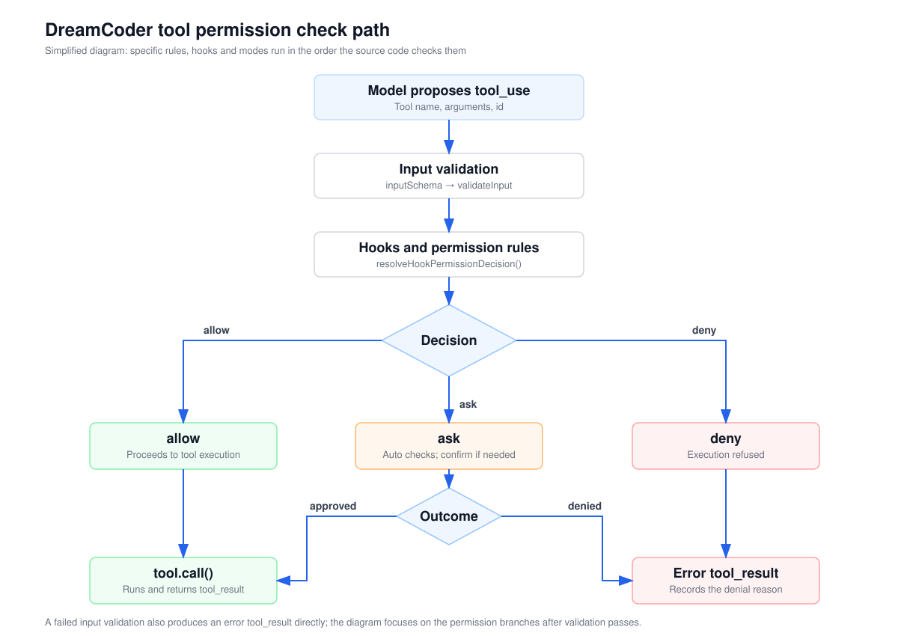
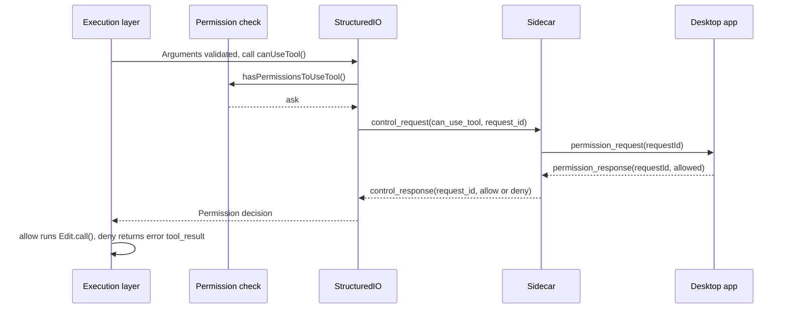

English | [简体中文](./03-permissions.zh.md)

# Tool permission control and execution boundaries

At the end of the previous chapter, the model proposed `toolu_edit_2`: change `export const value = 1` to `export const value = 2` in `/example/src/app.ts`. Passing argument validation only shows that the request can be executed. Whether it should be executed depends on the rules the user has configured, the current permission mode and the target path. A coding agent writes files and runs commands, so a decision is needed before a tool runs: which operations run directly, which ask the user first, and which are denied outright.

This chapter first describes the minimal permission check in four steps. It then follows `toolu_edit_2` through DreamCoder's two paths, "ask, then allow" and "ask, then deny". Finally it covers the check order, permission modes, hooks, and the path checks and sandbox of `Bash`.

## Minimal permission check

Without hooks, modes and the various sources of rules, the permission check has only four steps:

1. After argument validation passes, derive a decision from rules, mode and target path: `allow`, `deny` or `ask`.
2. When the decision is `ask`, show the tool name and arguments to the user and wait for an answer. The answer is converted to `allow` or `deny`.
3. When the decision is `deny`, do not execute the tool, and return an error `tool_result` carrying the original call ID.
4. When the decision is `allow`, call the tool.

In pseudocode it looks roughly like this. **This is simplified code written to explain the structure. It is not DreamCoder source code.**

```ts
async function runWithPermission(tool, input, toolUseId) {
  let decision = decide(tool, input)                              // Step 1
  if (decision === 'ask') {                                       // Step 2
    decision = (await askUser(tool.name, input)) ? 'allow' : 'deny'
  }
  if (decision === 'deny') {                                      // Step 3
    return { type: 'tool_result', tool_use_id: toolUseId, is_error: true, content: 'User denied' }
  }
  return await tool.call(input)                                   // Step 4
}
```

Whichever branch is taken, the model receives a `tool_result` for this call in the next turn, and can use it to try a different approach or stop trying.



In the diagram, "Hooks and permission rules" and "Decision" correspond to step 1, and "Outcome" corresponds to step 2.

## Mapping to the DreamCoder source

| Location | Responsibility in this request |
| --- | --- |
| [`toolExecution.ts`](https://github.com/GoDiao/dreamcoder/blob/dba5b24c75be4e3c35cd42d082dc9a7f8b631087/src/services/tools/toolExecution.ts#L599) | `checkPermissionsAndCallTool()` validates arguments, runs the `PreToolUse` hook, obtains the permission decision, then calls `tool.call()` or returns an error result. |
| [`permissions.ts`](https://github.com/GoDiao/dreamcoder/blob/dba5b24c75be4e3c35cd42d082dc9a7f8b631087/src/utils/permissions/permissions.ts#L473), [`filesystem.ts`](https://github.com/GoDiao/dreamcoder/blob/dba5b24c75be4e3c35cd42d082dc9a7f8b631087/src/utils/permissions/filesystem.ts#L1205) | Step 1: derives the decision from rules, the tool's own check and the mode. The target path of `Edit` is checked in `filesystem.ts`. |
| [`structuredIO.ts`](https://github.com/GoDiao/dreamcoder/blob/dba5b24c75be4e3c35cd42d082dc9a7f8b631087/src/cli/structuredIO.ts#L533) | The CLI side of step 2: sends the `can_use_tool` control request and waits for the answer. |
| [`conversationService.ts`](https://github.com/GoDiao/dreamcoder/blob/dba5b24c75be4e3c35cd42d082dc9a7f8b631087/src/server/services/conversationService.ts#L664), [`handler.ts`](https://github.com/GoDiao/dreamcoder/blob/dba5b24c75be4e3c35cd42d082dc9a7f8b631087/src/server/ws/handler.ts#L1208) | Sidecar: records pending permission requests, converts them into `permission_request` for the desktop app, and sends the desktop app's answer back to the CLI. |
| [`chatStore.ts`](https://github.com/GoDiao/dreamcoder/blob/dba5b24c75be4e3c35cd42d082dc9a7f8b631087/desktop/src/stores/chatStore.ts#L1502), [`PermissionDialog.tsx`](https://github.com/GoDiao/dreamcoder/blob/dba5b24c75be4e3c35cd42d082dc9a7f8b631087/desktop/src/components/chat/PermissionDialog.tsx#L115) | Desktop app: stores the pending request, shows the confirmation card and sends back `permission_response`. |



### Entry point: after argument validation

The request is `toolu_edit_2` from the [example in Part 2](./02-code-tools.en.md#example-changing-value-to-2). [`checkPermissionsAndCallTool()`](https://github.com/GoDiao/dreamcoder/blob/dba5b24c75be4e3c35cd42d082dc9a7f8b631087/src/services/tools/toolExecution.ts#L599) first completes the two layers of argument checks described in Part 2. If either fails, it returns an error `tool_result` directly, without entering the permission check, and the user does not see a confirmation UI.

After validation passes, the execution layer runs the `PreToolUse` hook. A hook is a command the user configures in settings (other types such as prompts are also supported). It runs at a specified point and can modify the tool input or return a decision such as allow or deny. The result of [`runPreToolUseHooks()`](https://github.com/GoDiao/dreamcoder/blob/dba5b24c75be4e3c35cd42d082dc9a7f8b631087/src/services/tools/toolExecution.ts#L800) is combined with the regular permission check by [`resolveHookPermissionDecision()`](https://github.com/GoDiao/dreamcoder/blob/dba5b24c75be4e3c35cd42d082dc9a7f8b631087/src/services/tools/toolHooks.ts#L332). This example assumes no hook is configured, so the combining function calls `canUseTool()` directly and enters the regular check.

### Step 1: arriving at `ask`

The desktop app starts the CLI with the `--sdk-url` argument, so the CLI selects `StructuredIO.createCanUseTool()` as its permission function. Interactive terminal mode uses a different entry point, [`useCanUseTool()`](https://github.com/GoDiao/dreamcoder/blob/dba5b24c75be4e3c35cd42d082dc9a7f8b631087/src/hooks/useCanUseTool.tsx#L28), which this chapter does not cover. [`print.ts`](https://github.com/GoDiao/dreamcoder/blob/dba5b24c75be4e3c35cd42d082dc9a7f8b631087/src/cli/print.ts#L804) This permission function first calls `hasPermissionsToUseTool()`. If the decision is already `allow` or `deny`, it returns directly. Only `ask` goes on to ask the desktop app. [`createCanUseTool()`](https://github.com/GoDiao/dreamcoder/blob/dba5b24c75be4e3c35cd42d082dc9a7f8b631087/src/cli/structuredIO.ts#L533)

For `toolu_edit_2`, [`hasPermissionsToUseToolInner()`](https://github.com/GoDiao/dreamcoder/blob/dba5b24c75be4e3c35cd42d082dc9a7f8b631087/src/utils/permissions/permissions.ts#L1158) first checks deny and ask rules for the whole tool. None are configured in this example, so it goes on to [`Edit.checkPermissions()`](https://github.com/GoDiao/dreamcoder/blob/dba5b24c75be4e3c35cd42d082dc9a7f8b631087/src/tools/FileEditTool/FileEditTool.ts#L125), which calls `checkWritePermissionForTool()` to check the target path. Assume the current mode is the default mode, no `Edit` rules are configured, and `app.ts` is inside the working directory and is not a protected path. None of the earlier conditions in the function match, and it reaches the default branch: [Default ask](https://github.com/GoDiao/dreamcoder/blob/dba5b24c75be4e3c35cd42d082dc9a7f8b631087/src/utils/permissions/filesystem.ts#L1395)

```ts
// 5. Default to asking for permission
return {
  behavior: 'ask',
  message: `Claude requested permissions to write to ${path}, but you haven't granted it yet.`,
  suggestions: generateSuggestions(path, 'write', toolPermissionContext, pathsToCheck),
  // decisionReason omitted
}
```

`suggestions` are authorization rules the user can adopt. The "Allow for session" button described later uses them.

### Step 2: the confirmation request reaches the desktop app

The `ask` branch generates a `requestId` for this wait and sends a `can_use_tool` control request: [Source](https://github.com/GoDiao/dreamcoder/blob/dba5b24c75be4e3c35cd42d082dc9a7f8b631087/src/cli/structuredIO.ts#L586)

```ts
const requestId = randomUUID()
const sdkPromise = this.sendRequest<PermissionToolOutput>(
  {
    subtype: 'can_use_tool',
    tool_name: tool.name,
    input,
    permission_suggestions: mainPermissionResult.suggestions,
    tool_use_id: toolUseID,
    agent_id: toolUseContext.agentId,
  },
  permissionToolOutputSchema(),
  hookAbortController.signal,
  requestId,
)
```

The snippet omits fields such as `blocked_path`. Two IDs appear here: `tool_use_id` refers to the call the model proposed, and `requestId` refers to this particular control request that waits for the desktop app's answer.

The Sidecar's [`ConversationService`](https://github.com/GoDiao/dreamcoder/blob/dba5b24c75be4e3c35cd42d082dc9a7f8b631087/src/server/services/conversationService.ts#L664) records this request by `request_id`, and the [WebSocket handler](https://github.com/GoDiao/dreamcoder/blob/dba5b24c75be4e3c35cd42d082dc9a7f8b631087/src/server/ws/handler.ts#L1208) converts it into a `permission_request` sent to the desktop app. The desktop app's [`chatStore`](https://github.com/GoDiao/dreamcoder/blob/dba5b24c75be4e3c35cd42d082dc9a7f8b631087/desktop/src/stores/chatStore.ts#L1502) stores `pendingPermission`, sets the session status to `permission_pending`, inserts a permission record and sends a desktop notification.

The user sees a confirmation card in the message list, rendered by [`PermissionDialog`](https://github.com/GoDiao/dreamcoder/blob/dba5b24c75be4e3c35cd42d082dc9a7f8b631087/desktop/src/components/chat/PermissionDialog.tsx#L115). In the English UI, the card for this `Edit` contains:

- The title "Allow Claude to Edit app.ts?", with an "Awaiting approval" badge next to it;
- The file path `/example/src/app.ts`, and a diff view generated from `old_string` and `new_string`, showing `value = 1` changed to `value = 2`;
- Three buttons at the bottom: "Allow", "Allow for session" and "Deny".

The buttons and strings are in [`PermissionDialog`](https://github.com/GoDiao/dreamcoder/blob/dba5b24c75be4e3c35cd42d082dc9a7f8b631087/desktop/src/components/chat/PermissionDialog.tsx#L227) and the [English locale file](https://github.com/GoDiao/dreamcoder/blob/dba5b24c75be4e3c35cd42d082dc9a7f8b631087/desktop/src/i18n/locales/en.ts#L1219), respectively.

### The user clicks "Allow" or "Deny"

The buttons call `chatStore`'s [`respondToPermission()`](https://github.com/GoDiao/dreamcoder/blob/dba5b24c75be4e3c35cd42d082dc9a7f8b631087/desktop/src/stores/chatStore.ts#L994), which sends a `permission_response` carrying the same `requestId`. The Sidecar's [`handlePermissionResponse()`](https://github.com/GoDiao/dreamcoder/blob/dba5b24c75be4e3c35cd42d082dc9a7f8b631087/src/server/ws/handler.ts#L451) passes it to [`ConversationService.respondToPermission()`](https://github.com/GoDiao/dreamcoder/blob/dba5b24c75be4e3c35cd42d082dc9a7f8b631087/src/server/services/conversationService.ts#L411), which deletes the pending record and sends a `control_response` to the CLI:

```ts
response: allowed
  ? {
      behavior: 'allow',
      updatedInput: updatedInput ?? {},
      // If "Allow for session" was chosen, permission updates for this session are also attached
    }
  : { behavior: 'deny', message: 'User denied via UI' }
```

The "Allow for session" button sends `rule: 'always'`. The server calls `normalizeSessionPermissionUpdates()`, which rewrites the previously recorded authorization suggestions as updates that apply to the current session. [`respondToPermission()`](https://github.com/GoDiao/dreamcoder/blob/dba5b24c75be4e3c35cd42d082dc9a7f8b631087/src/server/services/conversationService.ts#L429)

On the CLI side, `StructuredIO` finds the pending request by `request_id` and completes the wait with the answer. The answer is then converted into a permission decision by [`permissionPromptToolResultToPermissionDecision()`](https://github.com/GoDiao/dreamcoder/blob/dba5b24c75be4e3c35cd42d082dc9a7f8b631087/src/utils/permissions/PermissionPromptToolResultSchema.ts#L84). If permission updates are attached, they are first applied to the current permission context. When `updatedInput` is an empty object, the original input is kept, so `Edit` uses the model's original arguments.

- **Allow.** The desktop session status changes to `tool_executing`, and `checkPermissionsAndCallTool()` goes on to call [`tool.call()`](https://github.com/GoDiao/dreamcoder/blob/dba5b24c75be4e3c35cd42d082dc9a7f8b631087/src/services/tools/toolExecution.ts#L1207). `Edit.call()` checks the file again before writing. See [Part 2](./02-code-tools.en.md#why-editcall-checks-the-file-again).
- **Deny.** The desktop session status returns to `idle`. After the CLI receives the `deny` decision, [`checkPermissionsAndCallTool()`](https://github.com/GoDiao/dreamcoder/blob/dba5b24c75be4e3c35cd42d082dc9a7f8b631087/src/services/tools/toolExecution.ts#L995) does not call `tool.call()`. It builds an error result from the decision's `message`, and the file is not modified:

```json
{
  "type": "tool_result",
  "tool_use_id": "toolu_edit_2",
  "is_error": true,
  "content": "User denied via UI"
}
```

## Design analysis

The following is an analysis of what this implementation does.

### Why correct arguments are not enough to execute directly

Argument validation looks only at the request itself: whether the structure is correct and whether `old_string` can be found in the file. The permission check looks at the environment of the request: the current mode, the rules the user has configured, authorizations already given in this session, and whether the target path is inside the working directory. The same valid `Edit` request asks in the default mode, can run directly in `acceptEdits` mode, and is denied outright when it matches a `deny` rule. With the two stages separated, requests that are malformed or do not match the file state return errors at the validation stage, and every confirmation card the user sees is for a request that has passed validation. The cost is that the time spent waiting for the user sits between the two stages. File state that held at validation may have changed by the time the user clicks "Allow", so `Edit.call()` checks again before writing.

### Why the confirmation request uses a separate ID

`tool_use_id` belongs to the model's call, and one call corresponds to exactly one `tool_result`. `requestId` belongs to one control request that waits for the desktop app's answer. Both cancelling the wait and resending the request after the desktop app reconnects find the request by `requestId`. The CLI also records `tool_use_id` values it has already handled. When a reconnect causes the same answer to arrive twice, the duplicate `control_response` is ignored, and the same call does not produce a second result. [`sendRequest()`](https://github.com/GoDiao/dreamcoder/blob/dba5b24c75be4e3c35cd42d082dc9a7f8b631087/src/cli/structuredIO.ts#L490), [Duplicate answers](https://github.com/GoDiao/dreamcoder/blob/dba5b24c75be4e3c35cd42d082dc9a7f8b631087/src/cli/structuredIO.ts#L374) The cost is that every layer has to carry two IDs and maintain its own pending table, and answers that do not match must be handled separately. See [`handleOrphanedPermissionResponse()`](https://github.com/GoDiao/dreamcoder/blob/dba5b24c75be4e3c35cd42d082dc9a7f8b631087/src/cli/print.ts#L5249).

## Check order, permission modes and hooks

> You can skip this section and the next on a first read, and come back when you need to configure rules, modes or hooks.

The example above follows only one path: "no hooks, no rules, default mode". The conditions below together decide whether a confirmation UI appears, so it cannot be inferred from the tool name alone.

### The order in `hasPermissionsToUseToolInner()`

[`hasPermissionsToUseToolInner()`](https://github.com/GoDiao/dreamcoder/blob/dba5b24c75be4e3c35cd42d082dc9a7f8b631087/src/utils/permissions/permissions.ts#L1158) checks in the order of the table below, and the first item that matches returns directly:

| Order | Check | Result |
| --- | --- | --- |
| 1a | `deny` rule for the whole tool | `deny`. |
| 1b | `ask` rule for the whole tool | `ask`. The exception is `Bash` when sandbox auto-allow is enabled and the command will run in the sandbox, in which case checking continues. |
| 1c | The tool's own `checkPermissions()` | For `Edit` this is `checkWritePermissionForTool()`, which can return `allow / deny / ask / passthrough`. |
| 1d to 1g | Tool returns `deny`; a tool that requires user interaction returns `ask`; content-level `ask` rule; safety check (`safetyCheck`) | Returned as is. The mode checks below do not override them. |
| 2a | `bypassPermissions` mode | `allow`. |
| 2b | `allow` rule for the whole tool | `allow`. |
| 3 | Tool result is `passthrough` | Converted to `ask`. Other results are returned as is. |

The outer [`hasPermissionsToUseTool()`](https://github.com/GoDiao/dreamcoder/blob/dba5b24c75be4e3c35cd42d082dc9a7f8b631087/src/utils/permissions/permissions.ts#L473) rewrites the result in two places after the inner function returns `ask`: `dontAsk` mode changes `ask` to `deny`, and in `auto` mode with the classifier feature enabled, the classifier decides some requests in place of the user. [`dontAsk` branch](https://github.com/GoDiao/dreamcoder/blob/dba5b24c75be4e3c35cd42d082dc9a7f8b631087/src/utils/permissions/permissions.ts#L508)

### Path checks for `Edit`

[`checkWritePermissionForTool()`](https://github.com/GoDiao/dreamcoder/blob/dba5b24c75be4e3c35cd42d082dc9a7f8b631087/src/utils/permissions/filesystem.ts#L1205) also has a fixed internal order:

1. Check `Edit` `deny` rules against both the original path and the path after resolving symbolic links.
2. Internal editable paths such as plan files and the scratchpad are handled separately.
3. Session-level allow rules under `.claude/`.
4. Safety check: a protected path returns `ask` with `decisionReason.type = 'safetyCheck'`.
5. `Edit` `ask` rules.
6. Allow when in `acceptEdits` mode and the path is inside the working directory. [Mode branch](https://github.com/GoDiao/dreamcoder/blob/dba5b24c75be4e3c35cd42d082dc9a7f8b631087/src/utils/permissions/filesystem.ts#L1360)
7. `Edit` `allow` rules.
8. If none of the above match, return `ask`. When the path is outside the working directory, `decisionReason` is marked `workingDir`.

Read tools use [`checkReadPermissionForTool()`](https://github.com/GoDiao/dreamcoder/blob/dba5b24c75be4e3c35cd42d082dc9a7f8b631087/src/utils/permissions/filesystem.ts#L1030): explicit read deny rules take priority, reads inside the working directory are allowed directly, and reads outside it require confirmation when no rule matches.

### Permission modes

- For `Edit`, `acceptEdits` applies only to item 6 above. The deny rules, safety check and `ask` rules before it still return first.
- `bypassPermissions` is at 2a in the inner order, after 1a to 1g. Deny for the whole tool, deny from the tool itself, content-level `ask` rules and safety checks still apply in this mode.
- When `bypassPermissions` is selected in the desktop app, the Sidecar starts the CLI with `--dangerously-skip-permissions`. Other modes are passed with `--permission-mode`. [`getPermissionArgs()`](https://github.com/GoDiao/dreamcoder/blob/dba5b24c75be4e3c35cd42d082dc9a7f8b631087/src/server/services/conversationService.ts#L877) When the mode is switched while a session is running, the Sidecar sends a `set_permission_mode` control request to the CLI. [`setPermissionMode()`](https://github.com/GoDiao/dreamcoder/blob/dba5b24c75be4e3c35cd42d082dc9a7f8b631087/src/server/services/conversationService.ts#L449)

### How hooks take part in the decision

The `PreToolUse` hook runs before the regular check, and [`resolveHookPermissionDecision()`](https://github.com/GoDiao/dreamcoder/blob/dba5b24c75be4e3c35cd42d082dc9a7f8b631087/src/services/tools/toolHooks.ts#L332) branches on the hook's return value:

| Hook returns | Handling |
| --- | --- |
| `allow` | Skips the confirmation UI, but still calls `checkRuleBasedPermissions()`: a matching `deny` rule denies, and a matching `ask` rule still asks. For a tool that requires user interaction (when the hook did not provide modified input), or when the context requires `requireCanUseTool`, it goes on to call `canUseTool()`. [Hook allow branch](https://github.com/GoDiao/dreamcoder/blob/dba5b24c75be4e3c35cd42d082dc9a7f8b631087/src/services/tools/toolHooks.ts#L347) |
| `deny` | Used directly as the final decision. |
| `ask` | Calls `canUseTool()` and passes the hook's decision as `forceDecision`, replacing the result of the regular check, then proceeds to ask. |
| Modifies input only, no decision | Runs the regular check with the modified input. |

The `PermissionRequest` hook starts at the same time as the desktop confirmation in `StructuredIO`'s `ask` branch, and whichever produces a result first is used. If the hook gives a decision first, the CLI aborts the request sent to the desktop app. If the desktop app answers first, the hook's result is ignored. [Race handling](https://github.com/GoDiao/dreamcoder/blob/dba5b24c75be4e3c35cd42d082dc9a7f8b631087/src/cli/structuredIO.ts#L611)

### Other cases while waiting for confirmation

- **User interrupt.** When the request is cancelled, the CLI sends `control_cancel_request`, the wait ends with an error, and the permission function returns `deny`. [Signal forwarding](https://github.com/GoDiao/dreamcoder/blob/dba5b24c75be4e3c35cd42d082dc9a7f8b631087/src/cli/structuredIO.ts#L573), [Error converted to deny](https://github.com/GoDiao/dreamcoder/blob/dba5b24c75be4e3c35cd42d082dc9a7f8b631087/src/cli/structuredIO.ts#L639)
- **Desktop disconnect.** When there is a pending permission request, the Sidecar waits 30 minutes before cleaning up after a disconnect. In normal cases it waits 30 seconds. [`getDisconnectCleanupDelayMs()`](https://github.com/GoDiao/dreamcoder/blob/dba5b24c75be4e3c35cd42d082dc9a7f8b631087/src/server/ws/handler.ts#L1487) After the desktop app reconnects, the Sidecar resends requests that are still waiting. [`replayPendingPermissionRequests()`](https://github.com/GoDiao/dreamcoder/blob/dba5b24c75be4e3c35cd42d082dc9a7f8b631087/src/server/ws/handler.ts#L1493)

## Path checks and sandbox for Bash

[`BashTool.checkPermissions()`](https://github.com/GoDiao/dreamcoder/blob/dba5b24c75be4e3c35cd42d082dc9a7f8b631087/src/tools/BashTool/BashTool.tsx#L539) calls [`bashToolHasPermission()`](https://github.com/GoDiao/dreamcoder/blob/dba5b24c75be4e3c35cd42d082dc9a7f8b631087/src/tools/BashTool/bashPermissions.ts#L1663), in which [`checkPathConstraints()`](https://github.com/GoDiao/dreamcoder/blob/dba5b24c75be4e3c35cd42d082dc9a7f8b631087/src/tools/BashTool/pathValidation.ts#L1013) checks the path arguments and output redirection targets of a set of supported commands. Paths are resolved against the current working directory and the allowed directories, and judged by operation type: read, write or create. An explicit `deny` rule gives `deny`. Paths outside the allowed directories, or targets that cannot be confirmed as safe, usually give `ask`. `rm` and `rmdir` pointing at critical directories require explicit approval. A compound command that contains `cd` and then writes a file also requires manual confirmation, because later relative paths are hard to work out reliably.

For example, for `ls ../another-project`, the path extractor treats the non-option arguments of `ls` as paths and checks whether they are within the allowed scope. [`PATH_EXTRACTORS.ls`](https://github.com/GoDiao/dreamcoder/blob/dba5b24c75be4e3c35cd42d082dc9a7f8b631087/src/tools/BashTool/pathValidation.ts#L198) When there is no path problem, `checkPathConstraints()` returns `passthrough` so that the remaining permission checks continue. The `ask` results of subcommands are merged afterwards, so that showing a single path authorization suggestion does not end up approving a broader compound command. [Call site](https://github.com/GoDiao/dreamcoder/blob/dba5b24c75be4e3c35cd42d082dc9a7f8b631087/src/tools/BashTool/bashPermissions.ts#L2276)

Path checks depend on command parsing and the set of commands supported by `PATH_EXTRACTORS`. An unrecognized command is not judged safe on the basis of this check alone. Path checks decide whether a command can run automatically or needs confirmation. They do not by themselves provide a full system sandbox. After the user approves, the command runs with the permissions of the actual runtime environment. Whether the sandbox is enabled at runtime is decided by [`shouldUseSandbox()`](https://github.com/GoDiao/dreamcoder/blob/dba5b24c75be4e3c35cd42d082dc9a7f8b631087/src/tools/BashTool/shouldUseSandbox.ts#L130) from the sandbox configuration and the command input, and `Bash.call()` finally passes the input to [`runShellCommand()`](https://github.com/GoDiao/dreamcoder/blob/dba5b24c75be4e3c35cd42d082dc9a7f8b631087/src/tools/BashTool/BashTool.tsx#L646). The sandbox imposes constraints while the command runs, and path checks make an authorization decision before it runs. Neither can replace the other.

## Summary

- The permission check sits after argument validation and before `tool.call()`, and produces `allow`, `deny` or `ask`. Only `allow` executes the tool. Denials and asks that are not approved both become error `tool_result` blocks carrying the original `tool_use_id`.
- Desktop confirmation is one control-request round trip: `can_use_tool → permission_request → user clicks → permission_response → control_response`. It is correlated by `requestId`, which is separate from the model call's `tool_use_id`.
- Rules, modes and hooks take part in the check in a fixed order. Both `acceptEdits` and `bypassPermissions` keep the deny rules and safety checks that come before them. The path checks of `Bash` only make authorization decisions and are not a system sandbox.

After the user closes the desktop app and reopens the same session, how are requests and results such as `toolu_edit_2` restored, and what does the next model request include? The next chapter, [Session persistence and context engineering](./04-session-context.en.md), continues from here.
