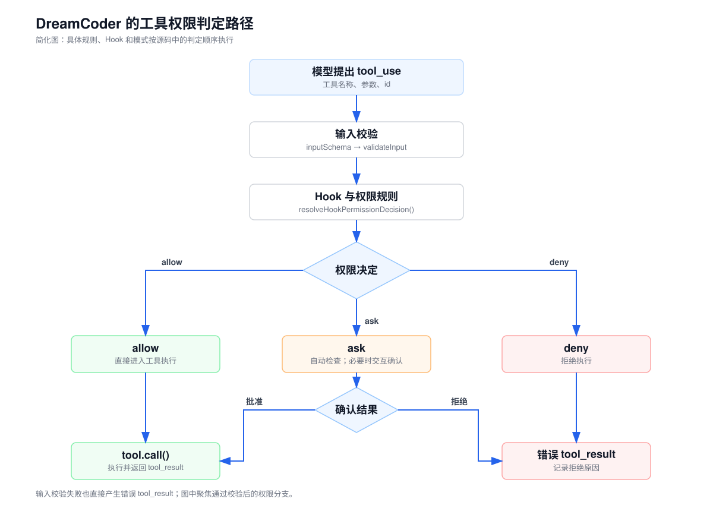
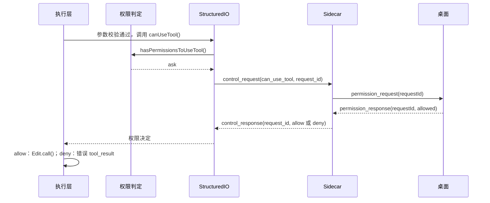

[English](./03-permissions.en.md) | 简体中文

# 工具权限控制与执行边界

上一篇结束时，模型提出了 `toolu_edit_2`：把 `/example/src/app.ts` 中的 `export const value = 1` 改成 `export const value = 2`。参数通过校验，只说明这个请求能够执行；该不该执行，还要看用户配置的规则、当前权限模式和目标路径。编程智能体会写文件、运行命令，所以工具执行前需要一道判断：哪些操作直接执行，哪些先问用户，哪些直接拒绝。

本篇先用四步说明最小的权限检查，再沿 `toolu_edit_2` 走完 DreamCoder 中“询问后允许”和“询问后拒绝”两条路径，最后介绍判定顺序、权限模式、Hook，以及 `Bash` 的路径检查与沙箱。

## 最小的权限检查

去掉 Hook、模式和各类规则来源，权限检查只有四步：

1. 参数校验通过后，按规则、模式和目标路径得出一个决定：`allow`、`deny` 或 `ask`。
2. 决定是 `ask` 时，把工具名称和参数展示给用户，等待回答；回答换算成 `allow` 或 `deny`。
3. 决定是 `deny` 时，不执行工具，返回一个带原调用 ID 的错误 `tool_result`。
4. 决定是 `allow` 时，调用工具。

写成伪代码大致如下。**这段是为说明结构写的简化代码，不是 DreamCoder 源码**：

```ts
async function runWithPermission(tool, input, toolUseId) {
  let decision = decide(tool, input)                              // 第 1 步
  if (decision === 'ask') {                                       // 第 2 步
    decision = (await askUser(tool.name, input)) ? 'allow' : 'deny'
  }
  if (decision === 'deny') {                                      // 第 3 步
    return { type: 'tool_result', tool_use_id: toolUseId, is_error: true, content: '用户拒绝' }
  }
  return await tool.call(input)                                   // 第 4 步
}
```

无论走哪条分支，模型下一轮都会收到这次调用的 `tool_result`，可以据此换一种做法或停止尝试。



图中“Hook 与权限规则”和“权限决定”对应第 1 步，“确认结果”对应第 2 步。

## 对应到 DreamCoder 源码

| 位置 | 在这次请求中的职责 |
| --- | --- |
| [`toolExecution.ts`](https://github.com/GoDiao/dreamcoder/blob/dba5b24c75be4e3c35cd42d082dc9a7f8b631087/src/services/tools/toolExecution.ts#L599) | `checkPermissionsAndCallTool()` 做参数校验、运行 `PreToolUse` Hook、取得权限决定，再调用 `tool.call()` 或返回错误结果。 |
| [`permissions.ts`](https://github.com/GoDiao/dreamcoder/blob/dba5b24c75be4e3c35cd42d082dc9a7f8b631087/src/utils/permissions/permissions.ts#L473)、[`filesystem.ts`](https://github.com/GoDiao/dreamcoder/blob/dba5b24c75be4e3c35cd42d082dc9a7f8b631087/src/utils/permissions/filesystem.ts#L1205) | 第 1 步：按规则、工具自身的检查和模式得出决定；`Edit` 的目标路径在 `filesystem.ts` 中检查。 |
| [`structuredIO.ts`](https://github.com/GoDiao/dreamcoder/blob/dba5b24c75be4e3c35cd42d082dc9a7f8b631087/src/cli/structuredIO.ts#L533) | 第 2 步的 CLI 一侧：发出 `can_use_tool` 控制请求，等待回答。 |
| [`conversationService.ts`](https://github.com/GoDiao/dreamcoder/blob/dba5b24c75be4e3c35cd42d082dc9a7f8b631087/src/server/services/conversationService.ts#L664)、[`handler.ts`](https://github.com/GoDiao/dreamcoder/blob/dba5b24c75be4e3c35cd42d082dc9a7f8b631087/src/server/ws/handler.ts#L1208) | Sidecar：记录待处理的权限请求，转成 `permission_request` 发给桌面；把桌面的回答发回 CLI。 |
| [`chatStore.ts`](https://github.com/GoDiao/dreamcoder/blob/dba5b24c75be4e3c35cd42d082dc9a7f8b631087/desktop/src/stores/chatStore.ts#L1502)、[`PermissionDialog.tsx`](https://github.com/GoDiao/dreamcoder/blob/dba5b24c75be4e3c35cd42d082dc9a7f8b631087/desktop/src/components/chat/PermissionDialog.tsx#L115) | 桌面：保存待处理请求，显示确认卡片，发回 `permission_response`。 |



### 入口：参数校验之后

请求就是[第二篇示例](./02-code-tools.zh.md#示例把-value-改成-2)中的 `toolu_edit_2`。[`checkPermissionsAndCallTool()`](https://github.com/GoDiao/dreamcoder/blob/dba5b24c75be4e3c35cd42d082dc9a7f8b631087/src/services/tools/toolExecution.ts#L599) 先完成第二篇讲过的两层参数检查，任一步失败都直接返回错误 `tool_result`，不进入权限判定，用户也看不到确认界面。

校验通过后，执行层运行 `PreToolUse` Hook。Hook 是用户在设置中配置的命令（也支持提示词等其他类型），在指定时点运行，可以修改工具输入，或返回允许、拒绝等决定。[`runPreToolUseHooks()`](https://github.com/GoDiao/dreamcoder/blob/dba5b24c75be4e3c35cd42d082dc9a7f8b631087/src/services/tools/toolExecution.ts#L800) 的结果与常规权限判定由 [`resolveHookPermissionDecision()`](https://github.com/GoDiao/dreamcoder/blob/dba5b24c75be4e3c35cd42d082dc9a7f8b631087/src/services/tools/toolHooks.ts#L332) 合并。本例假设没有配置 Hook，合并函数直接调用 `canUseTool()` 进入常规判定。

### 第 1 步：得出 `ask`

桌面端启动 CLI 时带 `--sdk-url` 参数，CLI 因此选用 `StructuredIO.createCanUseTool()` 作为权限函数；终端交互模式使用另一个入口 [`useCanUseTool()`](https://github.com/GoDiao/dreamcoder/blob/dba5b24c75be4e3c35cd42d082dc9a7f8b631087/src/hooks/useCanUseTool.tsx#L28)，本篇不展开。[`print.ts`](https://github.com/GoDiao/dreamcoder/blob/dba5b24c75be4e3c35cd42d082dc9a7f8b631087/src/cli/print.ts#L804) 这个权限函数先调用 `hasPermissionsToUseTool()`，决定已经是 `allow` 或 `deny` 时直接返回，只有 `ask` 才会继续询问桌面。[`createCanUseTool()`](https://github.com/GoDiao/dreamcoder/blob/dba5b24c75be4e3c35cd42d082dc9a7f8b631087/src/cli/structuredIO.ts#L533)

对 `toolu_edit_2`，[`hasPermissionsToUseToolInner()`](https://github.com/GoDiao/dreamcoder/blob/dba5b24c75be4e3c35cd42d082dc9a7f8b631087/src/utils/permissions/permissions.ts#L1158) 先检查整项工具的拒绝和询问规则，本例都没有配置，随后进入 [`Edit.checkPermissions()`](https://github.com/GoDiao/dreamcoder/blob/dba5b24c75be4e3c35cd42d082dc9a7f8b631087/src/tools/FileEditTool/FileEditTool.ts#L125)，它调用 `checkWritePermissionForTool()` 检查目标路径。假设当前是默认模式、没有配置任何 `Edit` 规则、`app.ts` 在工作目录内且不属于受保护路径，函数前面的条件都不命中，最后走到默认分支：[默认询问](https://github.com/GoDiao/dreamcoder/blob/dba5b24c75be4e3c35cd42d082dc9a7f8b631087/src/utils/permissions/filesystem.ts#L1395)

```ts
// 5. Default to asking for permission
return {
  behavior: 'ask',
  message: `Claude requested permissions to write to ${path}, but you haven't granted it yet.`,
  suggestions: generateSuggestions(path, 'write', toolPermissionContext, pathsToCheck),
  // 省略 decisionReason
}
```

`suggestions` 是可供用户采纳的授权规则，后面的“本次会话允许”会用到。

### 第 2 步：确认请求送到桌面

`ask` 分支为这次等待生成 `requestId`，发出 `can_use_tool` 控制请求：[源码](https://github.com/GoDiao/dreamcoder/blob/dba5b24c75be4e3c35cd42d082dc9a7f8b631087/src/cli/structuredIO.ts#L586)

```ts
const requestId = randomUUID()
const sdkPromise = this.sendRequest<PermissionToolOutput>(
  {
    subtype: 'can_use_tool',
    tool_name: tool.name,
    input,
    permission_suggestions: mainPermissionResult.suggestions,
    tool_use_id: toolUseID,
    agent_id: toolUseContext.agentId,
  },
  permissionToolOutputSchema(),
  hookAbortController.signal,
  requestId,
)
```

片段省略了 `blocked_path` 等字段。这里出现了两个 ID：`tool_use_id` 指向模型提出的调用，`requestId` 指向这一次等待桌面回答的控制请求。

Sidecar 的 [`ConversationService`](https://github.com/GoDiao/dreamcoder/blob/dba5b24c75be4e3c35cd42d082dc9a7f8b631087/src/server/services/conversationService.ts#L664) 按 `request_id` 记下这次请求，[WebSocket handler](https://github.com/GoDiao/dreamcoder/blob/dba5b24c75be4e3c35cd42d082dc9a7f8b631087/src/server/ws/handler.ts#L1208) 把它转换成 `permission_request` 发给桌面。桌面的 [`chatStore`](https://github.com/GoDiao/dreamcoder/blob/dba5b24c75be4e3c35cd42d082dc9a7f8b631087/desktop/src/stores/chatStore.ts#L1502) 保存 `pendingPermission`，把会话状态设为 `permission_pending`，插入一条权限记录并发出桌面通知。

用户看到的是消息列表中的一张确认卡片，由 [`PermissionDialog`](https://github.com/GoDiao/dreamcoder/blob/dba5b24c75be4e3c35cd42d082dc9a7f8b631087/desktop/src/components/chat/PermissionDialog.tsx#L115) 渲染。以中文界面为例，这次 `Edit` 的卡片包含：

- 标题“允许 Claude Edit app.ts？”，旁边有“等待审批”标记；
- 文件路径 `/example/src/app.ts`，以及用 `old_string` 和 `new_string` 生成的差异视图，显示 `value = 1` 改为 `value = 2`；
- 底部三个按钮：“允许”“本次会话允许”“拒绝”。

按钮与文案分别见 [`PermissionDialog`](https://github.com/GoDiao/dreamcoder/blob/dba5b24c75be4e3c35cd42d082dc9a7f8b631087/desktop/src/components/chat/PermissionDialog.tsx#L227) 和 [中文语言包](https://github.com/GoDiao/dreamcoder/blob/dba5b24c75be4e3c35cd42d082dc9a7f8b631087/desktop/src/i18n/locales/zh.ts#L1221)。

### 用户点击“允许”或“拒绝”

按钮调用 `chatStore` 的 [`respondToPermission()`](https://github.com/GoDiao/dreamcoder/blob/dba5b24c75be4e3c35cd42d082dc9a7f8b631087/desktop/src/stores/chatStore.ts#L994)，发出带同一 `requestId` 的 `permission_response`。Sidecar 的 [`handlePermissionResponse()`](https://github.com/GoDiao/dreamcoder/blob/dba5b24c75be4e3c35cd42d082dc9a7f8b631087/src/server/ws/handler.ts#L451) 把它交给 [`ConversationService.respondToPermission()`](https://github.com/GoDiao/dreamcoder/blob/dba5b24c75be4e3c35cd42d082dc9a7f8b631087/src/server/services/conversationService.ts#L411)，后者删除待处理记录，向 CLI 发送 `control_response`：

```ts
response: allowed
  ? {
      behavior: 'allow',
      updatedInput: updatedInput ?? {},
      // 若选择“本次会话允许”，还附带本会话的权限更新
    }
  : { behavior: 'deny', message: 'User denied via UI' }
```

“本次会话允许”按钮发送 `rule: 'always'`，服务端调用 `normalizeSessionPermissionUpdates()`，把之前记下的授权建议改写为作用于当前会话的更新。[`respondToPermission()`](https://github.com/GoDiao/dreamcoder/blob/dba5b24c75be4e3c35cd42d082dc9a7f8b631087/src/server/services/conversationService.ts#L429)

CLI 一侧，`StructuredIO` 按 `request_id` 找到待处理请求，用回答完成等待；回答再经 [`permissionPromptToolResultToPermissionDecision()`](https://github.com/GoDiao/dreamcoder/blob/dba5b24c75be4e3c35cd42d082dc9a7f8b631087/src/utils/permissions/PermissionPromptToolResultSchema.ts#L84) 转成权限决定。带有权限更新时，先把更新应用到当前权限上下文；`updatedInput` 是空对象时沿用原输入，所以 `Edit` 使用模型原来的参数。

- **允许。** 桌面会话状态改为 `tool_executing`，`checkPermissionsAndCallTool()` 继续调用 [`tool.call()`](https://github.com/GoDiao/dreamcoder/blob/dba5b24c75be4e3c35cd42d082dc9a7f8b631087/src/services/tools/toolExecution.ts#L1207)。`Edit.call()` 写入前还会重新检查文件，见[第二篇](./02-code-tools.zh.md#editcall-为什么重新检查文件)。
- **拒绝。** 桌面会话状态回到 `idle`。CLI 得到 `deny` 决定后，[`checkPermissionsAndCallTool()`](https://github.com/GoDiao/dreamcoder/blob/dba5b24c75be4e3c35cd42d082dc9a7f8b631087/src/services/tools/toolExecution.ts#L995) 不调用 `tool.call()`，用决定中的 `message` 构造错误结果，文件没有被修改：

```json
{
  "type": "tool_result",
  "tool_use_id": "toolu_edit_2",
  "is_error": true,
  "content": "User denied via UI"
}
```

## 设计分析

以下是对这段实现效果的分析。

### 为什么参数正确还不能直接执行

参数校验只看请求本身：结构是否正确，`old_string` 能否在文件中找到。权限判定看请求所处的环境：当前模式、用户配置的规则、本会话已给出的授权、目标路径是否在工作目录内。同一个合法的 `Edit` 请求，在默认模式下要询问，在 `acceptEdits` 模式下可以直接执行，命中 `deny` 规则时直接拒绝。两个阶段分开后，格式错误或与文件状态不符的请求在校验阶段就返回错误，用户看到的确认卡片都是已通过校验的请求。代价是两个阶段之间隔着等待用户的时间，校验时成立的文件状态到用户点击“允许”时可能已经变化，所以 `Edit.call()` 写入前还要再检查一次。

### 为什么确认请求另用一个 ID

`tool_use_id` 属于模型的调用，一次调用只对应一个 `tool_result`；`requestId` 属于一次等待桌面回答的控制请求。取消等待、桌面重连后重发请求，都按 `requestId` 定位；CLI 还记录已处理过的 `tool_use_id`，重连导致同一回答重复送达时，重复的 `control_response` 会被忽略，同一个调用不会产生第二个结果。[`sendRequest()`](https://github.com/GoDiao/dreamcoder/blob/dba5b24c75be4e3c35cd42d082dc9a7f8b631087/src/cli/structuredIO.ts#L490)、[重复回答](https://github.com/GoDiao/dreamcoder/blob/dba5b24c75be4e3c35cd42d082dc9a7f8b631087/src/cli/structuredIO.ts#L374) 代价是每一层都要携带两个 ID、各自维护待处理表，还要单独处理对不上的回答，见 [`handleOrphanedPermissionResponse()`](https://github.com/GoDiao/dreamcoder/blob/dba5b24c75be4e3c35cd42d082dc9a7f8b631087/src/cli/print.ts#L5249)。

## 判定顺序、权限模式与 Hook

> 首次阅读可以先跳过本节和下一节，需要配置规则、模式或 Hook 时再回来看。

上面的例子只走了“无 Hook、无规则、默认模式”这一条路径。是否出现确认界面由下面这些条件共同决定，不能只凭工具名称推断。

### `hasPermissionsToUseToolInner()` 的顺序

[`hasPermissionsToUseToolInner()`](https://github.com/GoDiao/dreamcoder/blob/dba5b24c75be4e3c35cd42d082dc9a7f8b631087/src/utils/permissions/permissions.ts#L1158) 按下表顺序判断，先命中的项直接返回：

| 顺序 | 判断点 | 结果 |
| --- | --- | --- |
| 1a | 整项工具的 `deny` 规则 | `deny`。 |
| 1b | 整项工具的 `ask` 规则 | `ask`；`Bash` 在沙箱自动允许开启且命令会进入沙箱时例外，继续往下判断。 |
| 1c | 工具自己的 `checkPermissions()` | 对 `Edit` 即 `checkWritePermissionForTool()`，可返回 `allow / deny / ask / passthrough`。 |
| 1d–1g | 工具返回 `deny`；需要用户交互的工具返回 `ask`；内容级 `ask` 规则；安全检查（`safetyCheck`） | 原样返回，下面的模式判断不会覆盖它们。 |
| 2a | `bypassPermissions` 模式 | `allow`。 |
| 2b | 整项工具的 `allow` 规则 | `allow`。 |
| 3 | 工具结果为 `passthrough` | 转成 `ask`；其余结果原样返回。 |

外层的 [`hasPermissionsToUseTool()`](https://github.com/GoDiao/dreamcoder/blob/dba5b24c75be4e3c35cd42d082dc9a7f8b631087/src/utils/permissions/permissions.ts#L473) 在内层返回 `ask` 之后还有两处改写：`dontAsk` 模式把 `ask` 改成 `deny`；在启用分类器功能的 `auto` 模式下，由分类器代替用户判断部分请求。[`dontAsk` 分支](https://github.com/GoDiao/dreamcoder/blob/dba5b24c75be4e3c35cd42d082dc9a7f8b631087/src/utils/permissions/permissions.ts#L508)

### `Edit` 的路径检查

[`checkWritePermissionForTool()`](https://github.com/GoDiao/dreamcoder/blob/dba5b24c75be4e3c35cd42d082dc9a7f8b631087/src/utils/permissions/filesystem.ts#L1205) 内部也有固定顺序：

1. 对原路径和符号链接解析后的路径检查 `Edit` 的 `deny` 规则。
2. 计划文件、scratchpad 等内部可编辑路径单独处理。
3. `.claude/` 下的会话级允许规则。
4. 安全检查：受保护路径返回 `decisionReason.type = 'safetyCheck'` 的 `ask`。
5. `Edit` 的 `ask` 规则。
6. `acceptEdits` 模式且路径在工作目录内时允许。[模式分支](https://github.com/GoDiao/dreamcoder/blob/dba5b24c75be4e3c35cd42d082dc9a7f8b631087/src/utils/permissions/filesystem.ts#L1360)
7. `Edit` 的 `allow` 规则。
8. 以上都不命中时返回 `ask`；路径在工作目录外时，`decisionReason` 标为 `workingDir`。

读取类工具使用 [`checkReadPermissionForTool()`](https://github.com/GoDiao/dreamcoder/blob/dba5b24c75be4e3c35cd42d082dc9a7f8b631087/src/utils/permissions/filesystem.ts#L1030)：显式的读取拒绝规则优先，工作目录内的读取直接允许，目录外的读取在没有匹配规则时要求确认。

### 权限模式

- 对 `Edit` 而言，`acceptEdits` 只作用于上面的第 6 项，它前面的拒绝规则、安全检查和 `ask` 规则仍先返回。
- `bypassPermissions` 位于内层顺序的 2a，排在 1a–1g 之后，整项工具拒绝、工具自身拒绝、内容级 `ask` 规则和安全检查在这个模式下仍然生效。
- 桌面端选择 `bypassPermissions` 时，Sidecar 用 `--dangerously-skip-permissions` 启动 CLI；其他模式用 `--permission-mode` 传入。[`getPermissionArgs()`](https://github.com/GoDiao/dreamcoder/blob/dba5b24c75be4e3c35cd42d082dc9a7f8b631087/src/server/services/conversationService.ts#L877) 会话运行中切换模式时，Sidecar 向 CLI 发送 `set_permission_mode` 控制请求。[`setPermissionMode()`](https://github.com/GoDiao/dreamcoder/blob/dba5b24c75be4e3c35cd42d082dc9a7f8b631087/src/server/services/conversationService.ts#L449)

### Hook 怎样参与决定

`PreToolUse` Hook 在常规判定之前运行，[`resolveHookPermissionDecision()`](https://github.com/GoDiao/dreamcoder/blob/dba5b24c75be4e3c35cd42d082dc9a7f8b631087/src/services/tools/toolHooks.ts#L332) 按 Hook 的返回值分支：

| Hook 返回 | 处理 |
| --- | --- |
| `allow` | 跳过确认界面，但仍调用 `checkRuleBasedPermissions()`：命中 `deny` 规则时拒绝，命中 `ask` 规则时仍要询问。需要用户交互的工具（且 Hook 没有提供修改后的输入），或上下文要求 `requireCanUseTool` 时，继续调用 `canUseTool()`。[Hook 允许分支](https://github.com/GoDiao/dreamcoder/blob/dba5b24c75be4e3c35cd42d082dc9a7f8b631087/src/services/tools/toolHooks.ts#L347) |
| `deny` | 直接作为最终决定。 |
| `ask` | 调用 `canUseTool()` 并把 Hook 的决定作为 `forceDecision` 传入，代替常规判定的结果，随后进入询问。 |
| 只修改输入、不给决定 | 用修改后的输入走常规判定。 |

`PermissionRequest` Hook 在 `StructuredIO` 的 `ask` 分支中与桌面确认同时启动，谁先给出结果就用谁的：Hook 先给出决定时，CLI 中止发往桌面的请求；桌面先回答时，Hook 的结果被忽略。[竞争处理](https://github.com/GoDiao/dreamcoder/blob/dba5b24c75be4e3c35cd42d082dc9a7f8b631087/src/cli/structuredIO.ts#L611)

### 等待确认期间的其他情况

- **用户中断。** 请求被取消时，CLI 发出 `control_cancel_request`，等待以错误结束，权限函数返回 `deny`。[信号转发](https://github.com/GoDiao/dreamcoder/blob/dba5b24c75be4e3c35cd42d082dc9a7f8b631087/src/cli/structuredIO.ts#L573)、[错误转为拒绝](https://github.com/GoDiao/dreamcoder/blob/dba5b24c75be4e3c35cd42d082dc9a7f8b631087/src/cli/structuredIO.ts#L639)
- **桌面断线。** 有待处理权限请求时，Sidecar 断线后的清理等待时间是 30 分钟，普通情况是 30 秒。[`getDisconnectCleanupDelayMs()`](https://github.com/GoDiao/dreamcoder/blob/dba5b24c75be4e3c35cd42d082dc9a7f8b631087/src/server/ws/handler.ts#L1487) 桌面重新连接后，Sidecar 重发仍在等待的请求。[`replayPendingPermissionRequests()`](https://github.com/GoDiao/dreamcoder/blob/dba5b24c75be4e3c35cd42d082dc9a7f8b631087/src/server/ws/handler.ts#L1493)

## Bash 的路径检查与沙箱

[`BashTool.checkPermissions()`](https://github.com/GoDiao/dreamcoder/blob/dba5b24c75be4e3c35cd42d082dc9a7f8b631087/src/tools/BashTool/BashTool.tsx#L539) 调用 [`bashToolHasPermission()`](https://github.com/GoDiao/dreamcoder/blob/dba5b24c75be4e3c35cd42d082dc9a7f8b631087/src/tools/BashTool/bashPermissions.ts#L1663)，其中的 [`checkPathConstraints()`](https://github.com/GoDiao/dreamcoder/blob/dba5b24c75be4e3c35cd42d082dc9a7f8b631087/src/tools/BashTool/pathValidation.ts#L1013) 检查一组已支持命令的路径参数和输出重定向目标。路径结合当前工作目录和允许目录解析，按读取、写入或创建操作判断：显式 `deny` 规则给出 `deny`；目录外路径或无法安全确认的目标通常给出 `ask`；`rm`、`rmdir` 指向关键目录时要求明确批准；带有 `cd` 的复合命令再写文件时，后续相对路径难以可靠推算，也要求人工确认。

例如 `ls ../another-project`，路径提取器把 `ls` 的非选项参数当作路径，再检查它是否位于允许范围。[`PATH_EXTRACTORS.ls`](https://github.com/GoDiao/dreamcoder/blob/dba5b24c75be4e3c35cd42d082dc9a7f8b631087/src/tools/BashTool/pathValidation.ts#L198) 没有路径问题时，`checkPathConstraints()` 返回 `passthrough`，让其余权限判断继续。之后还会合并子命令的 `ask` 结果，避免只显示一条路径授权建议却实际批准了更宽的复合命令。[调用处](https://github.com/GoDiao/dreamcoder/blob/dba5b24c75be4e3c35cd42d082dc9a7f8b631087/src/tools/BashTool/bashPermissions.ts#L2276)

路径检查依赖命令解析和 `PATH_EXTRACTORS` 支持的命令集合，不认识的命令不会仅凭这段检查被判为安全。路径检查用于决定能否自动执行、是否需要确认，本身不提供完整的系统沙箱；用户批准后，命令按实际运行环境的权限执行。运行时是否启用沙箱由 [`shouldUseSandbox()`](https://github.com/GoDiao/dreamcoder/blob/dba5b24c75be4e3c35cd42d082dc9a7f8b631087/src/tools/BashTool/shouldUseSandbox.ts#L130) 结合沙箱配置和命令输入决定，`Bash.call()` 最终把输入交给 [`runShellCommand()`](https://github.com/GoDiao/dreamcoder/blob/dba5b24c75be4e3c35cd42d082dc9a7f8b631087/src/tools/BashTool/BashTool.tsx#L646)。沙箱在命令执行时施加约束，路径检查在执行前做授权判断，两者不能互相替代。

## 小结

- 权限判定位于参数校验之后、`tool.call()` 之前，得出 `allow`、`deny` 或 `ask`；只有 `allow` 会执行工具，拒绝和未获批准的询问都变成带原 `tool_use_id` 的错误 `tool_result`。
- 桌面确认是一次控制请求往返：`can_use_tool → permission_request → 用户点击 → permission_response → control_response`，用 `requestId` 关联，与模型调用的 `tool_use_id` 分开。
- 规则、模式和 Hook 按固定顺序参与判定；`acceptEdits` 和 `bypassPermissions` 都保留前置的拒绝规则和安全检查。`Bash` 的路径检查只做授权判断，不等于系统沙箱。

用户关闭桌面后再打开同一会话，`toolu_edit_2` 这样的请求和结果怎样恢复，下一次模型请求又会带上哪些内容？下一篇[《会话持久化与上下文工程》](./04-session-context.zh.md)接着读。
