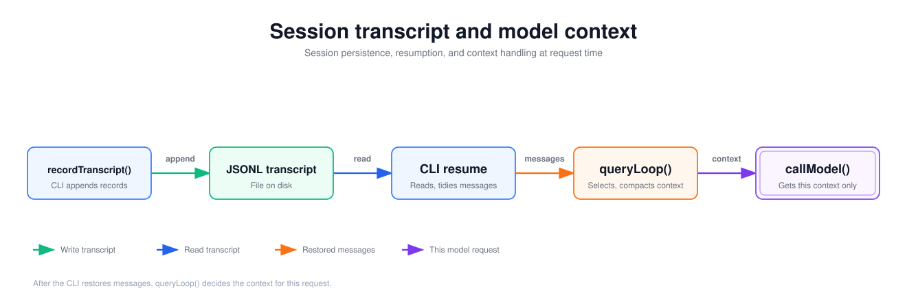

English | [简体中文](./04-session-context.zh.md)

# Session persistence and context engineering

A user closes the desktop app and reopens the same session. The earlier questions, tool calls and answers are still visible. When the user asks the next question, however, the model does not necessarily receive every message saved in the file. Two connected code paths are involved: session persistence writes and restores the record, and context engineering prepares the input for one model request.

This chapter starts with four steps that show the minimal relationship between the session record and the request context. It then follows one set of `Read`/`Edit` messages through three forms: on disk, after resume, and before a request. After that it maps each step to the DreamCoder source and covers the other branches of resume and compaction. It helps to have read [Part 1](./01-execution-loop.en.md) first and to know where `messagesForQuery` sits in the execution loop.

## Session record and request context

Leave out desktop process management, feature flags and the various repair logic, and session persistence and context construction come down to four steps:

1. Each time a conversation message is produced, append it to the end of the session file.
2. When a session is reopened, read the conversation messages back from the file, skip metadata lines, and obtain the message history in memory.
3. Before each model request, assemble the messages to send this time from the message history. When the context window limit is near, replace older messages with a summary.
4. Compaction also appends its boundary marker and summary to the file and keeps the earlier records. The next resume starts reading from the last boundary.

The session file uses the JSONL format (JSON Lines): each line is an independent JSON object, and a new record is written at the end of the file without rewriting existing content.

In pseudocode it looks roughly like this. **This is simplified code written to explain the structure. It is not DreamCoder source code.**

```ts
function record(file, entry) {                                  // Steps 1 and 4
  appendLine(file, JSON.stringify(entry))
}

function resume(file) {                                         // Step 2
  const lines = readLines(file).filter(isConversationMessage)
  return lines.slice(lastBoundaryIndex(lines))
}

async function request(history, file) {                         // Step 3
  let context = history
  if (estimateTokens(context) > threshold) {
    const summary = await summarize(context)
    context = [boundary, summary]
    record(file, boundary)                                      // Step 4
    record(file, summary)
  }
  return callModel(context)
}
```

There are two sets of data here. The file is the session record, and on the normal path new lines are only appended at its end. The request context is selected and assembled from the record before each request, and the request that goes out also carries content that is not in the file, such as the system prompt.

## The same messages in three places

The example is the one from the earlier chapters: the user asks to change `value = 1` to `value = 2` in `/example/src/app.ts`, and the model first calls `Read` (`toolu_read_1`) and then `Edit` (`toolu_edit_2`). After the desktop app is closed, the session is reopened and the user sends another input, `u4`. UUIDs are abbreviated as `u1`, `a1` and so on, and only the fields relevant to this section are shown.

**(a) The JSONL on disk.** The first two lines are written by the desktop app when it creates the session, and the rest are appended by the CLI. Each message's `parentUuid` points to the previous message, linking them into a chain:

```jsonl
{"type":"file-history-snapshot","messageId":"…","snapshot":{…},"isSnapshotUpdate":false}
{"type":"session-meta","isMeta":true,"workDir":"/example","timestamp":"…"}
{"type":"user","uuid":"u1","parentUuid":null,"message":{"role":"user","content":"Change value to 2"}}
{"type":"assistant","uuid":"a1","parentUuid":"u1","message":{"role":"assistant","content":[{"type":"tool_use","id":"toolu_read_1","name":"Read","input":{"file_path":"/example/src/app.ts"}}]}}
{"type":"user","uuid":"u2","parentUuid":"a1","message":{"role":"user","content":[{"type":"tool_result","tool_use_id":"toolu_read_1","content":"1\texport const value = 1"}]}}
{"type":"assistant","uuid":"a2","parentUuid":"u2","message":{"role":"assistant","content":[{"type":"tool_use","id":"toolu_edit_2","name":"Edit","input":{"file_path":"/example/src/app.ts","old_string":"export const value = 1","new_string":"export const value = 2"}}]}}
{"type":"user","uuid":"u3","parentUuid":"a2","message":{"role":"user","content":[{"type":"tool_result","tool_use_id":"toolu_edit_2","content":"The file /example/src/app.ts has been updated successfully."}]}}
{"type":"assistant","uuid":"a3","parentUuid":"u3","message":{"role":"assistant","content":[{"type":"text","text":"Changed value to 2."}]}}
```

**(b) The `messages` restored after `--resume`.** Walking back along `parentUuid` from the latest message `a3` gives `[u1, a1, u2, a2, u3, a3]`. If a resume hook produces messages, they are appended after `a3`. The first two lines of the file are not in the array. Before the execution loop starts, the current input `u4` is appended to the end of the array and also written to the JSONL.

**(c) The `messagesForQuery` of the current request.** There are two cases:

```text
Not compacted: [u1, a1, u2, a2, u3, a3, u4]
Compacted:     [b1(compact_boundary), s1(summary), attachments…]
```

A short session usually falls into the first case, and the user context and system prompt are added when the model is called. If the estimated tokens exceed the threshold (the example omits the other messages that make the history longer), `u1` to `u4` are all replaced by the summary, and the boundary `b1` is filtered out when the messages are converted to the API format. After compaction, two lines are added at the end of the JSONL, and the earlier lines are unchanged:

```jsonl
{"type":"system","subtype":"compact_boundary","uuid":"b1","parentUuid":null,"logicalParentUuid":"u4"}
{"type":"user","uuid":"s1","parentUuid":"b1","isCompactSummary":true,"message":{"role":"user","content":"This session is being continued from a previous conversation… read the full transcript at: …"}}
```

The boundary's `parentUuid` is `null`, so on a later resume the walk back stops at `b1`, and the restored `messages` start from `[b1, s1, …]`. When the desktop app displays history it reads in file order and does not cut off at the boundary, so the user can still see `u1` to `a3`.

| Entry | JSONL | Restored `messages` | `messagesForQuery` |
| --- | --- | --- | --- |
| `file-history-snapshot`, `session-meta` | Present | Absent | Absent |
| `u1` to `a3` | Present | Present | Present when not compacted; replaced by the summary after compaction |
| `u4` (current input) | Written before entering the loop | Appended at the end | Present when not compacted; included in the summary after compaction |
| `b1` boundary | Appended after compaction | The chain starts here on the next resume | First in the array, filtered at the API layer |
| `s1` summary | Appended after compaction | Present on the next resume | Present |
| File attachments after compaction | Not written by default | Absent on the next resume | Present |

**If a message exists on disk, does the next request necessarily include it?** Not necessarily. Metadata lines do not enter the message history. Resume reads only the one chain obtained by walking back along `parentUuid`, and messages before the last compact boundary are not on that chain. Resume also filters messages such as unpaired `tool_use`. Before a request, further trimming or compaction may still happen. Conversely, a request also contains content that is not on disk: the system prompt, the user context, and the file attachments generated after compaction. To know what the model saw in a given turn, look at that turn's `messagesForQuery` and prompts. To audit or reopen a session, look at the record on disk.

The following sections go through the four steps and show which code produces each of these differences.

## Mapping to the DreamCoder source

In DreamCoder, the desktop service creates the session file and starts the CLI. The CLI appends messages, restores the message chain and builds the model request.



| Location | Role in this path |
| --- | --- |
| [`SessionService.createSession()`](https://github.com/GoDiao/dreamcoder/blob/dba5b24c75be4e3c35cd42d082dc9a7f8b631087/src/server/services/sessionService.ts#L1523) | Allocates the session ID, creates the JSONL file under the config directory, and records metadata such as the working directory. |
| [`recordTranscript()`](https://github.com/GoDiao/dreamcoder/blob/dba5b24c75be4e3c35cd42d082dc9a7f8b631087/src/utils/sessionStorage.ts#L1437) | During CLI execution, deduplicates and cleans new messages, then appends them to the transcript. |
| [`ConversationService.startSession()`](https://github.com/GoDiao/dreamcoder/blob/dba5b24c75be4e3c35cd42d082dc9a7f8b631087/src/server/services/conversationService.ts#L155) | Checks whether the file already has conversation messages, and decides whether to start a new CLI with `--session-id` or resume with `--resume`. |
| [`loadConversationForResume()`](https://github.com/GoDiao/dreamcoder/blob/dba5b24c75be4e3c35cd42d082dc9a7f8b631087/src/utils/conversationRecovery.ts#L456) | Loads the record inside the CLI, cleans up the message chain, and hands it to the subsequent execution. |
| [`queryLoop()`](https://github.com/GoDiao/dreamcoder/blob/dba5b24c75be4e3c35cd42d082dc9a7f8b631087/src/query.ts#L366) | Builds `messagesForQuery` from the current messages, processes it according to configuration and compacts it when needed, then calls the model. |
| [`autoCompactIfNeeded()`](https://github.com/GoDiao/dreamcoder/blob/dba5b24c75be4e3c35cd42d082dc9a7f8b631087/src/services/compact/autoCompact.ts#L241), [`buildPostCompactMessages()`](https://github.com/GoDiao/dreamcoder/blob/dba5b24c75be4e3c35cd42d082dc9a7f8b631087/src/services/compact/compact.ts#L330) | Decide whether to auto-compact, and give the message order after compaction. |

### Step 1: create the session file and append messages

On the desktop side, `createSession()` generates a `sessionId`, creates `<sessionId>.jsonl` under `projects/<subdirectory named after the working directory>/` in the config directory, and writes two lines: `file-history-snapshot` and `session-meta`. The config directory is `CLAUDE_CONFIG_DIR`, or `~/.claude` when it is not set, and is unrelated to the code repository. [`getConfigDir()`](https://github.com/GoDiao/dreamcoder/blob/dba5b24c75be4e3c35cd42d082dc9a7f8b631087/src/server/services/sessionService.ts#L243) The CLI locates the same file through [`getTranscriptPath()`](https://github.com/GoDiao/dreamcoder/blob/dba5b24c75be4e3c35cd42d082dc9a7f8b631087/src/utils/sessionStorage.ts#L202).

When the CLI produces messages, `recordTranscript()` does not append the whole in-memory array as is. It first processes the records with `cleanMessagesForLogging()`, uses existing UUIDs to skip messages that have already been written, and then passes the new messages to `insertMessageChain()`:

```ts
const cleanedMessages = cleanMessagesForLogging(messages, allMessages)
const messageSet = await getSessionMessages(sessionId)
const newMessages: typeof cleanedMessages = []
for (const m of cleanedMessages) {
  if (messageSet.has(m.uuid as UUID)) {
    if (!seenNewMessage && isChainParticipant(m)) {
      startingParentUuid = m.uuid as UUID
    }
  } else {
    newMessages.push(m)
    seenNewMessage = true
  }
}
if (newMessages.length > 0) {
  await getProject().insertMessageChain(newMessages, false, undefined, startingParentUuid, teamInfo)
}
```

[`insertMessageChain()`](https://github.com/GoDiao/dreamcoder/blob/dba5b24c75be4e3c35cd42d082dc9a7f8b631087/src/utils/sessionStorage.ts#L1022) writes `uuid` and `parentUuid` for each new message. The `parentUuid` of a tool result message points to the assistant message that made the call. `startingParentUuid` is updated only when an already recorded message appears before the new messages and also participates in the message chain. As a result, old messages kept after compaction are not written a second time, and new messages are not attached to a parent from before compaction. [`recordTranscript()`](https://github.com/GoDiao/dreamcoder/blob/dba5b24c75be4e3c35cd42d082dc9a7f8b631087/src/utils/sessionStorage.ts#L1420)

On the `QueryEngine` path used by the desktop app, the current user input is written to the transcript before entering the execution loop, and after that, each assistant message, user message or compact boundary it receives is recorded as well. [`submitMessage()`](https://github.com/GoDiao/dreamcoder/blob/dba5b24c75be4e3c35cd42d082dc9a7f8b631087/src/QueryEngine.ts#L453), [recording inside the loop](https://github.com/GoDiao/dreamcoder/blob/dba5b24c75be4e3c35cd42d082dc9a7f8b631087/src/QueryEngine.ts#L712) Tool progress messages are used only by the UI. [`isLoggableMessage()`](https://github.com/GoDiao/dreamcoder/blob/dba5b24c75be4e3c35cd42d082dc9a7f8b631087/src/utils/sessionStorage.ts#L4380) filters out the `progress` type, so they are not written to the JSONL.

### Step 2: choose between new and resume, and read back the message chain

A newly created file has only the snapshot and the metadata, so the desktop app cannot resume the CLI just because a `.jsonl` file exists. [`countTranscriptMessages()`](https://github.com/GoDiao/dreamcoder/blob/dba5b24c75be4e3c35cd42d082dc9a7f8b631087/src/server/services/sessionService.ts#L475) counts only entries that have `message.role`, are not `isMeta`, and have the role `user`, `assistant` or `system`. [`startSession()`](https://github.com/GoDiao/dreamcoder/blob/dba5b24c75be4e3c35cd42d082dc9a7f8b631087/src/server/services/conversationService.ts#L169) decides based on this:

```ts
const launchInfo = await sessionService.getSessionLaunchInfo(sessionId)
const shouldResume = !!launchInfo && launchInfo.transcriptMessageCount > 0
const shouldReplacePlaceholder =
  !!launchInfo && launchInfo.transcriptMessageCount === 0
// ...
if (shouldReplacePlaceholder) {
  await sessionService.clearSessionTranscript(sessionId, workDir)
}
```

When the desktop app starts from an empty placeholder file, it first clears the placeholder records and then creates a new session with `--session-id`. It uses `--resume` only when conversation messages already exist. [`buildSessionCliArgs()`](https://github.com/GoDiao/dreamcoder/blob/dba5b24c75be4e3c35cd42d082dc9a7f8b631087/src/server/services/conversationService.ts#L116)

The CLI's `--resume` branch calls [`loadConversationForResume()`](https://github.com/GoDiao/dreamcoder/blob/dba5b24c75be4e3c35cd42d082dc9a7f8b631087/src/utils/conversationRecovery.ts#L456), which loads the messages, checks consistency, and then handles unpaired tool calls and interruption state. Compared with step 2 of the pseudocode, the actual code differs in two places:

- Only four kinds of entries enter the message table: `user`, `assistant`, `attachment` and `system`. Entries such as `session-meta` do not. [`loadTranscriptFile()`](https://github.com/GoDiao/dreamcoder/blob/dba5b24c75be4e3c35cd42d082dc9a7f8b631087/src/utils/sessionStorage.ts#L3501)
- Message order is not determined by file line order. [`getLastSessionLog()`](https://github.com/GoDiao/dreamcoder/blob/dba5b24c75be4e3c35cd42d082dc9a7f8b631087/src/utils/sessionStorage.ts#L3898) finds the latest non-sidechain message, and [`buildConversationChain()`](https://github.com/GoDiao/dreamcoder/blob/dba5b24c75be4e3c35cd42d082dc9a7f8b631087/src/utils/sessionStorage.ts#L2098) walks back along `parentUuid` to the root, stopping at a boundary whose `parentUuid` is `null`.

### Step 3: build `messagesForQuery` from the message history

Before each model call, `queryLoop()` first takes the last compact boundary and everything after it from `messages`, applies the tool result budget, microcompact and other processing according to configuration, and then decides whether auto-compaction is needed:

```ts
let messagesForQuery = [...getMessagesAfterCompactBoundary(messages)]
messagesForQuery = await applyToolResultBudget(messagesForQuery, /* ... */)
const microcompactResult = await deps.microcompact(messagesForQuery, toolUseContext, querySource)
messagesForQuery = microcompactResult.messages
const { compactionResult } = await deps.autocompact(messagesForQuery, /* ... */)
// ...if compaction succeeds, replace messagesForQuery
for await (const message of deps.callModel({
  messages: prependUserContext(messagesForQuery, userContext),
  systemPrompt: fullSystemPrompt,
  // ...
})) {
  // ...
}
```

The excerpt is from [`queryLoop()`](https://github.com/GoDiao/dreamcoder/blob/dba5b24c75be4e3c35cd42d082dc9a7f8b631087/src/query.ts#L366), with feature flags, error handling and post-compaction state updates omitted.

- The boundary itself stays in `messagesForQuery`. It is a `system` message and is filtered at the API layer by `normalizeMessagesForAPI()`. [Function comment](https://github.com/GoDiao/dreamcoder/blob/dba5b24c75be4e3c35cd42d082dc9a7f8b631087/src/utils/messages.ts#L4730)
- [`applyToolResultBudget()`](https://github.com/GoDiao/dreamcoder/blob/dba5b24c75be4e3c35cd42d082dc9a7f8b631087/src/utils/toolResultStorage.ts#L924) takes effect only when the tool context carries `contentReplacementState`. In the current source, the interactive REPL and some subagents set it; the `QueryEngine` path used by the desktop app does not.
- `prependUserContext()` adds the user context, and the system prompt is assembled separately by [`appendSystemContext()`](https://github.com/GoDiao/dreamcoder/blob/dba5b24c75be4e3c35cd42d082dc9a7f8b631087/src/query.ts#L450), so `messagesForQuery` is only part of the full request body.

### Step 4: auto-compaction and the compact boundary

Auto-compaction is not triggered by the size of the JSONL file. [`shouldAutoCompact()`](https://github.com/GoDiao/dreamcoder/blob/dba5b24c75be4e3c35cd42d082dc9a7f8b631087/src/services/compact/autoCompact.ts#L160) estimates the tokens of the current messages and compares them with a threshold. The threshold is the model's effective context window minus `AUTOCOMPACT_BUFFER_TOKENS` (13,000 tokens). [`getAutoCompactThreshold()`](https://github.com/GoDiao/dreamcoder/blob/dba5b24c75be4e3c35cd42d082dc9a7f8b631087/src/services/compact/autoCompact.ts#L72)

When the condition is met, [`autoCompactIfNeeded()`](https://github.com/GoDiao/dreamcoder/blob/dba5b24c75be4e3c35cd42d082dc9a7f8b631087/src/services/compact/autoCompact.ts#L241) first tries the session memory path, and calls `compactConversation()` if that path does not succeed. After compaction succeeds, [`buildPostCompactMessages()`](https://github.com/GoDiao/dreamcoder/blob/dba5b24c75be4e3c35cd42d082dc9a7f8b631087/src/services/compact/compact.ts#L330) defines the new array order:

```ts
return [
  result.boundaryMarker,
  ...result.summaryMessages,
  ...(result.messagesToKeep ?? []),
  ...result.attachments,
  ...result.hookResults,
]
```

[`queryLoop()`](https://github.com/GoDiao/dreamcoder/blob/dba5b24c75be4e3c35cd42d082dc9a7f8b631087/src/query.ts#L529) outputs these compaction messages, then sets `messagesForQuery` to the new array and continues the current model request. For the `compactConversation()` path:

- The boundary is a `system` message with `subtype: 'compact_boundary'`. When it is written, `parentUuid` is set to `null`, and `logicalParentUuid` records the last message before compaction. [`createCompactBoundaryMessage()`](https://github.com/GoDiao/dreamcoder/blob/dba5b24c75be4e3c35cd42d082dc9a7f8b631087/src/utils/messages.ts#L4619), [`insertMessageChain()`](https://github.com/GoDiao/dreamcoder/blob/dba5b24c75be4e3c35cd42d082dc9a7f8b631087/src/utils/sessionStorage.ts#L1069)
- The summary is a user message with `isCompactSummary: true`. Its body includes the transcript path, so the model can read that file when it needs details from before compaction. [`compactConversation()`](https://github.com/GoDiao/dreamcoder/blob/dba5b24c75be4e3c35cd42d082dc9a7f8b631087/src/services/compact/compact.ts#L621), [`getCompactUserSummaryMessage()`](https://github.com/GoDiao/dreamcoder/blob/dba5b24c75be4e3c35cd42d082dc9a7f8b631087/src/services/compact/prompt.ts#L349)
- The attachments include up to 5 recent files, regenerated from the read records. They are not written to the JSONL by default. [`createPostCompactFileAttachments()`](https://github.com/GoDiao/dreamcoder/blob/dba5b24c75be4e3c35cd42d082dc9a7f8b631087/src/services/compact/compact.ts#L1415)

## Design analysis

The following is an analysis of what this implementation does.

### Why the full history is not sent every time

The JSONL keeps the whole conversation for desktop display, resume and auditing. Each request sends only the cleaned-up messages after the last compact boundary, and when the threshold is near, older content is replaced by a summary. If the full history were sent every time, input tokens would keep growing with session length, and token-based cost would grow with them. Requests would usually take longer, and once the history exceeded the model's context window the request could not complete. The downside is that the two sets of data diverge. The history the user sees in the desktop app is larger than what the model receives in the current turn. Details replaced by the summary (for example the original text read by `toolu_read_1`) can only be recovered if the model reads the transcript through a tool. And when investigating "why the model does not know something", you have to reconstruct the current turn's `messagesForQuery`, because the file alone is not enough.

### Why compaction appends a boundary instead of rewriting old records

The normal recording and compaction paths described here use append-only writes. Compaction keeps the earlier records, so the desktop app can still display them. On resume, the walk back stops at the boundary, and old content does not enter the message history. The downside is that the file keeps growing; a source comment notes that a session JSONL can grow to several GB. The read side therefore needs extra handling: when the file is larger than 5 MB, `loadTranscriptFile()` skips the bytes before the last boundary; callers that read the raw file directly should not read the file once it exceeds 50 MB. [`SKIP_PRECOMPACT_THRESHOLD`](https://github.com/GoDiao/dreamcoder/blob/dba5b24c75be4e3c35cd42d082dc9a7f8b631087/src/utils/sessionStoragePortable.ts#L480), [`MAX_TRANSCRIPT_READ_BYTES`](https://github.com/GoDiao/dreamcoder/blob/dba5b24c75be4e3c35cd42d082dc9a7f8b631087/src/utils/sessionStorage.ts#L229) The storage layer also has operations that delete and rewrite records. For example, when the terminal REPL handles a streaming fallback it calls [`removeTranscriptMessage()`](https://github.com/GoDiao/dreamcoder/blob/dba5b24c75be4e3c35cd42d082dc9a7f8b631087/src/utils/sessionStorage.ts#L1501) to delete a retracted assistant message, and when the desktop app starts from an empty placeholder it calls [`clearSessionTranscript()`](https://github.com/GoDiao/dreamcoder/blob/dba5b24c75be4e3c35cd42d082dc9a7f8b631087/src/server/services/sessionService.ts#L1742) to clear the placeholder records.

## Other branches of resume and compaction

> You can skip this section on a first read and come back to it after reading Part 5.

**Interruption handling on resume.** [`deserializeMessagesWithInterruptDetection()`](https://github.com/GoDiao/dreamcoder/blob/dba5b24c75be4e3c35cd42d082dc9a7f8b631087/src/utils/conversationRecovery.ts#L164) first filters out `tool_use` blocks that have no corresponding result, together with the synthetic messages after them, and then removes orphaned assistant messages that contain only thinking or only whitespace text. When it determines that the previous turn was interrupted midway, it appends an `isMeta` user message `Continue from where you left off.`. When the last relevant message is a user message, it inserts a synthetic assistant message so that the message sequence satisfies the API format. When the desktop app displays history, [`shouldHideTranscriptEntry()`](https://github.com/GoDiao/dreamcoder/blob/dba5b24c75be4e3c35cd42d082dc9a7f8b631087/src/server/services/sessionService.ts#L654) hides these synthetic messages, and [`entriesToMessages()`](https://github.com/GoDiao/dreamcoder/blob/dba5b24c75be4e3c35cd42d082dc9a7f8b631087/src/server/services/sessionService.ts#L1986) reads entries in file order.

**Auto-compaction does not always happen.** When the request source is `session_memory` or `compact`, when auto-compaction is turned off, or when certain feature flags are in effect, `shouldAutoCompact()` returns `false` immediately. After 3 consecutive failures, the session no longer attempts auto-compaction. [`MAX_CONSECUTIVE_AUTOCOMPACT_FAILURES`](https://github.com/GoDiao/dreamcoder/blob/dba5b24c75be4e3c35cd42d082dc9a7f8b631087/src/services/compact/autoCompact.ts#L70)

**Preserved segments.** Compaction paths such as session memory return `messagesToKeep`, placed after the summary. These already have records on disk, and `recordTranscript()` skips them by UUID. On load, [`applyPreservedSegmentRelinks()`](https://github.com/GoDiao/dreamcoder/blob/dba5b24c75be4e3c35cd42d082dc9a7f8b631087/src/utils/sessionStorage.ts#L1868) relinks them after the summary in memory. The earlier description, "the walk back stops at the boundary", covers the case without preserved segments.

**Other context processing.** History snip and context collapse are controlled by build-time feature flags. The time-triggered path of microcompact replaces older tool result content with `[Old tool result content cleared]`, and its default configuration is `enabled: false`. When no path takes effect, the messages are returned unchanged. [`microcompactMessages()`](https://github.com/GoDiao/dreamcoder/blob/dba5b24c75be4e3c35cd42d082dc9a7f8b631087/src/services/compact/microCompact.ts#L253), [`TimeBasedMCConfig`](https://github.com/GoDiao/dreamcoder/blob/dba5b24c75be4e3c35cd42d082dc9a7f8b631087/src/services/compact/timeBasedMCConfig.ts#L18)

## Summary

- The JSONL is at `projects/<subdirectory named after the working directory>/<sessionId>.jsonl` in the config directory. Both the normal recording path and the compaction path append at the end. On resume, the chain is walked back from the latest message along `parentUuid`, stopping at a compact boundary.
- `messagesForQuery` is reassembled from the message history before each model request. It goes through boundary trimming, configuration-dependent processing and possible auto-compaction, and the user context and system prompt are added at call time.
- A message on disk does not necessarily enter the next request, and a request also contains content that is not on disk. Resuming a session does not mean the model remembers the whole history.

The next chapter, [Streaming responses and failure recovery](./05-streaming-recovery.en.md), continues from the moment the model starts returning the response chunk by chunk: text deltas can be shown in the desktop app first, but tool progress, the final `tool_result` and the next model request each have their own delivery timing.
