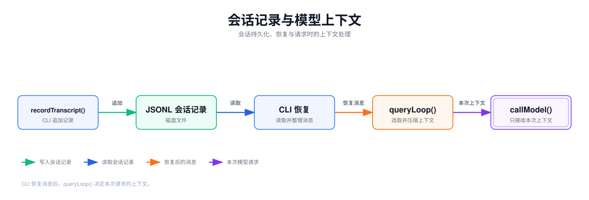

[English](./04-session-context.en.md) | 简体中文

# 会话持久化与上下文工程

用户关掉桌面应用，再打开同一会话，之前的提问、工具调用和回答仍然可见。继续提问时，模型却未必会收到文件里保存的每一条消息。这涉及两条相接的代码路径：会话持久化负责写入和恢复记录，上下文工程负责准备一次模型请求的输入。

本篇先用四步说明会话记录和请求上下文的最小关系，接着用同一组 `Read`/`Edit` 消息对照它在磁盘、恢复后和请求前的三种形态，再把每一步对应到 DreamCoder 的源码，最后看恢复与压缩的其他分支。阅读前最好读过[第一篇](./01-execution-loop.zh.md)，知道 `messagesForQuery` 在执行循环中的位置。

## 会话记录和请求上下文

去掉桌面进程管理、功能开关和各类修复逻辑，会话持久化与上下文构建可以缩成四步：

1. 每产生一条对话消息，就把它追加到会话文件末尾。
2. 重新打开会话时，从文件读回对话消息，跳过元数据行，得到内存中的消息历史。
3. 每次请求模型前，从消息历史整理出本次要发送的消息；接近上下文窗口上限时，用摘要替换较早的消息。
4. 压缩产生的边界标记和摘要同样追加到文件，此前的记录保留；下次恢复从最后一个边界开始读。

会话文件使用 JSONL 格式（JSON Lines）：每行是一个独立的 JSON 对象，新记录直接写在文件末尾，不需要重写已有内容。

写成伪代码大致如下。**这段是为说明结构写的简化代码，不是 DreamCoder 源码**：

```ts
function record(file, entry) {                                  // 第 1、4 步
  appendLine(file, JSON.stringify(entry))
}

function resume(file) {                                         // 第 2 步
  const lines = readLines(file).filter(isConversationMessage)
  return lines.slice(lastBoundaryIndex(lines))
}

async function request(history, file) {                         // 第 3 步
  let context = history
  if (estimateTokens(context) > threshold) {
    const summary = await summarize(context)
    context = [boundary, summary]
    record(file, boundary)                                      // 第 4 步
    record(file, summary)
  }
  return callModel(context)
}
```

这里有两份数据：文件是会话记录，正常路径下只在末尾追加；请求上下文在每次请求前从记录中选取、整理，发送时还会带上系统提示词等不在文件里的内容。

## 同一组消息在三处的样子

沿用前几篇的例子：用户要求把 `/example/src/app.ts` 中的 `value = 1` 改成 `value = 2`，模型先 `Read`（`toolu_read_1`），再 `Edit`（`toolu_edit_2`）。关闭桌面后重新打开会话，用户再发一条输入 `u4`。UUID 缩写为 `u1`、`a1` 等，字段只保留与本节有关的部分。

**(a) 磁盘上的 JSONL。** 前两行由桌面在创建会话时写入，其余由 CLI 追加。每条消息的 `parentUuid` 指向前一条消息，把它们连成一条链：

```jsonl
{"type":"file-history-snapshot","messageId":"…","snapshot":{…},"isSnapshotUpdate":false}
{"type":"session-meta","isMeta":true,"workDir":"/example","timestamp":"…"}
{"type":"user","uuid":"u1","parentUuid":null,"message":{"role":"user","content":"把 value 改成 2"}}
{"type":"assistant","uuid":"a1","parentUuid":"u1","message":{"role":"assistant","content":[{"type":"tool_use","id":"toolu_read_1","name":"Read","input":{"file_path":"/example/src/app.ts"}}]}}
{"type":"user","uuid":"u2","parentUuid":"a1","message":{"role":"user","content":[{"type":"tool_result","tool_use_id":"toolu_read_1","content":"1\texport const value = 1"}]}}
{"type":"assistant","uuid":"a2","parentUuid":"u2","message":{"role":"assistant","content":[{"type":"tool_use","id":"toolu_edit_2","name":"Edit","input":{"file_path":"/example/src/app.ts","old_string":"export const value = 1","new_string":"export const value = 2"}}]}}
{"type":"user","uuid":"u3","parentUuid":"a2","message":{"role":"user","content":[{"type":"tool_result","tool_use_id":"toolu_edit_2","content":"The file /example/src/app.ts has been updated successfully."}]}}
{"type":"assistant","uuid":"a3","parentUuid":"u3","message":{"role":"assistant","content":[{"type":"text","text":"已将 value 改为 2。"}]}}
```

**(b) `--resume` 后恢复的 `messages`。** 从最新消息 `a3` 沿 `parentUuid` 回溯，得到 `[u1, a1, u2, a2, u3, a3]`；若 resume hook 产生消息，追加在 `a3` 之后。前两行没有进入数组。本次输入 `u4` 在进入执行循环之前追加到数组末尾，也写入 JSONL。

**(c) 本次请求的 `messagesForQuery`。** 分两种情况：

```text
未压缩：[u1, a1, u2, a2, u3, a3, u4]
压缩后：[b1(compact_boundary), s1(摘要), 附件…]
```

短会话通常是第一种，调用模型时再附加用户上下文和系统提示词。如果估算的 token 超过阈值（例子里省略了使历史变长的其他消息），`u1`～`u4` 都由摘要代替，边界 `b1` 在转换为 API 格式时被过滤。压缩后，JSONL 末尾多出两行，前面的行不变：

```jsonl
{"type":"system","subtype":"compact_boundary","uuid":"b1","parentUuid":null,"logicalParentUuid":"u4"}
{"type":"user","uuid":"s1","parentUuid":"b1","isCompactSummary":true,"message":{"role":"user","content":"This session is being continued from a previous conversation… read the full transcript at: …"}}
```

边界的 `parentUuid` 为 `null`，之后再次恢复时回溯到 `b1` 就停止，恢复的 `messages` 从 `[b1, s1, …]` 开始。桌面显示历史时按文件顺序读取，不在边界处截断，因此用户仍能看到 `u1`～`a3`。

| 条目 | JSONL | 恢复后的 `messages` | `messagesForQuery` |
| --- | --- | --- | --- |
| `file-history-snapshot`、`session-meta` | 有 | 无 | 无 |
| `u1`～`a3` | 有 | 有 | 未压缩时有；压缩后由摘要代替 |
| `u4`（本次输入） | 进入循环前写入 | 追加在末尾 | 未压缩时有；压缩后计入摘要 |
| `b1` 边界 | 压缩后追加 | 下次恢复时链从这里开始 | 在数组首位，API 层过滤 |
| `s1` 摘要 | 压缩后追加 | 下次恢复时有 | 有 |
| 压缩后的文件附件 | 默认不写入 | 下次恢复时无 | 有 |

**磁盘上存在一条消息，是否意味着下一次请求一定包含它？** 不一定。元数据行不进入消息历史；恢复只读取沿 `parentUuid` 回溯得到的一条链，最后一个压缩边界之前的消息不在链上；恢复时还会过滤未配对的 `tool_use` 等消息；请求前还可能继续截取或压缩。反过来，请求中也有磁盘上没有的内容：系统提示词、用户上下文和压缩后生成的文件附件。要知道模型在某一轮看到了什么，应看这一轮的 `messagesForQuery` 与提示词；要审计或重新打开会话，应看磁盘记录。

下面按四步看这些差异分别在哪段代码中产生。

## 对应到 DreamCoder 源码

DreamCoder 中，桌面服务负责创建会话文件和启动 CLI，CLI 负责追加消息、恢复消息链和构造模型请求。



| 位置 | 在这条路径中的职责 |
| --- | --- |
| [`SessionService.createSession()`](https://github.com/GoDiao/dreamcoder/blob/dba5b24c75be4e3c35cd42d082dc9a7f8b631087/src/server/services/sessionService.ts#L1523) | 分配会话 ID，在配置目录下创建 JSONL 文件，记录工作目录等元数据。 |
| [`recordTranscript()`](https://github.com/GoDiao/dreamcoder/blob/dba5b24c75be4e3c35cd42d082dc9a7f8b631087/src/utils/sessionStorage.ts#L1437) | CLI 执行期间将新消息去重、整理，再追加到 transcript。 |
| [`ConversationService.startSession()`](https://github.com/GoDiao/dreamcoder/blob/dba5b24c75be4e3c35cd42d082dc9a7f8b631087/src/server/services/conversationService.ts#L155) | 判断文件里是否已有对话消息，决定以 `--session-id` 新开 CLI，还是以 `--resume` 恢复。 |
| [`loadConversationForResume()`](https://github.com/GoDiao/dreamcoder/blob/dba5b24c75be4e3c35cd42d082dc9a7f8b631087/src/utils/conversationRecovery.ts#L456) | 在 CLI 内加载记录，整理消息链，交给后续执行。 |
| [`queryLoop()`](https://github.com/GoDiao/dreamcoder/blob/dba5b24c75be4e3c35cd42d082dc9a7f8b631087/src/query.ts#L366) | 从当前消息构造 `messagesForQuery`，按配置处理并在需要时压缩，最后调用模型。 |
| [`autoCompactIfNeeded()`](https://github.com/GoDiao/dreamcoder/blob/dba5b24c75be4e3c35cd42d082dc9a7f8b631087/src/services/compact/autoCompact.ts#L241)、[`buildPostCompactMessages()`](https://github.com/GoDiao/dreamcoder/blob/dba5b24c75be4e3c35cd42d082dc9a7f8b631087/src/services/compact/compact.ts#L330) | 判断是否自动压缩，并给出压缩后的消息顺序。 |

### 第 1 步：创建会话文件并追加消息

桌面端的 `createSession()` 生成 `sessionId`，在配置目录的 `projects/<以工作目录命名的子目录>/` 下创建 `<sessionId>.jsonl`，写入 `file-history-snapshot` 和 `session-meta` 两行。配置目录取 `CLAUDE_CONFIG_DIR`，未设置时为 `~/.claude`，与代码仓库无关。[`getConfigDir()`](https://github.com/GoDiao/dreamcoder/blob/dba5b24c75be4e3c35cd42d082dc9a7f8b631087/src/server/services/sessionService.ts#L243) CLI 通过 [`getTranscriptPath()`](https://github.com/GoDiao/dreamcoder/blob/dba5b24c75be4e3c35cd42d082dc9a7f8b631087/src/utils/sessionStorage.ts#L202) 定位同一个文件。

CLI 产出消息时，`recordTranscript()` 不会原样追加整个内存数组。它先用 `cleanMessagesForLogging()` 处理记录，用已有 UUID 跳过已经写过的消息，再将新消息交给 `insertMessageChain()`：

```ts
const cleanedMessages = cleanMessagesForLogging(messages, allMessages)
const messageSet = await getSessionMessages(sessionId)
const newMessages: typeof cleanedMessages = []
for (const m of cleanedMessages) {
  if (messageSet.has(m.uuid as UUID)) {
    if (!seenNewMessage && isChainParticipant(m)) {
      startingParentUuid = m.uuid as UUID
    }
  } else {
    newMessages.push(m)
    seenNewMessage = true
  }
}
if (newMessages.length > 0) {
  await getProject().insertMessageChain(newMessages, false, undefined, startingParentUuid, teamInfo)
}
```

[`insertMessageChain()`](https://github.com/GoDiao/dreamcoder/blob/dba5b24c75be4e3c35cd42d082dc9a7f8b631087/src/utils/sessionStorage.ts#L1022) 为每条新消息写入 `uuid` 和 `parentUuid`；工具结果消息的 `parentUuid` 指向提出这次调用的助手消息。`startingParentUuid` 只在已记录消息出现在新消息之前、又参与消息链时更新，压缩后保留的旧消息因此不会被写第二遍，新消息也不会接到压缩前的父节点上。[`recordTranscript()`](https://github.com/GoDiao/dreamcoder/blob/dba5b24c75be4e3c35cd42d082dc9a7f8b631087/src/utils/sessionStorage.ts#L1420)

桌面使用的 `QueryEngine` 路径中，本次用户输入在进入执行循环之前就写入 transcript，之后每收到助手消息、用户消息或压缩边界都再记录一次。[`submitMessage()`](https://github.com/GoDiao/dreamcoder/blob/dba5b24c75be4e3c35cd42d082dc9a7f8b631087/src/QueryEngine.ts#L453)、[循环中的记录](https://github.com/GoDiao/dreamcoder/blob/dba5b24c75be4e3c35cd42d082dc9a7f8b631087/src/QueryEngine.ts#L712) 工具进度消息只用于界面，[`isLoggableMessage()`](https://github.com/GoDiao/dreamcoder/blob/dba5b24c75be4e3c35cd42d082dc9a7f8b631087/src/utils/sessionStorage.ts#L4380) 把 `progress` 类型过滤掉，它们不写入 JSONL。

### 第 2 步：选择新开还是恢复，并读回消息链

刚创建的文件只有快照和元数据，所以桌面端不能仅凭 `.jsonl` 文件存在就恢复 CLI。[`countTranscriptMessages()`](https://github.com/GoDiao/dreamcoder/blob/dba5b24c75be4e3c35cd42d082dc9a7f8b631087/src/server/services/sessionService.ts#L475) 只统计有 `message.role`、不是 `isMeta`、角色为 `user`、`assistant` 或 `system` 的条目，[`startSession()`](https://github.com/GoDiao/dreamcoder/blob/dba5b24c75be4e3c35cd42d082dc9a7f8b631087/src/server/services/conversationService.ts#L169) 据此判断：

```ts
const launchInfo = await sessionService.getSessionLaunchInfo(sessionId)
const shouldResume = !!launchInfo && launchInfo.transcriptMessageCount > 0
const shouldReplacePlaceholder =
  !!launchInfo && launchInfo.transcriptMessageCount === 0
// ...
if (shouldReplacePlaceholder) {
  await sessionService.clearSessionTranscript(sessionId, workDir)
}
```

从空占位文件启动时，先清理占位记录，再以 `--session-id` 新建会话；已有对话消息才用 `--resume` 恢复。[`buildSessionCliArgs()`](https://github.com/GoDiao/dreamcoder/blob/dba5b24c75be4e3c35cd42d082dc9a7f8b631087/src/server/services/conversationService.ts#L116)

CLI 的 `--resume` 分支调用 [`loadConversationForResume()`](https://github.com/GoDiao/dreamcoder/blob/dba5b24c75be4e3c35cd42d082dc9a7f8b631087/src/utils/conversationRecovery.ts#L456)，它加载消息、检查一致性，再处理尚未配对的工具调用和中断状态。与伪代码的第 2 步相比，实际代码有两处不同：

- 只有 `user`、`assistant`、`attachment`、`system` 四类条目进入消息表，`session-meta` 等条目不进入。[`loadTranscriptFile()`](https://github.com/GoDiao/dreamcoder/blob/dba5b24c75be4e3c35cd42d082dc9a7f8b631087/src/utils/sessionStorage.ts#L3501)
- 消息顺序不按文件行序确定。[`getLastSessionLog()`](https://github.com/GoDiao/dreamcoder/blob/dba5b24c75be4e3c35cd42d082dc9a7f8b631087/src/utils/sessionStorage.ts#L3898) 找到最新一条非 sidechain 消息，由 [`buildConversationChain()`](https://github.com/GoDiao/dreamcoder/blob/dba5b24c75be4e3c35cd42d082dc9a7f8b631087/src/utils/sessionStorage.ts#L2098) 沿 `parentUuid` 回溯到根，遇到 `parentUuid` 为 `null` 的边界就停止。

### 第 3 步：从消息历史构造 `messagesForQuery`

每次模型调用前，`queryLoop()` 先从 `messages` 取最后一个压缩边界及其之后的部分，随后按配置处理工具结果预算、microcompact 等，再判断是否需要自动压缩：

```ts
let messagesForQuery = [...getMessagesAfterCompactBoundary(messages)]
messagesForQuery = await applyToolResultBudget(messagesForQuery, /* ... */)
const microcompactResult = await deps.microcompact(messagesForQuery, toolUseContext, querySource)
messagesForQuery = microcompactResult.messages
const { compactionResult } = await deps.autocompact(messagesForQuery, /* ... */)
// ...若压缩成功，替换 messagesForQuery
for await (const message of deps.callModel({
  messages: prependUserContext(messagesForQuery, userContext),
  systemPrompt: fullSystemPrompt,
  // ...
})) {
  // ...
}
```

节选来自 [`queryLoop()`](https://github.com/GoDiao/dreamcoder/blob/dba5b24c75be4e3c35cd42d082dc9a7f8b631087/src/query.ts#L366)，省略了功能开关、错误处理和压缩后的状态更新。

- 边界本身留在 `messagesForQuery` 中，它是 `system` 消息，由 `normalizeMessagesForAPI()` 在 API 层过滤。[函数注释](https://github.com/GoDiao/dreamcoder/blob/dba5b24c75be4e3c35cd42d082dc9a7f8b631087/src/utils/messages.ts#L4730)
- [`applyToolResultBudget()`](https://github.com/GoDiao/dreamcoder/blob/dba5b24c75be4e3c35cd42d082dc9a7f8b631087/src/utils/toolResultStorage.ts#L924) 只在工具上下文带有 `contentReplacementState` 时生效。当前源码中交互式 REPL 和部分子智能体会设置它，桌面使用的 `QueryEngine` 路径没有设置。
- `prependUserContext()` 附加用户上下文，系统提示词由 [`appendSystemContext()`](https://github.com/GoDiao/dreamcoder/blob/dba5b24c75be4e3c35cd42d082dc9a7f8b631087/src/query.ts#L450) 单独组织，所以 `messagesForQuery` 只是完整请求体的一部分。

### 第 4 步：自动压缩与压缩边界

自动压缩不以 JSONL 文件大小为触发条件。[`shouldAutoCompact()`](https://github.com/GoDiao/dreamcoder/blob/dba5b24c75be4e3c35cd42d082dc9a7f8b631087/src/services/compact/autoCompact.ts#L160) 估算当前消息的 token，与阈值比较；阈值是模型有效上下文窗口减去 `AUTOCOMPACT_BUFFER_TOKENS`（13,000 token）。[`getAutoCompactThreshold()`](https://github.com/GoDiao/dreamcoder/blob/dba5b24c75be4e3c35cd42d082dc9a7f8b631087/src/services/compact/autoCompact.ts#L72)

满足条件时，[`autoCompactIfNeeded()`](https://github.com/GoDiao/dreamcoder/blob/dba5b24c75be4e3c35cd42d082dc9a7f8b631087/src/services/compact/autoCompact.ts#L241) 先尝试 session memory 路径，没有成功结果时再调用 `compactConversation()`。压缩成功后，[`buildPostCompactMessages()`](https://github.com/GoDiao/dreamcoder/blob/dba5b24c75be4e3c35cd42d082dc9a7f8b631087/src/services/compact/compact.ts#L330) 规定新的数组顺序：

```ts
return [
  result.boundaryMarker,
  ...result.summaryMessages,
  ...(result.messagesToKeep ?? []),
  ...result.attachments,
  ...result.hookResults,
]
```

[`queryLoop()`](https://github.com/GoDiao/dreamcoder/blob/dba5b24c75be4e3c35cd42d082dc9a7f8b631087/src/query.ts#L529) 输出这些压缩消息，再把 `messagesForQuery` 改为新数组，继续当前模型请求。对 `compactConversation()` 这条路径：

- 边界是 `subtype: 'compact_boundary'` 的 `system` 消息，写入时 `parentUuid` 设为 `null`，`logicalParentUuid` 记录压缩前的最后一条消息。[`createCompactBoundaryMessage()`](https://github.com/GoDiao/dreamcoder/blob/dba5b24c75be4e3c35cd42d082dc9a7f8b631087/src/utils/messages.ts#L4619)、[`insertMessageChain()`](https://github.com/GoDiao/dreamcoder/blob/dba5b24c75be4e3c35cd42d082dc9a7f8b631087/src/utils/sessionStorage.ts#L1069)
- 摘要是带 `isCompactSummary: true` 的用户消息，正文附有 transcript 路径，模型需要压缩前的细节时可以读取这个文件。[`compactConversation()`](https://github.com/GoDiao/dreamcoder/blob/dba5b24c75be4e3c35cd42d082dc9a7f8b631087/src/services/compact/compact.ts#L621)、[`getCompactUserSummaryMessage()`](https://github.com/GoDiao/dreamcoder/blob/dba5b24c75be4e3c35cd42d082dc9a7f8b631087/src/services/compact/prompt.ts#L349)
- 附件包括按读取记录重新生成的最近文件，最多 5 个，默认不写入 JSONL。[`createPostCompactFileAttachments()`](https://github.com/GoDiao/dreamcoder/blob/dba5b24c75be4e3c35cd42d082dc9a7f8b631087/src/services/compact/compact.ts#L1415)

## 设计分析

以下是对这段实现效果的分析。

### 为什么不每次发送全部历史

JSONL 保存全部对话，供桌面显示、恢复和审计；每次请求只发送最后一个压缩边界之后、经过整理的消息，接近阈值时由摘要替代较早内容。如果每次都发送全部历史，输入 token 会随会话长度持续增加，按 token 计费的费用随之增加，请求耗时通常也更长，超过模型上下文窗口后请求无法完成。代价是两份数据会出现差异：用户在桌面看到的历史多于模型本轮收到的内容；被摘要替代的细节（例如 `toolu_read_1` 读到的原文）只能由模型通过工具读取 transcript 找回；排查“模型为什么不知道某件事”时，需要还原当轮的 `messagesForQuery`，只看文件不够。

### 为什么压缩追加边界而不改写旧记录

这里讲解的正常记录与压缩路径采用追加写入，压缩保留此前的记录，桌面仍能显示；恢复时回溯到边界即停止，旧内容不进入消息历史。代价是文件持续增长，源码注释提到会话 JSONL 可以增长到数 GB。读取端因此要做额外处理：文件大于 5 MB 时，`loadTranscriptFile()` 跳过最后一个边界之前的字节；直接读取原始文件的调用方在超过 50 MB 时应放弃读取。[`SKIP_PRECOMPACT_THRESHOLD`](https://github.com/GoDiao/dreamcoder/blob/dba5b24c75be4e3c35cd42d082dc9a7f8b631087/src/utils/sessionStoragePortable.ts#L480)、[`MAX_TRANSCRIPT_READ_BYTES`](https://github.com/GoDiao/dreamcoder/blob/dba5b24c75be4e3c35cd42d082dc9a7f8b631087/src/utils/sessionStorage.ts#L229) 存储层也有删除和改写记录的操作，例如终端 REPL 处理流式回退时调用 [`removeTranscriptMessage()`](https://github.com/GoDiao/dreamcoder/blob/dba5b24c75be4e3c35cd42d082dc9a7f8b631087/src/utils/sessionStorage.ts#L1501) 删除被撤回的助手消息，桌面从空占位启动时调用 [`clearSessionTranscript()`](https://github.com/GoDiao/dreamcoder/blob/dba5b24c75be4e3c35cd42d082dc9a7f8b631087/src/server/services/sessionService.ts#L1742) 清理占位记录。

## 恢复与压缩的其他分支

> 首次阅读可以先跳过本节，读完第五篇再回来看。

**恢复时的中断处理。** [`deserializeMessagesWithInterruptDetection()`](https://github.com/GoDiao/dreamcoder/blob/dba5b24c75be4e3c35cd42d082dc9a7f8b631087/src/utils/conversationRecovery.ts#L164) 先过滤没有对应结果的 `tool_use` 及其后的合成消息，再去掉只有 thinking 或只有空白文本的孤立助手消息。判断上一轮在中途被打断时，它追加一条 `isMeta` 的用户消息 `Continue from where you left off.`；最后一条相关消息是用户消息时，它插入一条合成助手消息，使消息序列满足 API 格式。桌面显示历史时，[`shouldHideTranscriptEntry()`](https://github.com/GoDiao/dreamcoder/blob/dba5b24c75be4e3c35cd42d082dc9a7f8b631087/src/server/services/sessionService.ts#L654) 会隐藏这类合成消息，[`entriesToMessages()`](https://github.com/GoDiao/dreamcoder/blob/dba5b24c75be4e3c35cd42d082dc9a7f8b631087/src/server/services/sessionService.ts#L1986) 按文件顺序读取条目。

**自动压缩不一定发生。** 请求来源为 `session_memory` 或 `compact`、自动压缩被关闭，或部分功能开关生效时，`shouldAutoCompact()` 直接返回 `false`。连续失败达到 3 次后，本会话不再发起自动压缩。[`MAX_CONSECUTIVE_AUTOCOMPACT_FAILURES`](https://github.com/GoDiao/dreamcoder/blob/dba5b24c75be4e3c35cd42d082dc9a7f8b631087/src/services/compact/autoCompact.ts#L70)

**保留片段。** session memory 等压缩路径会返回 `messagesToKeep`，排在摘要之后。它们在磁盘上已有记录，`recordTranscript()` 按 UUID 跳过；加载时 [`applyPreservedSegmentRelinks()`](https://github.com/GoDiao/dreamcoder/blob/dba5b24c75be4e3c35cd42d082dc9a7f8b631087/src/utils/sessionStorage.ts#L1868) 在内存中把它们重新接到摘要之后。前面“回溯到边界就停止”描述的是没有保留片段的情况。

**其他上下文处理。** history snip 和 context collapse 受构建期功能开关控制。microcompact 按时间触发的路径会把较早的工具结果内容替换为 `[Old tool result content cleared]`，默认配置为 `enabled: false`；没有任何路径生效时原样返回消息。[`microcompactMessages()`](https://github.com/GoDiao/dreamcoder/blob/dba5b24c75be4e3c35cd42d082dc9a7f8b631087/src/services/compact/microCompact.ts#L253)、[`TimeBasedMCConfig`](https://github.com/GoDiao/dreamcoder/blob/dba5b24c75be4e3c35cd42d082dc9a7f8b631087/src/services/compact/timeBasedMCConfig.ts#L18)

## 小结

- JSONL 位于配置目录 `projects/<以工作目录命名的子目录>/<sessionId>.jsonl`，正常记录与压缩路径都在末尾追加；恢复时从最新消息沿 `parentUuid` 回溯，遇到压缩边界即停止。
- `messagesForQuery` 在每次模型请求前从消息历史重新整理，经过边界截取、按配置的处理和可能的自动压缩，调用时再附加用户上下文和系统提示词。
- 磁盘上有的消息不一定进入下一次请求，请求里也有磁盘上没有的内容；恢复会话不等于模型记住了全部历史。

下一篇[《流式响应与故障恢复》](./05-streaming-recovery.zh.md)从模型开始逐块返回响应的时刻接着看：文本增量可以先显示在桌面，但工具进度、最终 `tool_result` 和下一次模型请求各有自己的交付时机。
