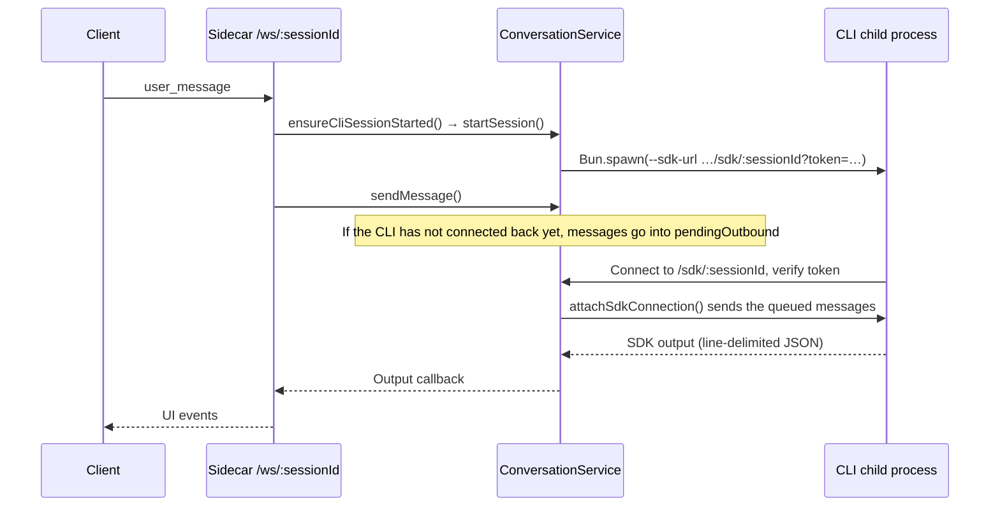

English | [简体中文](./06-desktop-integration.zh.md)

# Model access and desktop integration

When the CLI is used in a terminal, the model service is determined by environment variables set before launch, and both input and output stay in the terminal. Desktop users instead choose a model service on the settings page, open several sessions at once, and may continue a conversation from a phone. The UI and the CLI therefore need a local service between them: it turns the settings into the CLI's runtime environment, starts a CLI process for each session, and relays messages between the clients and the CLI. In DreamCoder this service is called the Sidecar, a local service process shipped with the desktop app.

This chapter is mainly about session integration. It first describes the minimal form of this service in four steps, then maps them to DreamCoder's `ProviderService`, `ConversationService` and WebSocket handling code. Two further-reading sections follow: how model requests are converted between protocols by a local proxy inside the Sidecar when the provider's API uses the OpenAI format, and how H5 on a phone joins the same session. How the CLI assembles and sends model requests internally is covered in [Part 1](./01-execution-loop.en.md) and [Part 5](./05-streaming-recovery.en.md). For the official OpenAI login (`runtimeKind: 'openai_oauth'`), the CLI selects a different transport in [`client.ts`](https://github.com/GoDiao/dreamcoder/blob/dba5b24c75be4e3c35cd42d082dc9a7f8b631087/src/services/api/client.ts#L187) and does not go through the proxy described below; IM adapters can also connect to sessions. This chapter does not cover these two parts.

## Minimal desktop integration

Without authentication, diagnostics, session resumption and failure branches, this local service does only four things:

1. Read the model service configuration the user selected and convert it into environment variables.
2. When a session receives input but has no CLI process yet, start a CLI child process with these environment variables and tell it which address to connect back to.
3. A client sends input over one WebSocket; the service wraps the input as one line of JSON the CLI can read and sends it over another WebSocket that the CLI connected back on. If the CLI has not connected yet, messages are queued first.
4. The CLI's output comes back in the opposite direction, is converted into UI events, and is sent to every client connected to that session.

**This is simplified code written to explain the structure. It is not DreamCoder source code.**

```ts
const sessions = new Map()

function onClientMessage(sessionId, msg, client) {
  let s = sessions.get(sessionId)
  if (!s) {
    const env = { ...process.env, ...providerEnv(selectedProvider) }   // Step 1
    const proc = spawn(                                                // Step 2
      ['cli', '--sdk-url', `ws://127.0.0.1:${PORT}/sdk/${sessionId}`],
      { env },
    )
    s = { proc, sdkSocket: null, pending: [], clients: new Set() }
    sessions.set(sessionId, s)
  }
  s.clients.add(client)
  const line = JSON.stringify({ type: 'user', message: { role: 'user', content: msg.content } }) + '\n'
  if (s.sdkSocket) s.sdkSocket.send(line)                             // Step 3
  else s.pending.push(line)
}

function onSdkConnect(sessionId, socket) {
  const s = sessions.get(sessionId)
  s.sdkSocket = socket
  for (const line of s.pending) socket.send(line)
  s.pending = []
}

function onSdkMessage(sessionId, line) {                               // Step 4
  for (const client of sessions.get(sessionId).clients) {
    client.send(toUiEvent(JSON.parse(line)))
  }
}
```

Model requests are always sent by the CLI. This service affects model selection only through environment variables when the CLI starts; after that it only relays messages.

## Mapping to the DreamCoder source

| Step | Responsibility | Source entry point |
| --- | --- | --- |
| Step 1 | Store the Provider selection and build the child process environment | [`ProviderService`](https://github.com/GoDiao/dreamcoder/blob/dba5b24c75be4e3c35cd42d082dc9a7f8b631087/src/server/services/providerService.ts#L62), [`buildChildEnv()`](https://github.com/GoDiao/dreamcoder/blob/dba5b24c75be4e3c35cd42d082dc9a7f8b631087/src/server/services/conversationService.ts#L912) |
| Step 2 | Start a CLI child process per session ID | [`ensureCliSessionStarted()`](https://github.com/GoDiao/dreamcoder/blob/dba5b24c75be4e3c35cd42d082dc9a7f8b631087/src/server/ws/handler.ts#L927), [`startSession()`](https://github.com/GoDiao/dreamcoder/blob/dba5b24c75be4e3c35cd42d082dc9a7f8b631087/src/server/services/conversationService.ts#L155) |
| Step 3 | Wrap input and hold it until the CLI connects | [`sendMessage()`](https://github.com/GoDiao/dreamcoder/blob/dba5b24c75be4e3c35cd42d082dc9a7f8b631087/src/server/services/conversationService.ts#L395), [`sendSdkMessage()`](https://github.com/GoDiao/dreamcoder/blob/dba5b24c75be4e3c35cd42d082dc9a7f8b631087/src/server/services/conversationService.ts#L817), [`attachSdkConnection()`](https://github.com/GoDiao/dreamcoder/blob/dba5b24c75be4e3c35cd42d082dc9a7f8b631087/src/server/services/conversationService.ts#L611) |
| Step 4 | Parse CLI output and convert it into UI events | [`handleSdkPayload()`](https://github.com/GoDiao/dreamcoder/blob/dba5b24c75be4e3c35cd42d082dc9a7f8b631087/src/server/services/conversationService.ts#L635), [`translateCliMessage()`](https://github.com/GoDiao/dreamcoder/blob/dba5b24c75be4e3c35cd42d082dc9a7f8b631087/src/server/ws/handler.ts#L962) |

### Step 1: Provider configuration enters the child process environment

`ProviderService` reads the Provider list and `activeId` from the local `dreamcoder/providers.json`; the configuration directory comes from `CLAUDE_CONFIG_DIR` and defaults to `.claude` in the user's home directory. [`getIndexPath()`](https://github.com/GoDiao/dreamcoder/blob/dba5b24c75be4e3c35cd42d082dc9a7f8b631087/src/server/services/providerService.ts#L81) `activateProvider()` updates the current selection and syncs the corresponding environment variables to the settings file managed by DreamCoder; `getProviderRuntimeEnv()` builds the CLI runtime environment for an explicitly specified Provider. [`activateProvider()`](https://github.com/GoDiao/dreamcoder/blob/dba5b24c75be4e3c35cd42d082dc9a7f8b631087/src/server/services/providerService.ts#L217) and [`getProviderRuntimeEnv()`](https://github.com/GoDiao/dreamcoder/blob/dba5b24c75be4e3c35cd42d082dc9a7f8b631087/src/server/services/providerService.ts#L255) both call [`buildProviderManagedEnv()`](https://github.com/GoDiao/dreamcoder/blob/dba5b24c75be4e3c35cd42d082dc9a7f8b631087/src/server/services/providerRuntimeEnv.ts#L186), which produces the model address `ANTHROPIC_BASE_URL`, the authentication variables, `ANTHROPIC_MODEL` and the model mapping for each tier.

When the desktop app starts a session, [`buildChildEnv()`](https://github.com/GoDiao/dreamcoder/blob/dba5b24c75be4e3c35cd42d082dc9a7f8b631087/src/server/services/conversationService.ts#L912) builds the environment passed to the CLI child process. If the launch explicitly specifies a `providerId`, it takes that Provider's runtime environment; if the launch also specifies a model, `options.model` overrides `ANTHROPIC_MODEL`. The merged environment is passed to `Bun.spawn()`. [`buildChildEnv()`](https://github.com/GoDiao/dreamcoder/blob/dba5b24c75be4e3c35cd42d082dc9a7f8b631087/src/server/services/conversationService.ts#L966), [`startSession()`](https://github.com/GoDiao/dreamcoder/blob/dba5b24c75be4e3c35cd42d082dc9a7f8b631087/src/server/services/conversationService.ts#L253) When the desktop app manages the Provider configuration, it first removes Provider environment variables inherited from the parent process, so old authentication or model settings do not carry over into the new session. [`shouldStripInheritedProviderEnv()`](https://github.com/GoDiao/dreamcoder/blob/dba5b24c75be4e3c35cd42d082dc9a7f8b631087/src/server/services/conversationService.ts#L1065)

The Provider's name, API address, credentials and model mapping are all runtime configuration; they are not sent to the CLI as the content of a `user_message`. The API key is stored in the local `providers.json`; when a cloud model is used, requests go to the selected provider.

### How a desktop session runs

This section corresponds to steps 2 and 3: how input sent by a client triggers the CLI launch, and how it is delivered into the CLI.

The desktop app's [`chatStore.sendMessage()`](https://github.com/GoDiao/dreamcoder/blob/dba5b24c75be4e3c35cd42d082dc9a7f8b631087/desktop/src/stores/chatStore.ts#L991) sends a `user_message` over `/ws/:sessionId`, and the Sidecar hands it to [`handleUserMessage()`](https://github.com/GoDiao/dreamcoder/blob/dba5b24c75be4e3c35cd42d082dc9a7f8b631087/src/server/ws/handler.ts#L267), which first calls `ensureCliSessionStarted()`. If the session already has a process, it uses that process; if it has to start a new one, it resolves the working directory, gets this session's runtime settings, generates an internal SDK address with a random token, `ws://<host>:<port>/sdk/<sessionId>?token=…`, and then calls `startSession()`.

`startSession()` decides from the session record whether to create a new session or resume one (see [Part 4](./04-session-context.en.md)), checks the working directory, builds the arguments and environment, and creates the process with `Bun.spawn()`. Below are the arguments in [`buildSessionCliArgs()`](https://github.com/GoDiao/dreamcoder/blob/dba5b24c75be4e3c35cd42d082dc9a7f8b631087/src/server/services/conversationService.ts#L116) that relate to the message channel:

```ts
'--sdk-url',
sdkUrl,
'--input-format',
'stream-json',
'--output-format',
'stream-json',
'--include-partial-messages',
...(shouldResume ? ['--resume', sessionId] : ['--session-id', sessionId]),
```

| Argument | Purpose |
| --- | --- |
| `--sdk-url` | The address the CLI connects back to, i.e. the Sidecar's `/sdk/:sessionId`. When the CLI receives this argument, it uses `RemoteIO` instead of standard input and output. [`print.ts`](https://github.com/GoDiao/dreamcoder/blob/dba5b24c75be4e3c35cd42d082dc9a7f8b631087/src/cli/print.ts#L5238) |
| `--input-format stream-json`, `--output-format stream-json` | Both input and output are line-delimited JSON messages. |
| `--include-partial-messages` | The output includes incremental assistant message deltas. A source comment explains that without this argument the server sees the complete assistant message only at the end of a turn. |
| `--resume` / `--session-id` | Resume an existing session, or create a new session with the given ID. |

Once the process has started, `handleUserMessage()` calls `ConversationService.sendMessage()`, which wraps the client input as an SDK user message the CLI accepts: [source](https://github.com/GoDiao/dreamcoder/blob/dba5b24c75be4e3c35cd42d082dc9a7f8b631087/src/server/services/conversationService.ts#L395)

```ts
return this.sendSdkMessage(sessionId, {
  type: 'user',
  message: {
    role: 'user',
    content: this.buildUserContent(content, sessionId, attachments),
  },
  parent_tool_use_id: null,
  session_id: '',
})
```

In the current implementation, `session_id` in the message body is left empty; which session the message goes to is determined by the outer argument `sessionId`. [`sendSdkMessage()`](https://github.com/GoDiao/dreamcoder/blob/dba5b24c75be4e3c35cd42d082dc9a7f8b631087/src/server/services/conversationService.ts#L824) sends or holds the message depending on the state of the SDK connection:

```ts
const line = JSON.stringify(payload) + '\n'
if (session.sdkSocket) {
  session.sdkSocket.send(line)
} else {
  session.pendingOutbound.push(line)
}
```

When the CLI connects back to `/sdk/:sessionId`, [`handleWebSocket.open()`](https://github.com/GoDiao/dreamcoder/blob/dba5b24c75be4e3c35cd42d082dc9a7f8b631087/src/server/ws/handler.ts#L124) first compares the token and closes the connection with 1008 if it does not match; if it passes, it calls [`attachSdkConnection()`](https://github.com/GoDiao/dreamcoder/blob/dba5b24c75be4e3c35cd42d082dc9a7f8b631087/src/server/services/conversationService.ts#L611), which records `sdkSocket` and sends the messages in `pendingOutbound` in order.



Both WebSocket paths terminate at the Sidecar, and `startServer()` tags them with different `channel` values when upgrading the connection:

| Path | `channel` | Purpose | Source entry point |
| --- | --- | --- | --- |
| `/ws/:sessionId` | `client` | Desktop or H5 clients submit input and receive status and output | [`src/server/index.ts`](https://github.com/GoDiao/dreamcoder/blob/dba5b24c75be4e3c35cd42d082dc9a7f8b631087/src/server/index.ts#L195) |
| `/sdk/:sessionId` | `sdk` | The CLI child process receives relayed input and sends back SDK messages; only internal local connections are accepted | [`src/server/index.ts`](https://github.com/GoDiao/dreamcoder/blob/dba5b24c75be4e3c35cd42d082dc9a7f8b631087/src/server/index.ts#L233) |

### Step 4: output returns to the clients

CLI output returns to the Sidecar over `/sdk/:sessionId`. [`handleSdkPayload()`](https://github.com/GoDiao/dreamcoder/blob/dba5b24c75be4e3c35cd42d082dc9a7f8b631087/src/server/services/conversationService.ts#L635) parses the JSON line by line and calls the session's output callbacks in turn. The callbacks are registered for each client by [`bindClientSessionOutput()`](https://github.com/GoDiao/dreamcoder/blob/dba5b24c75be4e3c35cd42d082dc9a7f8b631087/src/server/ws/handler.ts#L1769) and call `translateCliMessage()` to convert CLI messages into UI events:

| CLI message | UI event |
| --- | --- |
| Text deltas in `stream_event` | `content_delta` |
| A complete `tool_use` content block (from the `content_block_stop` streaming event, or from an `assistant` message) | `tool_use_complete`, with the tool name, `toolUseId` and arguments |
| A `user` message carrying `tool_result` | `tool_result`, with `toolUseId`, content and `isError`; the UI uses these to match it to the call shown earlier. [source](https://github.com/GoDiao/dreamcoder/blob/dba5b24c75be4e3c35cd42d082dc9a7f8b631087/src/server/ws/handler.ts#L1075) |
| `control_request` (`can_use_tool`) | `permission_request`; see [Part 3](./03-permissions.en.md) |
| `result` | `message_complete`; when execution fails, an `error` may come before it. [source](https://github.com/GoDiao/dreamcoder/blob/dba5b24c75be4e3c35cd42d082dc9a7f8b631087/src/server/ws/handler.ts#L1229) |

[`handleUserMessage()`](https://github.com/GoDiao/dreamcoder/blob/dba5b24c75be4e3c35cd42d082dc9a7f8b631087/src/server/ws/handler.ts#L352) registers output callbacks for all clients of the session before sending this turn's input; according to a source comment, this is so that startup errors are not missed. [`activeSessions`](https://github.com/GoDiao/dreamcoder/blob/dba5b24c75be4e3c35cd42d082dc9a7f8b631087/src/server/ws/handler.ts#L114) stores the set of clients per session ID, so one running session can have several clients at the same time.

## Design analysis

The following is an analysis of what this implementation does.

### Why each session starts its own CLI child process

Through `--sdk-url` and the stream-json arguments, the Sidecar uses the CLI's existing input and output interface, so the execution loop, tool and permission code is shared between the terminal and the desktop app. Each session's Provider and model are written into the environment of its own process, so different sessions can use different providers. The cost is that the Sidecar has to manage process lifecycles: detecting at startup whether the process exited early, holding messages until the CLI connects back, and stopping the process after a delay once all clients have disconnected. The environment takes effect only at startup; when the Provider or model is switched in the middle of a session, [`restartSessionWithRuntimeConfig()`](https://github.com/GoDiao/dreamcoder/blob/dba5b24c75be4e3c35cd42d082dc9a7f8b631087/src/server/ws/handler.ts#L607) stops that session's CLI process and restarts it with the new settings.

### Why OpenAI-format services go through a local proxy for conversion

See the next section. The CLI always sends requests and parses streaming events in the Anthropic format, so connecting to an OpenAI-compatible service does not require changing the CLI's model-calling code; the child process environment holds only a placeholder value, and the API key is read by the Sidecar and sent to the provider. The cost is that the fields of the two protocols do not correspond exactly, so the conversion loses some information; model requests also take one extra local hop and depend on the Sidecar staying running.

## Further reading: protocol conversion for the OpenAI format

> Readers who only use Anthropic-format providers can skip this section.

A Provider's `apiFormat` has three possible values: `anthropic`, `openai_chat` (Chat Completions) and `openai_responses` (Responses API). [`ApiFormatSchema`](https://github.com/GoDiao/dreamcoder/blob/dba5b24c75be4e3c35cd42d082dc9a7f8b631087/src/server/types/provider.ts#L10) `buildProviderManagedEnv()` uses this field to decide the CLI's model address: [source](https://github.com/GoDiao/dreamcoder/blob/dba5b24c75be4e3c35cd42d082dc9a7f8b631087/src/server/services/providerRuntimeEnv.ts#L195)

```ts
const needsProxy = apiFormat !== 'anthropic'
const proxyPath = options?.proxyPath ?? '/proxy'
const serverPort = options?.serverPort ?? 3456
const baseUrl = needsProxy
  ? `http://127.0.0.1:${serverPort}${proxyPath}`
  : provider.baseUrl
```

For a Provider in the `anthropic` format, the CLI requests the provider's address directly. For the other two formats, the CLI's model address points to the `/proxy` path of the local Sidecar, and `startServer()` sets the port to the service's actual port. [source](https://github.com/GoDiao/dreamcoder/blob/dba5b24c75be4e3c35cd42d082dc9a7f8b631087/src/server/index.ts#L126) In this case `ANTHROPIC_API_KEY` in the child process environment is the placeholder value `proxy-managed`; the proxy reads the provider's address and API key through [`getProviderForProxy()`](https://github.com/GoDiao/dreamcoder/blob/dba5b24c75be4e3c35cd42d082dc9a7f8b631087/src/server/services/providerService.ts#L376) and sends them upstream. [`buildProviderAuthEnv()`](https://github.com/GoDiao/dreamcoder/blob/dba5b24c75be4e3c35cd42d082dc9a7f8b631087/src/server/services/providerRuntimeEnv.ts#L148)

[`handleProxyRequest()`](https://github.com/GoDiao/dreamcoder/blob/dba5b24c75be4e3c35cd42d082dc9a7f8b631087/src/server/proxy/handler.ts#L71) handles a request in three steps:

1. Look up the Provider configuration by path; if the configuration does not exist or its `apiFormat` is `anthropic`, return 400.
2. Convert the Anthropic-format request body into the Chat Completions or Responses format and send it to the provider. [`anthropicToOpenaiChat()`](https://github.com/GoDiao/dreamcoder/blob/dba5b24c75be4e3c35cd42d082dc9a7f8b631087/src/server/proxy/transform/anthropicToOpenaiChat.ts#L21), [`anthropicToOpenaiResponses()`](https://github.com/GoDiao/dreamcoder/blob/dba5b24c75be4e3c35cd42d082dc9a7f8b631087/src/server/proxy/transform/anthropicToOpenaiResponses.ts#L19)
3. Convert the response back to the Anthropic format. For streaming responses, the Anthropic streaming events `message_start`, `content_block_*` and `message_stop` are regenerated, and the CLI consumes them as usual. [`openaiChatToAnthropic()`](https://github.com/GoDiao/dreamcoder/blob/dba5b24c75be4e3c35cd42d082dc9a7f8b631087/src/server/proxy/transform/openaiChatToAnthropic.ts#L17), [`openaiChatStreamToAnthropic()`](https://github.com/GoDiao/dreamcoder/blob/dba5b24c75be4e3c35cd42d082dc9a7f8b631087/src/server/proxy/streaming/openaiChatStreamToAnthropic.ts#L93)

Tool-call fields correspond as shown in the table below. Call IDs are kept unchanged during conversion, so the [correspondence between results and calls](./01-execution-loop.en.md#from-tool_use-to-tool_result) described in Part 1 still holds after conversion:

| Anthropic format | Chat Completions | Responses |
| --- | --- | --- |
| `tools[].input_schema` | `tools[].function.parameters` | `tools[].parameters` |
| `tool_use` in an assistant message (`id`) | `tool_calls[].id` of the assistant message | `call_id` of a `function_call` item |
| `tool_result` in a user message (`tool_use_id`) | `tool_call_id` of a `role: 'tool'` message | `call_id` of a `function_call_output` item |

The current conversion code loses the following information:

- When the content of a `tool_result` is an array, only text blocks are kept, and the `is_error` flag is not passed upstream. [Chat Completions](https://github.com/GoDiao/dreamcoder/blob/dba5b24c75be4e3c35cd42d082dc9a7f8b631087/src/server/proxy/transform/anthropicToOpenaiChat.ts#L135), [Responses](https://github.com/GoDiao/dreamcoder/blob/dba5b24c75be4e3c35cd42d082dc9a7f8b631087/src/server/proxy/transform/anthropicToOpenaiResponses.ts#L127)
- Requests do not carry `max_tokens`, so the provider uses its own default. [`anthropicToOpenaiChat()`](https://github.com/GoDiao/dreamcoder/blob/dba5b24c75be4e3c35cd42d082dc9a7f8b631087/src/server/proxy/transform/anthropicToOpenaiChat.ts#L49)
- A tool definition named `BatchTool` is not sent upstream. [`anthropicToOpenaiChat()`](https://github.com/GoDiao/dreamcoder/blob/dba5b24c75be4e3c35cd42d082dc9a7f8b631087/src/server/proxy/transform/anthropicToOpenaiChat.ts#L63)
- `thinking` blocks are skipped when converting to the Responses format. [`anthropicToOpenaiResponses.ts`](https://github.com/GoDiao/dreamcoder/blob/dba5b24c75be4e3c35cd42d082dc9a7f8b631087/src/server/proxy/transform/anthropicToOpenaiResponses.ts#L140)
- When tool arguments returned by the upstream cannot be parsed as a JSON object, they are converted to `{ raw: ... }` and used as `tool_use.input`. [`parseOpenAIToolArguments()`](https://github.com/GoDiao/dreamcoder/blob/dba5b24c75be4e3c35cd42d082dc9a7f8b631087/src/server/proxy/transform/toolArguments.ts#L5)

## Further reading: continuing the same session on a phone through H5

> Readers who do not continue sessions on a phone can skip this section.

[`H5AccessSettings`](https://github.com/GoDiao/dreamcoder/blob/dba5b24c75be4e3c35cd42d082dc9a7f8b631087/desktop/src/components/settings/H5AccessSettings.tsx#L94) in the desktop settings has controls such as enable, disable, regenerate token and copy access address, and shows a QR code. When enabled, [`H5AccessService.setToken()`](https://github.com/GoDiao/dreamcoder/blob/dba5b24c75be4e3c35cd42d082dc9a7f8b631087/src/server/services/h5AccessService.ts#L537) generates a token, stores its hash and preview fields, and returns the plaintext token to the current desktop operation; when disabled, the hash is cleared. [`disable()`](https://github.com/GoDiao/dreamcoder/blob/dba5b24c75be4e3c35cd42d082dc9a7f8b631087/src/server/services/h5AccessService.ts#L575) The QR code combines the access address and the token into a launch URL whose query parameters are `serverUrl` and `h5Token`. [`buildH5LaunchUrl()`](https://github.com/GoDiao/dreamcoder/blob/dba5b24c75be4e3c35cd42d082dc9a7f8b631087/desktop/src/components/settings/H5AccessSettings.tsx#L14)

After the phone browser opens this URL, [`initializeBrowserServerUrl()`](https://github.com/GoDiao/dreamcoder/blob/dba5b24c75be4e3c35cd42d082dc9a7f8b631087/desktop/src/lib/desktopRuntime.ts#L133) parses the server address and token, checks that the server is reachable, and calls the H5 verification endpoint; only after it passes does it connect to the session. When connecting, [`buildSessionWebSocketUrl()`](https://github.com/GoDiao/dreamcoder/blob/dba5b24c75be4e3c35cd42d082dc9a7f8b631087/desktop/src/api/websocket.ts#L180) builds the `/ws/:sessionId` address and puts the H5 token into the query parameters. The phone uses the same client channel as the desktop UI, and the `user_message` it sends also enters `handleUserMessage()`.

Access control is done in [the `fetch` of `startServer()`](https://github.com/GoDiao/dreamcoder/blob/dba5b24c75be4e3c35cd42d082dc9a7f8b631087/src/server/index.ts#L149). [`classifyH5Request()`](https://github.com/GoDiao/dreamcoder/blob/dba5b24c75be4e3c35cd42d082dc9a7f8b631087/src/server/h5AccessPolicy.ts#L36) uses the source address, `Origin` and path to classify requests as trusted local requests, internal SDK connections, or H5 browser requests. When H5 is not enabled and authentication is not explicitly forced, browser access to `/api/`, `/proxy/`, `/ws/` and `/sdk/` is blocked; once enabled, H5 browser requests to `/api/`, `/proxy/` and `/ws/` need a valid token, checked by [`requireH5Token()`](https://github.com/GoDiao/dreamcoder/blob/dba5b24c75be4e3c35cd42d082dc9a7f8b631087/src/server/middleware/auth.ts#L77). `/sdk/` accepts only internal local connections, so a phone browser cannot reach the CLI through this path.

The current [README](https://github.com/GoDiao/dreamcoder/blob/dba5b24c75be4e3c35cd42d082dc9a7f8b631087/README_en.md#L34) says H5 is meant for use on the same LAN; access across networks requires a reverse proxy you configure yourself. When the server entry point is not given `--host` or `SERVER_HOST`, it listens on `127.0.0.1` by default; the Sidecar of the packaged desktop app uses `0.0.0.0`. [`resolveServerOptions()`](https://github.com/GoDiao/dreamcoder/blob/dba5b24c75be4e3c35cd42d082dc9a7f8b631087/src/server/index.ts#L38), [`desktop/src-tauri/src/lib.rs`](https://github.com/GoDiao/dreamcoder/blob/dba5b24c75be4e3c35cd42d082dc9a7f8b631087/desktop/src-tauri/src/lib.rs#L221) The CLI and the session processes all run on the desktop, so the desktop app and its service must stay running for the phone to continue the session.

## Edge cases at startup and disconnection

> You can skip this section on a first read and come back to it when you need to troubleshoot session startup problems.

**Provider environment at startup.** `buildChildEnv()` handles three cases of `providerId` differently:

| Startup case | What `buildChildEnv()` does |
| --- | --- |
| `providerId` is a specific ID | Takes that Provider's runtime environment and overrides `ANTHROPIC_MODEL` with the model specified for this launch. |
| `providerId` is `null` | Clears the inherited Provider environment; the OAuth marker for official mode is decided by [`shouldMarkManagedOAuth()`](https://github.com/GoDiao/dreamcoder/blob/dba5b24c75be4e3c35cd42d082dc9a7f8b631087/src/server/services/conversationService.ts#L1116). |
| `providerId` not passed | Decides whether to clear the inherited environment based on whether the machine already has a Provider configuration managed by DreamCoder; according to the comment at the start of the function, the CLI then reads the current Provider's environment from the settings file managed by DreamCoder. |

**Startup failure.** After creating the process, `startSession()` waits at most 3 seconds; if the process exits within that time, a startup error is produced. If it can clear a leftover session lock, it calls `startSession()` again. [`startSession()`](https://github.com/GoDiao/dreamcoder/blob/dba5b24c75be4e3c35cd42d082dc9a7f8b631087/src/server/services/conversationService.ts#L310) Startup errors are sent to the client by `handleUserMessage()` as `error` events. When the same session receives several startup requests at once, later requests wait for the startup already in progress. [`ensureCliSessionStarted()`](https://github.com/GoDiao/dreamcoder/blob/dba5b24c75be4e3c35cd42d082dc9a7f8b631087/src/server/ws/handler.ts#L932)

**CLI process does not exist.** When `sendSdkMessage()` cannot find the session record, it returns `false`, and `handleUserMessage()` emits a `CLI_NOT_RUNNING` error. [`handleUserMessage()`](https://github.com/GoDiao/dreamcoder/blob/dba5b24c75be4e3c35cd42d082dc9a7f8b631087/src/server/ws/handler.ts#L373)

**Disconnection.** A client disconnecting and the CLI process exiting are two different kinds of event. When the SDK connection drops, `detachSdkConnection()` only sets `sdkSocket` to null, and later input goes into `pendingOutbound` again. [`detachSdkConnection()`](https://github.com/GoDiao/dreamcoder/blob/dba5b24c75be4e3c35cd42d082dc9a7f8b631087/src/server/services/conversationService.ts#L628) After the last client of a session disconnects, [`handleWebSocket.close()`](https://github.com/GoDiao/dreamcoder/blob/dba5b24c75be4e3c35cd42d082dc9a7f8b631087/src/server/ws/handler.ts#L222) starts a delayed cleanup: 30 seconds by default, or 30 minutes when there is a pending permission request. If a client reconnects during this time, the timer is cancelled; otherwise the session's CLI process is stopped. [Cleanup delay](https://github.com/GoDiao/dreamcoder/blob/dba5b24c75be4e3c35cd42d082dc9a7f8b631087/src/server/ws/handler.ts#L49)

## Summary

- Provider configuration becomes child process environment variables when the CLI starts and is not sent with user messages; switching the Provider or model in the middle of a session restarts that session's CLI process.
- Clients connect to the Sidecar over `/ws/:sessionId` and the CLI over `/sdk/:sessionId`; before the CLI connects back, input is held in `pendingOutbound`, and after it connects back and the token is verified, the input is sent in order.
- Further reading: OpenAI-format providers go through the Sidecar's `/proxy/` for protocol conversion, and call IDs stay unchanged; H5 on a phone accesses the same desktop service and session, so the desktop must stay running.

This is the end of the series. To modify or extend DreamCoder, start with the [contribution guide](https://github.com/GoDiao/dreamcoder/blob/main/docs/CONTRIBUTING_en.md); to report a problem or make a suggestion, submit it to [issues](https://github.com/GoDiao/dreamcoder/issues).
