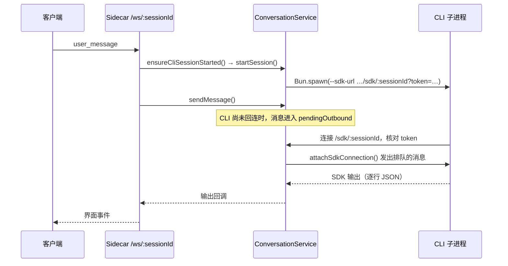

[English](./06-desktop-integration.en.md) | 简体中文

# 模型接入与桌面端集成

在终端里使用 CLI 时，模型服务由启动前设置的环境变量决定，输入和输出都在终端里。桌面端的用户则在设置页选择模型服务，同时打开多个会话，还可能从手机继续对话。界面和 CLI 之间因此需要一个本地服务：把设置转成 CLI 的运行环境，为每个会话启动 CLI 进程，在客户端和 CLI 之间转发消息。DreamCoder 中这个服务叫 Sidecar，是桌面应用附带的本地服务进程。

本篇的主线是会话集成：先用四步说明这个服务的最小形式，再对照 DreamCoder 的 `ProviderService`、`ConversationService` 和 WebSocket 处理代码。主线之后有两段扩展阅读：服务商接口为 OpenAI 格式时，模型请求怎样经 Sidecar 内的本地代理转换协议；手机 H5 怎样接入同一个会话。CLI 内部怎样组装和发送模型请求见[第一篇](./01-execution-loop.zh.md)和[第五篇](./05-streaming-recovery.zh.md)。官方 OpenAI 登录（`runtimeKind: 'openai_oauth'`）由 CLI 在 [`client.ts`](https://github.com/GoDiao/dreamcoder/blob/dba5b24c75be4e3c35cd42d082dc9a7f8b631087/src/services/api/client.ts#L187) 中选择另一套传输，不经过下文的代理；IM 适配器也能连接会话。这两部分本篇不展开。

## 最小的桌面集成

去掉鉴权、诊断、会话恢复和失败分支，这个本地服务只做四件事：

1. 读取用户选择的模型服务配置，转成环境变量。
2. 会话收到输入而还没有 CLI 进程时，用这些环境变量启动一个 CLI 子进程，并告诉它回连哪个地址。
3. 客户端经一条 WebSocket 发来输入；服务把输入包装成 CLI 能读的一行 JSON，经 CLI 回连的另一条 WebSocket 发过去。CLI 还没连上时，消息先排队。
4. CLI 的输出沿反方向回来，转成界面事件，发给连接该会话的每个客户端。

**这段是为说明结构写的简化代码，不是 DreamCoder 源码**：

```ts
const sessions = new Map()

function onClientMessage(sessionId, msg, client) {
  let s = sessions.get(sessionId)
  if (!s) {
    const env = { ...process.env, ...providerEnv(selectedProvider) }   // 第 1 步
    const proc = spawn(                                                // 第 2 步
      ['cli', '--sdk-url', `ws://127.0.0.1:${PORT}/sdk/${sessionId}`],
      { env },
    )
    s = { proc, sdkSocket: null, pending: [], clients: new Set() }
    sessions.set(sessionId, s)
  }
  s.clients.add(client)
  const line = JSON.stringify({ type: 'user', message: { role: 'user', content: msg.content } }) + '\n'
  if (s.sdkSocket) s.sdkSocket.send(line)                             // 第 3 步
  else s.pending.push(line)
}

function onSdkConnect(sessionId, socket) {
  const s = sessions.get(sessionId)
  s.sdkSocket = socket
  for (const line of s.pending) socket.send(line)
  s.pending = []
}

function onSdkMessage(sessionId, line) {                               // 第 4 步
  for (const client of sessions.get(sessionId).clients) {
    client.send(toUiEvent(JSON.parse(line)))
  }
}
```

模型请求始终由 CLI 发出。这个服务只在 CLI 启动时通过环境变量影响模型选择，之后只转发消息。

## 对应到 DreamCoder 源码

| 步骤 | 负责什么 | 源码入口 |
| --- | --- | --- |
| 第 1 步 | 保存 Provider 选择，生成子进程环境 | [`ProviderService`](https://github.com/GoDiao/dreamcoder/blob/dba5b24c75be4e3c35cd42d082dc9a7f8b631087/src/server/services/providerService.ts#L62)、[`buildChildEnv()`](https://github.com/GoDiao/dreamcoder/blob/dba5b24c75be4e3c35cd42d082dc9a7f8b631087/src/server/services/conversationService.ts#L912) |
| 第 2 步 | 按会话 ID 启动 CLI 子进程 | [`ensureCliSessionStarted()`](https://github.com/GoDiao/dreamcoder/blob/dba5b24c75be4e3c35cd42d082dc9a7f8b631087/src/server/ws/handler.ts#L927)、[`startSession()`](https://github.com/GoDiao/dreamcoder/blob/dba5b24c75be4e3c35cd42d082dc9a7f8b631087/src/server/services/conversationService.ts#L155) |
| 第 3 步 | 包装输入，CLI 连上前暂存 | [`sendMessage()`](https://github.com/GoDiao/dreamcoder/blob/dba5b24c75be4e3c35cd42d082dc9a7f8b631087/src/server/services/conversationService.ts#L395)、[`sendSdkMessage()`](https://github.com/GoDiao/dreamcoder/blob/dba5b24c75be4e3c35cd42d082dc9a7f8b631087/src/server/services/conversationService.ts#L817)、[`attachSdkConnection()`](https://github.com/GoDiao/dreamcoder/blob/dba5b24c75be4e3c35cd42d082dc9a7f8b631087/src/server/services/conversationService.ts#L611) |
| 第 4 步 | 解析 CLI 输出，转成界面事件 | [`handleSdkPayload()`](https://github.com/GoDiao/dreamcoder/blob/dba5b24c75be4e3c35cd42d082dc9a7f8b631087/src/server/services/conversationService.ts#L635)、[`translateCliMessage()`](https://github.com/GoDiao/dreamcoder/blob/dba5b24c75be4e3c35cd42d082dc9a7f8b631087/src/server/ws/handler.ts#L962) |

### 第 1 步：Provider 配置进入子进程环境

`ProviderService` 从本机的 `dreamcoder/providers.json` 读取 Provider 列表和 `activeId`；配置目录由 `CLAUDE_CONFIG_DIR` 决定，未设置时使用用户主目录下的 `.claude`。[`getIndexPath()`](https://github.com/GoDiao/dreamcoder/blob/dba5b24c75be4e3c35cd42d082dc9a7f8b631087/src/server/services/providerService.ts#L81) `activateProvider()` 更新当前选择，并把相应环境变量同步到 DreamCoder 管理的设置文件；`getProviderRuntimeEnv()` 为一次明确指定的 Provider 生成 CLI 运行环境。[`activateProvider()`](https://github.com/GoDiao/dreamcoder/blob/dba5b24c75be4e3c35cd42d082dc9a7f8b631087/src/server/services/providerService.ts#L217)、[`getProviderRuntimeEnv()`](https://github.com/GoDiao/dreamcoder/blob/dba5b24c75be4e3c35cd42d082dc9a7f8b631087/src/server/services/providerService.ts#L255) 两者都调用 [`buildProviderManagedEnv()`](https://github.com/GoDiao/dreamcoder/blob/dba5b24c75be4e3c35cd42d082dc9a7f8b631087/src/server/services/providerRuntimeEnv.ts#L186)，生成模型地址 `ANTHROPIC_BASE_URL`、认证变量、`ANTHROPIC_MODEL` 和各档位的模型映射。

桌面启动会话时，[`buildChildEnv()`](https://github.com/GoDiao/dreamcoder/blob/dba5b24c75be4e3c35cd42d082dc9a7f8b631087/src/server/services/conversationService.ts#L912) 生成传给 CLI 子进程的环境。本次启动明确指定了 `providerId` 时，它取该 Provider 的运行环境；本次还指定了模型时，用 `options.model` 覆盖 `ANTHROPIC_MODEL`。合并后的环境传给 `Bun.spawn()`。[`buildChildEnv()`](https://github.com/GoDiao/dreamcoder/blob/dba5b24c75be4e3c35cd42d082dc9a7f8b631087/src/server/services/conversationService.ts#L966)、[`startSession()`](https://github.com/GoDiao/dreamcoder/blob/dba5b24c75be4e3c35cd42d082dc9a7f8b631087/src/server/services/conversationService.ts#L253) 桌面管理了 Provider 配置时，它还会先删除从父进程继承的 Provider 环境变量，避免旧的认证或模型设置进入新会话。[`shouldStripInheritedProviderEnv()`](https://github.com/GoDiao/dreamcoder/blob/dba5b24c75be4e3c35cd42d082dc9a7f8b631087/src/server/services/conversationService.ts#L1065)

Provider 的名称、API 地址、认证信息和模型映射都属于运行配置，不会作为 `user_message` 的内容发给 CLI。API Key 保存在本机的 `providers.json` 中；使用云端模型时，请求发往所选服务商。

### 一个桌面会话怎样运行

这一节对应第 2、3 步：客户端发来的输入怎样触发 CLI 启动，又怎样送进 CLI。

桌面端 [`chatStore.sendMessage()`](https://github.com/GoDiao/dreamcoder/blob/dba5b24c75be4e3c35cd42d082dc9a7f8b631087/desktop/src/stores/chatStore.ts#L991) 经 `/ws/:sessionId` 发送 `user_message`，Sidecar 交给 [`handleUserMessage()`](https://github.com/GoDiao/dreamcoder/blob/dba5b24c75be4e3c35cd42d082dc9a7f8b631087/src/server/ws/handler.ts#L267)，后者先调用 `ensureCliSessionStarted()`。该会话已有进程就直接使用；需要新启动时，它解析工作目录、取得本会话的运行设置，生成带随机 token 的内部 SDK 地址 `ws://<host>:<port>/sdk/<sessionId>?token=…`，再调用 `startSession()`。

`startSession()` 按会话记录决定新建还是恢复（见[第四篇](./04-session-context.zh.md)），检查工作目录，生成参数和环境，用 `Bun.spawn()` 创建进程。下面是 [`buildSessionCliArgs()`](https://github.com/GoDiao/dreamcoder/blob/dba5b24c75be4e3c35cd42d082dc9a7f8b631087/src/server/services/conversationService.ts#L116) 中与消息通道有关的参数：

```ts
'--sdk-url',
sdkUrl,
'--input-format',
'stream-json',
'--output-format',
'stream-json',
'--include-partial-messages',
...(shouldResume ? ['--resume', sessionId] : ['--session-id', sessionId]),
```

| 参数 | 作用 |
| --- | --- |
| `--sdk-url` | CLI 回连的地址，即 Sidecar 的 `/sdk/:sessionId`。CLI 收到这个参数后用 `RemoteIO` 代替标准输入输出。[`print.ts`](https://github.com/GoDiao/dreamcoder/blob/dba5b24c75be4e3c35cd42d082dc9a7f8b631087/src/cli/print.ts#L5238) |
| `--input-format stream-json`、`--output-format stream-json` | 输入和输出都是逐行的 JSON 消息。 |
| `--include-partial-messages` | 输出中包含助手消息的增量。源码注释说明，缺少这个参数时服务端要到一轮结束才看到完整的助手消息。 |
| `--resume` / `--session-id` | 恢复已有会话，或用给定 ID 新建会话。 |

进程确认启动后，`handleUserMessage()` 调用 `ConversationService.sendMessage()`，把客户端输入包装成 CLI 接收的 SDK 用户消息：[源码](https://github.com/GoDiao/dreamcoder/blob/dba5b24c75be4e3c35cd42d082dc9a7f8b631087/src/server/services/conversationService.ts#L395)

```ts
return this.sendSdkMessage(sessionId, {
  type: 'user',
  message: {
    role: 'user',
    content: this.buildUserContent(content, sessionId, attachments),
  },
  parent_tool_use_id: null,
  session_id: '',
})
```

消息体中的 `session_id` 按当前实现留空；消息送往哪个会话，由外层参数 `sessionId` 决定。[`sendSdkMessage()`](https://github.com/GoDiao/dreamcoder/blob/dba5b24c75be4e3c35cd42d082dc9a7f8b631087/src/server/services/conversationService.ts#L824) 按 SDK 连接的状态发送或暂存：

```ts
const line = JSON.stringify(payload) + '\n'
if (session.sdkSocket) {
  session.sdkSocket.send(line)
} else {
  session.pendingOutbound.push(line)
}
```

CLI 回连 `/sdk/:sessionId` 时，[`handleWebSocket.open()`](https://github.com/GoDiao/dreamcoder/blob/dba5b24c75be4e3c35cd42d082dc9a7f8b631087/src/server/ws/handler.ts#L124) 先比对 token，不一致就以 1008 关闭连接；通过后调用 [`attachSdkConnection()`](https://github.com/GoDiao/dreamcoder/blob/dba5b24c75be4e3c35cd42d082dc9a7f8b631087/src/server/services/conversationService.ts#L611)，记下 `sdkSocket`，按顺序发出 `pendingOutbound` 中的消息。



两条 WebSocket 路径都终止在 Sidecar，`startServer()` 在升级连接时给它们标上不同的 `channel`：

| 路径 | `channel` | 用途 | 源码入口 |
| --- | --- | --- | --- |
| `/ws/:sessionId` | `client` | 桌面或 H5 客户端提交输入、接收状态和输出 | [`src/server/index.ts`](https://github.com/GoDiao/dreamcoder/blob/dba5b24c75be4e3c35cd42d082dc9a7f8b631087/src/server/index.ts#L195) |
| `/sdk/:sessionId` | `sdk` | CLI 子进程接收转发的输入，回传 SDK 消息；只接受本机内部连接 | [`src/server/index.ts`](https://github.com/GoDiao/dreamcoder/blob/dba5b24c75be4e3c35cd42d082dc9a7f8b631087/src/server/index.ts#L233) |

### 第 4 步：输出回到客户端

CLI 的输出经 `/sdk/:sessionId` 回到 Sidecar，[`handleSdkPayload()`](https://github.com/GoDiao/dreamcoder/blob/dba5b24c75be4e3c35cd42d082dc9a7f8b631087/src/server/services/conversationService.ts#L635) 按行解析 JSON，依次调用该会话的输出回调。回调由 [`bindClientSessionOutput()`](https://github.com/GoDiao/dreamcoder/blob/dba5b24c75be4e3c35cd42d082dc9a7f8b631087/src/server/ws/handler.ts#L1769) 为每个客户端注册，调用 `translateCliMessage()` 把 CLI 消息转成界面事件：

| CLI 消息 | 界面事件 |
| --- | --- |
| `stream_event` 中的文本增量 | `content_delta` |
| 完整的 `tool_use` 内容块（来自流式事件的 `content_block_stop`，或 `assistant` 消息） | `tool_use_complete`，带工具名称、`toolUseId` 和参数 |
| 带 `tool_result` 的 `user` 消息 | `tool_result`，带 `toolUseId`、内容和 `isError`，界面据此对应此前显示的调用。[源码](https://github.com/GoDiao/dreamcoder/blob/dba5b24c75be4e3c35cd42d082dc9a7f8b631087/src/server/ws/handler.ts#L1075) |
| `control_request`（`can_use_tool`） | `permission_request`，见[第三篇](./03-permissions.zh.md) |
| `result` | `message_complete`；执行出错时，前面可能还有一条 `error`。[源码](https://github.com/GoDiao/dreamcoder/blob/dba5b24c75be4e3c35cd42d082dc9a7f8b631087/src/server/ws/handler.ts#L1229) |

[`handleUserMessage()`](https://github.com/GoDiao/dreamcoder/blob/dba5b24c75be4e3c35cd42d082dc9a7f8b631087/src/server/ws/handler.ts#L352) 在发送本轮输入之前，先为该会话的所有客户端注册输出回调；源码注释说明这样做是为了不漏掉启动错误。[`activeSessions`](https://github.com/GoDiao/dreamcoder/blob/dba5b24c75be4e3c35cd42d082dc9a7f8b631087/src/server/ws/handler.ts#L114) 按会话 ID 保存客户端集合，同一个运行中的会话可以同时有多个客户端。

## 设计分析

以下是对这段实现效果的分析。

### 为什么每个会话启动一个 CLI 子进程

Sidecar 通过 `--sdk-url` 和 stream-json 参数使用 CLI 已有的输入输出接口，执行循环、工具和权限代码在终端和桌面之间共用。每个会话的 Provider 和模型写在各自进程的环境里，不同会话可以使用不同的服务商。代价是 Sidecar 要管理进程的生命周期：启动时检测进程是否提前退出，CLI 回连之前暂存消息，客户端全部断开后延迟停止进程。环境只在启动时生效，会话中途切换 Provider 或模型时，[`restartSessionWithRuntimeConfig()`](https://github.com/GoDiao/dreamcoder/blob/dba5b24c75be4e3c35cd42d082dc9a7f8b631087/src/server/ws/handler.ts#L607) 会停止该会话的 CLI 进程，再用新设置重新启动。

### 为什么 OpenAI 格式的服务经本地代理转换

见下一节。CLI 始终按 Anthropic 格式发送请求、解析流式事件，接入 OpenAI 兼容服务不需要修改 CLI 的模型调用代码；子进程环境中只有占位值，API Key 由 Sidecar 读取后发给服务商。代价是两种协议的字段不能完全对应，转换会丢掉部分信息；模型请求多了一次本机转发，并且依赖 Sidecar 保持运行。

## 扩展阅读：OpenAI 格式的协议转换

> 只使用 Anthropic 格式服务商的读者可以跳过本节。

Provider 的 `apiFormat` 有三种取值：`anthropic`、`openai_chat`（Chat Completions）和 `openai_responses`（Responses API）。[`ApiFormatSchema`](https://github.com/GoDiao/dreamcoder/blob/dba5b24c75be4e3c35cd42d082dc9a7f8b631087/src/server/types/provider.ts#L10) `buildProviderManagedEnv()` 按这个字段决定 CLI 的模型地址：[源码](https://github.com/GoDiao/dreamcoder/blob/dba5b24c75be4e3c35cd42d082dc9a7f8b631087/src/server/services/providerRuntimeEnv.ts#L195)

```ts
const needsProxy = apiFormat !== 'anthropic'
const proxyPath = options?.proxyPath ?? '/proxy'
const serverPort = options?.serverPort ?? 3456
const baseUrl = needsProxy
  ? `http://127.0.0.1:${serverPort}${proxyPath}`
  : provider.baseUrl
```

`anthropic` 格式的 Provider，CLI 直接请求服务商地址。其他两种格式，CLI 的模型地址指向本机 Sidecar 的 `/proxy` 路径，端口由 `startServer()` 设为服务实际端口。[源码](https://github.com/GoDiao/dreamcoder/blob/dba5b24c75be4e3c35cd42d082dc9a7f8b631087/src/server/index.ts#L126) 这时子进程环境中的 `ANTHROPIC_API_KEY` 是占位值 `proxy-managed`，代理通过 [`getProviderForProxy()`](https://github.com/GoDiao/dreamcoder/blob/dba5b24c75be4e3c35cd42d082dc9a7f8b631087/src/server/services/providerService.ts#L376) 读取服务商地址和 API Key，发给上游。[`buildProviderAuthEnv()`](https://github.com/GoDiao/dreamcoder/blob/dba5b24c75be4e3c35cd42d082dc9a7f8b631087/src/server/services/providerRuntimeEnv.ts#L148)

[`handleProxyRequest()`](https://github.com/GoDiao/dreamcoder/blob/dba5b24c75be4e3c35cd42d082dc9a7f8b631087/src/server/proxy/handler.ts#L71) 处理一次请求分三步：

1. 按路径取 Provider 配置；配置不存在或 `apiFormat` 为 `anthropic` 时返回 400。
2. 把 Anthropic 格式的请求体转成 Chat Completions 或 Responses 格式，发到服务商。[`anthropicToOpenaiChat()`](https://github.com/GoDiao/dreamcoder/blob/dba5b24c75be4e3c35cd42d082dc9a7f8b631087/src/server/proxy/transform/anthropicToOpenaiChat.ts#L21)、[`anthropicToOpenaiResponses()`](https://github.com/GoDiao/dreamcoder/blob/dba5b24c75be4e3c35cd42d082dc9a7f8b631087/src/server/proxy/transform/anthropicToOpenaiResponses.ts#L19)
3. 把响应转回 Anthropic 格式。流式响应重新生成 `message_start`、`content_block_*`、`message_stop` 这组 Anthropic 流式事件，CLI 按原有方式消费。[`openaiChatToAnthropic()`](https://github.com/GoDiao/dreamcoder/blob/dba5b24c75be4e3c35cd42d082dc9a7f8b631087/src/server/proxy/transform/openaiChatToAnthropic.ts#L17)、[`openaiChatStreamToAnthropic()`](https://github.com/GoDiao/dreamcoder/blob/dba5b24c75be4e3c35cd42d082dc9a7f8b631087/src/server/proxy/streaming/openaiChatStreamToAnthropic.ts#L93)

工具调用相关的字段按下表对应，调用 ID 在转换中原样保留，第一篇说明的[结果与调用的对应关系](./01-execution-loop.zh.md#从-tool_use-到-tool_result)在转换后仍然成立：

| Anthropic 格式 | Chat Completions | Responses |
| --- | --- | --- |
| `tools[].input_schema` | `tools[].function.parameters` | `tools[].parameters` |
| 助手消息中的 `tool_use`（`id`） | 助手消息的 `tool_calls[].id` | `function_call` 项的 `call_id` |
| 用户消息中的 `tool_result`（`tool_use_id`） | `role: 'tool'` 消息的 `tool_call_id` | `function_call_output` 项的 `call_id` |

当前的转换代码会丢失这些信息：

- `tool_result` 的内容为数组时只保留文本块，`is_error` 标记不传给上游。[Chat Completions](https://github.com/GoDiao/dreamcoder/blob/dba5b24c75be4e3c35cd42d082dc9a7f8b631087/src/server/proxy/transform/anthropicToOpenaiChat.ts#L135)、[Responses](https://github.com/GoDiao/dreamcoder/blob/dba5b24c75be4e3c35cd42d082dc9a7f8b631087/src/server/proxy/transform/anthropicToOpenaiResponses.ts#L127)
- 请求不带 `max_tokens`，由服务商使用自己的默认值。[`anthropicToOpenaiChat()`](https://github.com/GoDiao/dreamcoder/blob/dba5b24c75be4e3c35cd42d082dc9a7f8b631087/src/server/proxy/transform/anthropicToOpenaiChat.ts#L49)
- 名为 `BatchTool` 的工具定义不发给上游。[`anthropicToOpenaiChat()`](https://github.com/GoDiao/dreamcoder/blob/dba5b24c75be4e3c35cd42d082dc9a7f8b631087/src/server/proxy/transform/anthropicToOpenaiChat.ts#L63)
- 转成 Responses 格式时跳过 `thinking` 块。[`anthropicToOpenaiResponses.ts`](https://github.com/GoDiao/dreamcoder/blob/dba5b24c75be4e3c35cd42d082dc9a7f8b631087/src/server/proxy/transform/anthropicToOpenaiResponses.ts#L140)
- 上游返回的工具参数不能解析为 JSON 对象时，转成 `{ raw: ... }` 作为 `tool_use.input`。[`parseOpenAIToolArguments()`](https://github.com/GoDiao/dreamcoder/blob/dba5b24c75be4e3c35cd42d082dc9a7f8b631087/src/server/proxy/transform/toolArguments.ts#L5)

## 扩展阅读：手机 H5 接续同一个会话

> 不使用手机接续的读者可以跳过本节。

桌面设置中的 [`H5AccessSettings`](https://github.com/GoDiao/dreamcoder/blob/dba5b24c75be4e3c35cd42d082dc9a7f8b631087/desktop/src/components/settings/H5AccessSettings.tsx#L94) 提供启用、关闭、重新生成 Token、复制访问地址和二维码等操作。启用时，[`H5AccessService.setToken()`](https://github.com/GoDiao/dreamcoder/blob/dba5b24c75be4e3c35cd42d082dc9a7f8b631087/src/server/services/h5AccessService.ts#L537) 生成 Token，保存哈希与预览字段，把明文 Token 返回给当前桌面操作；关闭时清除哈希。[`disable()`](https://github.com/GoDiao/dreamcoder/blob/dba5b24c75be4e3c35cd42d082dc9a7f8b631087/src/server/services/h5AccessService.ts#L575) 二维码用访问地址和 Token 组成启动 URL，查询参数是 `serverUrl` 与 `h5Token`。[`buildH5LaunchUrl()`](https://github.com/GoDiao/dreamcoder/blob/dba5b24c75be4e3c35cd42d082dc9a7f8b631087/desktop/src/components/settings/H5AccessSettings.tsx#L14)

手机浏览器打开这个 URL 后，[`initializeBrowserServerUrl()`](https://github.com/GoDiao/dreamcoder/blob/dba5b24c75be4e3c35cd42d082dc9a7f8b631087/desktop/src/lib/desktopRuntime.ts#L133) 解析服务地址与 Token，检查服务可达性，调用 H5 校验接口，通过后才连接会话。连接时，[`buildSessionWebSocketUrl()`](https://github.com/GoDiao/dreamcoder/blob/dba5b24c75be4e3c35cd42d082dc9a7f8b631087/desktop/src/api/websocket.ts#L180) 生成 `/ws/:sessionId` 地址，把 H5 Token 放进查询参数。手机使用的是与桌面界面相同的客户端通道，送来的 `user_message` 同样进入 `handleUserMessage()`。

访问控制在 [`startServer()` 的 `fetch`](https://github.com/GoDiao/dreamcoder/blob/dba5b24c75be4e3c35cd42d082dc9a7f8b631087/src/server/index.ts#L149) 中完成。[`classifyH5Request()`](https://github.com/GoDiao/dreamcoder/blob/dba5b24c75be4e3c35cd42d082dc9a7f8b631087/src/server/h5AccessPolicy.ts#L36) 按来源地址、`Origin` 和路径把请求分成本地可信请求、内部 SDK 连接与 H5 浏览器请求。H5 未启用且没有显式强制鉴权时，浏览器访问 `/api/`、`/proxy/`、`/ws/`、`/sdk/` 会被阻止；启用后，H5 浏览器对 `/api/`、`/proxy/`、`/ws/` 的请求需要有效 Token，由 [`requireH5Token()`](https://github.com/GoDiao/dreamcoder/blob/dba5b24c75be4e3c35cd42d082dc9a7f8b631087/src/server/middleware/auth.ts#L77) 检查。`/sdk/` 只接受本地内部连接，手机浏览器不能经这条路径连到 CLI。

按当前 [README](https://github.com/GoDiao/dreamcoder/blob/dba5b24c75be4e3c35cd42d082dc9a7f8b631087/README.md#L34) 的使用范围，H5 面向同一局域网；跨网络访问需要自行配置反向代理。服务器入口未传 `--host` 或 `SERVER_HOST` 时默认监听 `127.0.0.1`；打包桌面应用的 Sidecar 使用 `0.0.0.0`。[`resolveServerOptions()`](https://github.com/GoDiao/dreamcoder/blob/dba5b24c75be4e3c35cd42d082dc9a7f8b631087/src/server/index.ts#L38)、[`desktop/src-tauri/src/lib.rs`](https://github.com/GoDiao/dreamcoder/blob/dba5b24c75be4e3c35cd42d082dc9a7f8b631087/desktop/src-tauri/src/lib.rs#L221) CLI 和会话进程都在桌面上运行，桌面应用及其服务必须保持运行，手机才能接续会话。

## 启动与断连的边界情况

> 首次阅读可以先跳过本节，需要排查会话启动问题时再回来看。

**启动时的 Provider 环境。** `buildChildEnv()` 对 `providerId` 的三种情形处理不同：

| 启动情形 | `buildChildEnv()` 的关键处理 |
| --- | --- |
| `providerId` 是指定的 ID | 取该 Provider 的运行环境，并用本次指定的模型覆盖 `ANTHROPIC_MODEL`。 |
| `providerId` 为 `null` | 清理继承的 Provider 环境；官方模式的 OAuth 标记由 [`shouldMarkManagedOAuth()`](https://github.com/GoDiao/dreamcoder/blob/dba5b24c75be4e3c35cd42d082dc9a7f8b631087/src/server/services/conversationService.ts#L1116) 决定。 |
| 未传 `providerId` | 根据本机是否已有 DreamCoder 管理的 Provider 配置，决定是否清理继承环境；按函数开头的注释，此时 CLI 从 DreamCoder 管理的设置文件读取当前 Provider 的环境。 |

**启动失败。** `startSession()` 在进程创建后最多等待 3 秒；进程在这段时间内退出，就生成启动错误。如果能清除残留的会话锁，它会重新调用 `startSession()`。[`startSession()`](https://github.com/GoDiao/dreamcoder/blob/dba5b24c75be4e3c35cd42d082dc9a7f8b631087/src/server/services/conversationService.ts#L310) 启动错误由 `handleUserMessage()` 作为 `error` 事件发给客户端。同一会话同时收到多个启动请求时，后来的请求等待正在进行的那次启动。[`ensureCliSessionStarted()`](https://github.com/GoDiao/dreamcoder/blob/dba5b24c75be4e3c35cd42d082dc9a7f8b631087/src/server/ws/handler.ts#L932)

**CLI 进程不存在。** `sendSdkMessage()` 找不到会话记录时返回 `false`，`handleUserMessage()` 发出 `CLI_NOT_RUNNING` 错误。[`handleUserMessage()`](https://github.com/GoDiao/dreamcoder/blob/dba5b24c75be4e3c35cd42d082dc9a7f8b631087/src/server/ws/handler.ts#L373)

**连接断开。** 客户端断开和 CLI 进程退出是两类事件。SDK 连接断开时，`detachSdkConnection()` 只把 `sdkSocket` 置空，之后的输入重新进入 `pendingOutbound`。[`detachSdkConnection()`](https://github.com/GoDiao/dreamcoder/blob/dba5b24c75be4e3c35cd42d082dc9a7f8b631087/src/server/services/conversationService.ts#L628) 一个会话的最后一个客户端断开后，[`handleWebSocket.close()`](https://github.com/GoDiao/dreamcoder/blob/dba5b24c75be4e3c35cd42d082dc9a7f8b631087/src/server/ws/handler.ts#L222) 开始延迟清理：默认 30 秒，有待处理的权限请求时 30 分钟；期间有客户端重新连接就取消计时，否则停止该会话的 CLI 进程。[清理延迟](https://github.com/GoDiao/dreamcoder/blob/dba5b24c75be4e3c35cd42d082dc9a7f8b631087/src/server/ws/handler.ts#L49)

## 小结

- Provider 配置在 CLI 启动时变成子进程环境变量，不随用户消息发送；会话中途切换 Provider 或模型会重启该会话的 CLI 进程。
- 客户端经 `/ws/:sessionId`、CLI 经 `/sdk/:sessionId` 连到 Sidecar；CLI 回连之前，输入暂存在 `pendingOutbound`，回连并核对 token 后按顺序发出。
- 扩展部分：OpenAI 格式的服务商经 Sidecar 的 `/proxy/` 转换协议，调用 ID 保持不变；手机 H5 访问的是同一个桌面服务和会话，桌面必须保持运行。

系列到这里结束。想修改或补充 DreamCoder，可以先读[贡献指南](https://github.com/GoDiao/dreamcoder/blob/main/docs/CONTRIBUTING_zh.md)；发现问题或有建议，可以提交到 [issues](https://github.com/GoDiao/dreamcoder/issues)。
